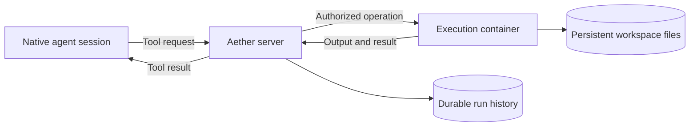

# Separating the agent session from execution

## Decision

Aether does not currently split a native agent session from its tools. Keep
that boundary unchanged until one supported harness can delegate its complete
enabled tool surface. Do not advertise a partial bridge as isolation, and do
not replace native agents with an Aether-owned agent loop without a separate
product decision.

This document records findings checked on 2026-10-08, the tradeoffs, and the
smallest next steps. Provider documentation describes public contracts, not
proof of the private architecture of Claude Code on the web, Codex cloud or
v0. The proposed architecture and acceptance checks below are not shipped
features or completed isolation tests.

## What “brain” and “hands” mean

The **brain** is the agent process: its conversation, model requests, planning,
tool selection and approval handling. The model itself may already run at an
external provider. Moving model inference is not the missing boundary.

The **hands** are the environment performing file access, searches, edits,
commands, tests, builds and their child processes. A real split lets an
execution process or container fail without killing the agent process that
receives and explains the failure.

A **run** is Aether's durable identity for one task. Its compute, checkout and
recorded history have separate lifetimes. Separating execution does not
require deleting history: recordings and captured diff history persist until
explicit deletion, independently of whether either process is running.

## What established providers expose

| Public contract | What it establishes | What it does not establish |
| --- | --- | --- |
| [Anthropic code execution](https://platform.claude.com/docs/en/agents-and-tools/tool-use/code-execution-tool) runs Bash/file operations in a server-side sandbox and supports container reuse. | A model conversation can request execution in a separately managed environment. | That every native Claude Code tool can be redirected through that API. |
| [OpenAI Shell](https://developers.openai.com/api/docs/guides/tools-shell) supports hosted containers and a locally operated shell runtime; containers can be reused across requests. | Tool execution has an explicit environment boundary. | That Codex App Server or its ACP adapter exposes the same complete remote-executor contract. Hosted shell also does not provide interactive TTY sessions. |
| [Vercel Sandbox](https://vercel.com/docs/sandbox/concepts) exposes isolated microVM sessions; current docs describe filesystem snapshots on stop and restoration on resume by default. | Compute lifetime and filesystem persistence can be separate. | That a restored filesystem restores running processes or arbitrary native agent sessions. Running the whole agent inside a sandbox alone is not a brain/hands split. |
| [Cloudflare Agents](https://developers.cloudflare.com/agents/) separates the harness, durable agent runtime and tools. Its [Sandbox lifetime](https://developers.cloudflare.com/sandbox/concepts/lifetime/) distinguishes the durable name/object from the Linux instance. | Session identity/state can outlive execution compute. | That every stop is transparent: Cloudflare documents that filesystem snapshots do not save memory or processes, and background work needs explicit lifecycle ownership. |

The useful common pattern is **durable identity and data, independently managed
execution**. There is no single universal implementation or retention policy
to copy. Provider SDK versions also matter: older Sandbox lifecycle pages can
describe different persistence behavior from current APIs.

“Active only during tool calls” needs qualification. A command can start a
background build or development server and return before that process exits.
An open terminal may need to remain attached. Stopping that environment just
because no RPC is in flight would kill real work. An idle policy must account
for owned processes and terminals, not just gaps between model requests.

## Aether's current boundary and adapter findings

Aether runs the native CLI and its tools in the same run container. Enhanced
mode changes the session protocol and presentation, not execution placement.
The [ACP host](../internal/acphost/conn.go) advertises terminal authentication
and output display, not client-side filesystem or terminal execution.
Tool-call updates are observations; they are not instructions for Aether to
execute again.

[ACP v1 filesystem](https://agentclientprotocol.com/protocol/v1/file-system)
and [terminal methods](https://agentclientprotocol.com/protocol/v1/terminals)
allow explicit delegation only when an agent actually uses them. The
[ACP v2 removal RFD](https://agentclientprotocol.com/rfds/v2/client-filesystem-terminal-capabilities)
is a proposal that explicitly leaves v1 unchanged, not evidence that today's
v1 methods have disappeared.

| Inspected integration | Finding |
| --- | --- |
| [Claude ACP 0.86.0](https://github.com/agentclientprotocol/claude-agent-acp/blob/v0.86.0/README.md) | Uses Claude Agent SDK tools. Activity reporting is not delegation; its [filesystem delegation change](https://github.com/agentclientprotocol/claude-agent-acp/issues/339) leaves native file tools on disk. |
| [Codex ACP 2.1.1](https://github.com/agentclientprotocol/codex-acp/blob/v2.1.1/README.md) | Translates Codex App Server operations/events into ACP, not a complete equivalent client-side file/search/shell executor. |
| [pi-acp 0.0.34](https://github.com/svkozak/pi-acp/blob/v0.0.34/README.md#limitations) | Explicitly does not delegate `fs/*` or `terminal/*`; pi executes locally. |
| [OMP 18.8.4](https://github.com/can1357/oh-my-pi/tree/v18.8.4) | Has conditional read/write/edit/Bash delegation, but fallbacks and unbridged paths prevent a complete boundary. |

The first three versions match [Aether's adapter pins](../internal/harness/acp.go).
OMP 18.8.4 was checked against its exact upstream tag and the installed
`omp --version`; it is an inspected version, not an Aether installation pin.
OpenCode and custom agents receive no execution-delegation guarantee merely
by supporting ACP. Recheck the exact version before changing these conclusions.

OMP's [read tool](https://github.com/can1357/oh-my-pi/blob/v18.8.4/packages/coding-agent/src/tools/read.ts)
can fall back to local disk after a bridge error. Its
[Bash tool](https://github.com/can1357/oh-my-pi/blob/v18.8.4/packages/coding-agent/src/tools/bash.ts)
delegates only without PTY or virtual-CWD use;
[grep](https://github.com/can1357/oh-my-pi/blob/v18.8.4/packages/coding-agent/src/tools/grep.ts)
and [glob](https://github.com/can1357/oh-my-pi/blob/v18.8.4/packages/coding-agent/src/tools/glob.ts)
remain local. [Extensions run in-process without isolation](https://github.com/can1357/oh-my-pi/blob/v18.8.4/docs/extensions.md).
**[INFERENCE]** The [root ACP setup](https://github.com/can1357/oh-my-pi/blob/v18.8.4/packages/coding-agent/src/modes/acp/acp-agent.ts)
installs a bridge, while the [subagent creation path](https://github.com/can1357/oh-my-pi/blob/v18.8.4/packages/coding-agent/src/task/executor.ts)
does not show propagation. That is source evidence, not a live subagent
isolation result.

## Pros and cons for Aether

| Potential benefit | Cost or condition |
| --- | --- |
| A build OOM can leave the agent responsive. | Agent and executor need separate resource boundaries. Two processes in one container are not enough; host-wide OOM and agent/plugin failures remain possible. |
| Idle execution memory can be released without ending the conversation. | Stopping loses processes and shell state. Pausing saves CPU but generally retains memory. Background jobs must prevent unsafe reclamation. |
| Execution can be replaced after failure while completed file writes survive. | Persistent mounts, image/user identity, working directory and process ownership must remain consistent. A filesystem snapshot is not an exact-process resume. |
| Tool attribution and resource ownership become clearer. | Every operation needs authorization, identity and an unambiguous result or unknown-outcome state across transport failure. |
| Agent credentials can be kept away from arbitrary build commands. | Only credentials needed by execution should cross the boundary. Sharing the whole home with both sides weakens this benefit. |
| Small agent processes may support more concurrent sessions on a host. | A second runtime and transport add baseline memory, startup latency and operational work. Measure a moderate swarm on a 32 GiB host; do not assume a savings figure. |

A split is not a logging policy, a substitute for capacity admission, or a
promise of exactly-once commands. Disk space and durable history still need
capacity planning. Existing [runtime limits](environments.md#resource-limits-and-launch-admission)
protect between runs; they do not promise that the native agent survives its
own tools exhausting their shared container.

## Smallest plausible architecture

Keep one Aether server and one run identity. For one fully supported harness,
place the agent process and execution environment in separate managed
containers/cgroups on the same host. Reuse the existing scheduler, authority,
resource limits, history storage and cleanup ownership. Do not introduce a
second control-plane service, a distributed queue, or a container per command.

The agent owns its native conversation and login state. The server owns run
and operation identity, approvals, cancellation and recordings. The executor
owns command processes and the intended writable workspace. Files and logs
are not deleted when the executor stops. Neither container gets the Docker
socket or writable host cgroups.

Keep the executor warm for the first implementation. Prove the boundary
before adding idle shutdown. Later, reclaim it only when no owned command,
background process, terminal or pending write needs it; wake it transparently
with the same workspace. Do not silently restart tools after a lost reply.

## Next steps and the release gate

1. **Prove a complete delegation contract for one exact harness version.**
   Inventory startup/context discovery, file/search/edit tools, shell and PTY,
   subprocesses, subagents and plugins. Bridge errors must not fall back to
   local side effects. If no harness supports this, stop and pursue upstream
   executor support; do not ship a misleading partial mode.
2. **Run a same-host execution-boundary experiment.** Keep the existing native
   login/session behavior and generous execution limits. Use server-authored
   run/session/operation identities and generation fencing for replacement.
   Record started, completed and unknown outcomes in existing durable state.
3. **Exercise failures against actual processes.** Cause an execution-side OOM
   in its own cgroup and show the agent can receive the failure and answer a
   subsequent prompt. Verify committed file writes, exit status/output,
   cancellation of descendants, permissions, approval replies and attribution.
   Test lost transport, server restart and executor replacement without
   replaying a side-effecting command whose completion is unknown.
4. **Verify native compatibility, not just a demo command.** Test every enabled
   tool path, PTYs, plugins, subagents, session restoration, environment/user
   identity and supported mode switches. Distinguish surviving processes,
   reattachment, conversation restore and a genuinely new session. Unsupported
   paths must fail before side effects; disabling expected native features is
   a product tradeoff, not proof of equivalent support.
5. **Measure and then decide on idle reclamation.** Compare memory, startup
   latency and concurrency with today's single-runtime model on the intended
   host. Add automatic idle stop only if process ownership is complete and the
   savings justify it. No user should have to manage two runtimes manually.

Only after those checks pass should Aether claim support for that harness and
version. None of the adapter inspection above proves that these live
isolation tests have passed. A complete upstream executor interface is the
first dependency; more lifecycle machinery is not a substitute for it.
