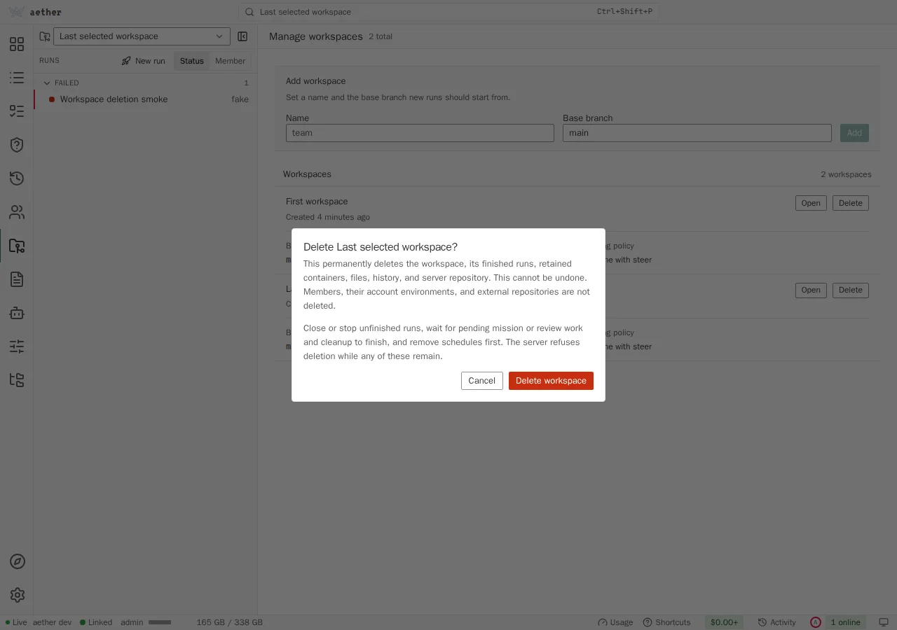
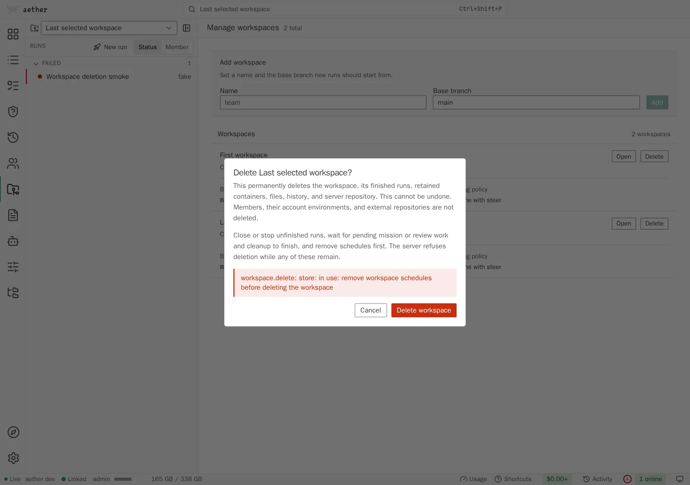

# Dashboard SPA (`web/`)

The browser client is one static bundle served through either dashboard
gateway: `aether gui` on the user's machine, or
`aether-server --web-port` over HTTPS on the server's tailnet addresses.
Next.js 16.3.4 produces the static export, while React 19 + TypeScript render
the client runtime, Tailwind v4 and the Radix-based primitives in
`src/components/ui/` provide the components, and Zustand holds the state. Both gateways use the shared `internal/webgate`
API and WebSocket surfaces; the server gateway authenticates each request with
Tailscale WhoIs and no browser token.

The visual contract is a dense developer workbench on graphite surfaces with
one teal accent: flat panes and compact controls. `docs/styles.md` defines the
tokens, type and motion.

The gateways and their transport boundaries are documented in
`docs/local-gateway.md`. The same bundle serves both, gating machine-local
surfaces on the capabilities descriptor while keeping shared Files,
configuration, runs and terminal surfaces available through either transport.
This guide describes the dashboard's public route, store and component
structure.

## Runtime boundary and commands

`src/app/page.tsx` is a minimal Next App Router page. It loads
`src/app/client-runtime.tsx`, which is a client component that dynamically
imports `src/App.tsx` with `ssr: false`. This boundary keeps the browser-only
store, WebSocket, xterm and Electron bridge out of static prerendering. Next
still emits the document, CSS, fonts and JavaScript assets; the existing
client-side registry and in-memory `navigate()` state remain the dashboard's
navigation model. Next does not run in production.

```sh
make dashboard   # Bun install, then Node 22+ and next build (from repo root)
make build       # dashboard export, then the Go binaries
cd web && bun run dev -- --port 3000 --hostname 127.0.0.1
cd web && bun run test       # vitest
cd web && bun run typecheck  # tsc --noEmit
```

`bun run dev` starts `dev-server.mjs`, the development-only Node loopback
server. It defaults to `127.0.0.1:3000`, accepts `--port`/`-p` and
`--hostname`/`-H`, and uses `AETHER_DASHBOARD` as its gateway target. The
target may be a local `aether gui` URL or a server-hosted HTTPS dashboard;
local targets also proxy `/local`, while both targets proxy `/api` and `/ws`
with WebSocket support. The proxy preserves the browser `Host` and `Origin`
headers so the shared gateway remains the WebSocket origin boundary. Other
requests and Next HMR upgrades go to Next's development handler. The Next
Node inspector attach endpoint is unavailable through this server.

For a local gateway, run it and start the dev server in separate terminals.
The local gateway prints a tokened URL; copy its `token` query value onto the
dev URL:

```sh
# terminal 1
aether gui --port 8080 --url

# terminal 2
cd web && AETHER_DASHBOARD=http://127.0.0.1:8080 \
  bun run dev -- --port 3000 --hostname 127.0.0.1
# open http://127.0.0.1:3000/?token=<token-from-aether-gui>
```

The client moves `?token=` into `sessionStorage` under `aether.token`, removes
only that query parameter from the address bar, and sends the value as a
Bearer token on HTTP or a `token` query parameter on WebSockets. The token is
minted per `aether gui` process and stops working when that process exits.
When `AETHER_DASHBOARD` points at the server gateway instead, the browser
sends no token: Tailscale WhoIs identifies the phone or development browser
on every request.

`?run=<run_id>` is the route itself, not a one-time parameter: it stays in
the address bar, so a reload reopens the run, and it is the whole deep-link
contract for both shells. See [URL state](#url-state) and
[local-gateway.md](local-gateway.md#running-it).

Node 22+ is required for a hand-run dashboard build. The complete contributor
toolchain and the optional desktop installer workflow are in
[CONTRIBUTING.md](../CONTRIBUTING.md#toolchain).

## Testing on a phone

The shipped phone path is the server-hosted gateway: set `web-port`, then open
the server's MagicDNS name on a phone joined to the tailnet
([Testing on a real phone](#testing-on-a-real-phone)). The connection is
HTTPS and carries no browser token; Tailscale WhoIs identifies the phone's
source address on every request. New members enter hosted onboarding even
when the server already has workspaces: Repository with the git identity on
top, Agent and First run. Machine-local linking, folder
picking and updates still require the desktop app or `aether gui`.

For a contributor's loop against a dashboard build that is not embedded in a
server yet, use the development server as a LAN-facing proxy to a local
`aether gui`:

```sh
# terminal 1, on the computer the phone will reach
aether gui --port 8080 --url

# terminal 2, with <lan-ip> that computer's address on the phone's network
cd web && AETHER_DASHBOARD=http://127.0.0.1:8080 \
  bun run dev -- --port 3000 --hostname <lan-ip>
# on the phone: http://<lan-ip>:3000/?token=<token-from-aether-gui>
```

- **Binding the LAN address gives up the loopback boundary for as long as
  the dev server runs.** Every device on that network can reach a proxy in
  front of a gateway with the member's authority on the linked server, and
  the local bearer token is the authentication: it travels in clear over
  HTTP, sits in the URL and stays in the phone's history. Use a network you
  trust, and stop the dev server when the session ends. The shipped boundary
  is the loopback rule in [security.md](security.md#the-dashboard-gateways);
  this is a development-time exception a contributor opts into by hand.
- `--hostname` has to be the address typed on the phone. Next's development
  server permits only localhost and the hostname it was started on; any other
  origin needs `allowedDevOrigins` in `web/next.config.ts`.
- The token is minted per `aether gui` process, and the phone needs that one.
  Nothing else authenticates the local development proxy.
- A tunnel or proxy in front of this must preserve `Host` and `Origin`. One
  that rewrites `Host` breaks every WebSocket - the terminal, the event feed
  and the attach stream - while plain HTTP keeps working, which makes for a
  confusing half-broken dashboard.
- This serves the Next development build over plain HTTP, not the static
  export the binary embeds, and it needs the computer awake and on the same
  network. It is a contributor's loop, not the shipped phone path.

Automated phone coverage is the `mobile` Playwright project, described in
[testing.md](testing.md).

## Build pipeline and the embed

`web/next.config.ts` sets `output: 'export'` and `distDir: 'dist'` outside
development. `next build` therefore writes a static `web/dist` artifact:
HTML, `_next` assets, CSS and copied public files. There is no production Next
server or Node process in the shipped dashboard.

`web/embed.go` embeds `web/dist` with `//go:embed all:dist`, which fails to
compile against an empty directory. The build output is not committed, so the
invariant is kept by two placeholder files:

- `web/dist/.gitkeep` is committed so a clean checkout compiles the Go server
  before anyone has run the web build.
- `web/public/.gitkeep` is copied into `dist` by every Next build, so emptying
  the output directory never breaks the next Go build.

`.gitignore` ignores generated `web/dist` and Next metadata while retaining
`web/dist/.gitkeep`. A binary built without running the web build serves the
gateway's "dashboard not built" response rather than a blank page.

### The web app manifest

`web/src/app/manifest.ts` is a Next metadata file, so the export writes
`/manifest.webmanifest` and links it from the page. A static export refuses to
collect a metadata route that has not declared itself static, which is what the
`export const dynamic = 'force-static'` in it is for.

It declares `display: standalone` and `start_url: '/'`, and names four icons
from `web/public/icons/`: 192px and 512px in both `any` and `maskable`. 192 and
512 are the pair Chrome and MDN document; what the installability check
enforces is lower - one `any` icon of at least 144px - so shipping both
documented sizes is belt and braces. No service worker ships. Chromium's
installability check no longer looks for one; the post announcing the removal
([update-install-criteria](https://developer.chrome.com/blog/update-install-criteria))
scopes it to installing "from the menu, since version 108 on mobile and 112 on
Desktop". The dashboard could not cache anyway, because it lives inside the
server binary and has to change with it.

**Both mobile browsers read the manifest.** Safari has since iOS 11.3
(`display`, `name`, `short_name`, `start_url`, `scope`), with `theme_color`
since 15 and `icons` since 15.4, so an iPhone's standalone window comes from
the manifest, not from the layout's Apple meta tags. Those tags cover what a
manifest cannot say: the status bar style, which needs
`apple-mobile-web-app-capable` spelled out by hand because Next 16 emits only
the unprefixed `mobile-web-app-capable`. `web/public/icons/apple-touch-icon.png`
stays because Safari prefers it over the manifest icons.

A manifest carries one `theme_color` where the layout's viewport export carries
one per colour scheme, so both read `web/src/app/theme-color.ts` and the
manifest takes the dark value. `background_color` is the separate
`iconBackground` from that module, `#0a0a0a`: an installed app's splash centres
an icon on it, and any other value would leave the icon's tile showing as a
square. That hex is deliberately darker than the dashboard's own dark
`--canvas`, `#141516` - a launcher icon has to read as an object against a
wallpaper - so the splash lightens slightly as the SPA paints over it.

Every icon is generated from `web/public/aether-mark.png` by `python3
scripts/make-icons.py`, the same script that writes the desktop app's, and the
output is committed. Maskable icons and the iOS icon are square and full-bleed
because the platform applies its own mask; the rest carry the rounded tile.

CI installs Bun with `oven-sh/setup-bun` (version pinned in `web/.bun-version`)
in jobs that run `make build` or `make release-binaries`, plus a dashboard job that
typechecks and tests the SPA on its own.

## The three extension seams

Later waves (the board, terminal, diff timeline, team surfaces) add views and
state without editing the shell.

**Route registry** (`src/routes/registry.ts`). A route file calls
`registerRoute('board', Board)` at module scope; `src/routes/index.ts` imports
it once for that side effect. The center view looks the current route up by
name and renders it with `route.params`. Navigation is a store action -
`navigate('terminal', { runId })` - rather than a URL router: Next supplies the
document and static assets, while the dashboard remains one client screen and
every surface uses the same action. The route is mirrored in the address bar
(see [URL state](#url-state)).

The global `overview` route (`src/routes/overview.tsx`) is **All workspaces**:
every run in every workspace, reached from the workspace switcher, `g` then
`l` and the palette. Run-detail routes are Terminal, Browser, Diff and Events;
there is no separate per-run Overview route.


**Store slices** (`src/store/`). One Zustand store composed of slice creators,
one file each (`server`, `workspaces`, `runs`, `members`, `env-terminal`,
`terminal`, `board`, `palette`, `approvals`, `presence`, `cost`, `timeline`,
`diff`, `files`, `collaboration`, `local`, `missions`, `messages`, `ui`). A
new feature adds a slice file and one spread in
`createRootStore`. Slices are typed against the whole root state, so a slice
may read another's data. Only view preferences and local progress (theme,
sidebar width and collapse state, dock heights, terminal zoom, text size,
single-key shortcuts, diff wrap, `activeWorkspace`, the **Mine** toggle, launch defaults,
dismissed update versions, onboarding progress) are persisted;
`persistedUi` in `store/index.ts` is the list that decides. Server data is
always re-fetched.

**Selectors return primitives or stable references.** A selector that builds
a new array or object on every call re-renders its component on every store
write, and under React 19 can loop. Lists of IDs go through `useShallow`
(`useRunIDs(workspace)` in `src/store/hooks.ts`); one entity is read by ID
(`useRun(id)`); a row asks for a boolean (`selected`) or its own state
(`useRunPresentation(run)`) rather than the whole `route` or run map. Derived maps live in the reducer that
changes their inputs: `setInbox` rebuilds `approvalsByRun` (each run's
pending requests, oldest first), so a row's approval count is one lookup.
Run rows and board cards are `React.memo` components; reducers replace only
the record of the run that changed, so an event about one run re-renders
that run's row and card and leaves the rest alone.

**Relative times tick on one shared clock.** `<RelativeTime at>`
(`src/components/ui/relative-time.tsx`) renders a `<time>` whose text comes
from `timeAgo` and subscribes to `useClock()` in `src/lib/clock.ts`: one
30-second interval for the whole app, running only while something
subscribes. Only the `<time>` re-renders on a tick, so "2 minutes ago" on a
board card, a run list row, a feed entry, an approval, the members and
devices views or the diff timeline keeps moving without re-rendering the
row. A per-second countdown, such as a queued steer's delivery in the Run
Room, is its own small component and re-renders only its text.

The `messages` slice holds agent mail (`coord.messages.list`) per workspace,
swarm, or run scope, merged by message ID. A `coord.message` event carries no
body, so every loaded scope the message belongs to re-reads its newest page;
`coord.message.acked` stamps the row. Both re-read the recipient run for its
`unacked_messages`.

**`activeWorkspace` is the scope workspace surfaces read.** It lives on the `ui`
slice and names the workspace the sidebar's run list, the board, launches,
templates, budget dialogs and the activity feed all act on. Empty means "all",
which is what the board falls back to before hydration has named one.
`setActiveWorkspace` carries an open `workspace` route along with it, so the
switcher can never say one workspace while the view beside it acts on another,
and `navigate('workspace', ...)` makes the workspace it opens the active scope
for the same reason.
Member configuration is account-scoped and does not require a workspace.

The last selected workspace survives reopening. Browser and server-hosted
dashboards use the `aether.ui` local-storage preference. The local gateway also
stores it through `workspace.selection`, keyed by server address and member,
because the desktop app's ephemeral port changes the browser origin on each
launch. Startup restores this value before choosing a fallback; a selection
made while startup is loading takes precedence. A failed preference read shows
the gateway's original error in a toast without blocking workspace and run
data: the current valid selection or normal fallback still applies.

Derived data (the run groups, the flat run list, the Needs you counts) lives
in `src/store/selectors.ts` as pure functions over a `StateContext`
(`stateContextOf` in the same file), wrapped by memoizing hooks in
`src/store/hooks.ts`. Selectors that build new arrays must not be passed to
`useStore` directly. A view that owns its own derived shape keeps it beside
the view instead (`src/routes/board/selectors.ts`). `useRunInput` combines
structured native requests, pending Aether approvals and unanswered teammate
questions for the request indicator; the run's state comes from
[Run state](#run-state).

**Slots** (`src/components/slots.tsx`). Where a route registry is too coarse -
something belongs *inside* a surface another ticket owns - the surface renders
`<Slot name="..." />` and contributors call
`registerSlot(name, id, Component)` at module scope. Registration order is
render order, `id` keys the render and makes a double registration an error.
The slots that exist:

| Slot | Props | Where it renders |
| --- | --- | --- |
| `card:meta` | `{ run }` | the run card's meta line, after the agent, owner and diff counts |

`AppShell` mounts the shell-wide hosts once: the command palette, the launch
and run forms, the shortcuts dialog, the updates dialog and the team refresh
(`useTeamRefresh`).

`card:meta` content renders inside `CardControls`, above the card's open
target, so its links and buttons stay interactive. Keep it to one short
item per contributor: a count or a word, with details behind a popover.

## Sidebar

`src/components/shell/` is the shell: one sidebar and one content area. The
sidebar (`sidebar.tsx`) is a `nav` named "Aether", 260px wide by default and
resizable from 220px to 400px; older saved widths are clamped. `Mod+B`, the
**Hide sidebar** button in its header and Enter on its splitter hide it
completely; the content view's header then shows **Open sidebar** at its left
edge. Hiding or showing it hands focus to the control that reverses it. From
top to bottom:

1. **Workspace switcher and search.** The switcher
   (`workspace-switcher.tsx`) shows the active workspace's name and base
   branch, and the total Needs you count across every workspace. Its menu
   lists each workspace with its own count, **All workspaces** (the
   `overview` route), **Manage workspaces** and **Repository** (the
   workspace page). With one workspace and no `workspace.list` method it is a
   plain label. The search button opens the command palette.
2. **New run**, the only filled button in the shell (`n`).
3. **Runs** (`sidebar-runs.tsx`), a `region` with three groups, **Needs you**,
   **Working** and **Finished** (see [Run state](#run-state)), each an `h2`
   holding an `aria-expanded` disclosure button and its count. Finished starts
   collapsed. Needs you lists every workspace; a row outside the selected
   workspace leads with that workspace's name. Working and Finished list the
   selected workspace, and only the viewer's own runs while **Mine**
   (`mineOnly`, persisted) in the Working header is pressed.
4. **Navigation**: Board, Swarms, Activity, Files, Environment, Agents and
   Templates, then under a hairline Members (admins only) and Settings. The
   current one carries `aria-current="page"`. Gates come from
   `src/lib/surfaces.ts`, which also feeds the palette's Navigate group; its
   `palette` entries (Approvals, Agent config files, Devices, Manage
   workspaces, Onboarding) are reached from the palette only.
5. **One update notice row** when a CLI, server or desktop update exists, for
   example "Aether 0.5.3 is available · Update"; see
   [Update prompts](#update-prompts).
6. **Footer**: the member's avatar and name and a connection dot, whose word
   ("Live", "Reconnecting", "Offline") is in the button's name and tooltip.
   Its menu holds **Profile** (colour, git identity and agent account
   sharing; see [Members and devices](#members-and-devices)), **Keyboard shortcuts**, **Theme**, **Update…** when an
   update exists, and a **Team** line with who is online and the spend
   against workspace budgets.

A run row is a 28px `ListRow` (44px on a coarse pointer): a shaped state dot,
the title, and the agent's monochrome glyph. Its accessible name starts with
the state word, then the workspace when it is another one, the title and the
reason. Paused, finished and other members' working rows recede: their title
is in the muted colour. A Needs you row offers the condition's primary
action on hover, focus and a coarse pointer, the same one its board card
shows (see [Board](#board)): **Approve** resolves in place, every other
action and the row itself go to the view the condition names. The list is one tab stop (roving `tabindex`); Arrow
keys, Home and End move within it, `j` and `k` move from anywhere (starting
at the open run), and `u` opens the next run that needs you, oldest first.

A swarm is a mission whose integrator coordinates worker runs. It is one row
showing the objective and the workers' counts ("3 working · 1 needs you");
selecting it opens the swarm page. Only workers that need the viewer are
listed under it, and the row then sits in Needs you. Workers never list on
their own: a swarm whose integrator is missing or archived is rooted at its
oldest worker (`swarmRoot` in `src/store/selectors.ts`). Relationships come from
the run snapshot's `mission_id`, `mission_role` and `integrator_run_id`, not
task text. `mission.changed` coalesces background refreshes of those fields
without blocking run-status events or overwriting newer run state; reconnect
hydration supersedes pending relationship requests. Older servers that omit
the fields get a flat list.

**Phone (under 768px).** `top-bar.tsx` is a 48px `banner`, padded by
`--safe-top`: **Open sidebar** with an amber dot while anything needs you, the
view's title, **Search** and **New run**. A connection problem is one line
under it. The sidebar opens as a left side sheet, a `dialog` named "Aether"
with the same contents; a tap outside, Escape or any navigation closes it, and
navigation moves focus to the new view's heading. `Mod+B` closes it too,
because it is the key that opened it; every other shell key stands down while
it is open. On a phone the view's own header keeps only its actions, and its
`h1` stays for screen readers.

**Landmarks.** The skip link "Skip to content" is the first tab stop; the
sidebar is `nav` "Aether" containing `region` "Runs"; the content is the one
`main`, with one `h1` per view from `PaneHeader` (`tabIndex=-1`). After a route
change focus moves to that `h1`, unless the view took focus for itself. Unit
and end-to-end tests select by these names.

**Headers.** Every non-run view draws `ViewHeader`
(`src/components/view-header.tsx`), a `PaneHeader` with the title in
`text-title`, an optional one-line subtitle, the view's actions, the sidebar
opener while the sidebar is hidden, and on desktop the connection problem in
place of the subtitle. While `link.status` reports no server configured there
is no connection to report, so neither header shows one.

### URL state

`src/lib/url-state.ts` keeps the route in the query string. A run view is
`?run=<id>`, with `&view=session|terminal|changes|browser` (an old
`&view=diff` reads as `changes`); any other
view is `?page=<name>`, plus `&id=<id>` for a swarm or workspace page; the
board is the bare address. The store starts on the route the address names
(`initialRoute()`), `bindRouteToUrl` pushes a history entry per navigation,
and back and forward navigate to the entry's route, so reload, back, `Esc`
and a shared link agree. Other query parameters and the hash are kept; the
token is removed on first load as before.

`aether://run/<id>` still works unchanged: both shells load
`<dashboard>?run=<id>`, which is that run's Terminal view. When the first
hydration does not find the run, the dashboard opens the board instead, or
onboarding for a member who has not finished it. A `?page=` name with no
view, or a page the gates in `src/lib/surfaces.ts` do not offer this gateway
or member, opens the board once the first hydration has the capabilities.
These redirects replace the history entry (`redirectRoute`), so back does not
return to the dead link. A `?page=missions&id=` link to a swarm the server
does not know stays on the Swarms page and shows the server's error.

## Agent config files

`src/components/profile-import.tsx` is the configuration importer. **Agents**
and onboarding's Agent step show it under an **Agent config files**
disclosure whenever `config.roots` and `config.import` are advertised, on both
gateways, without a workspace. There is no separate route: typing "config
files" in the command palette finds **Agents**, through the `keywords` its
entry in `src/lib/surfaces.ts` carries.

The browser directory picker grants access to the directory the user selects
even when the dashboard is server-hosted; it does not grant access to arbitrary
local paths. The importer previews metadata and policy exclusions without
reading file bytes. It transfers the entire eligible directory through
sequential bounded requests, not a truncated selection. It retains at most the
current batch's encoded payload and shows cumulative progress. Files above the
64 MiB configuration-file ceiling and read failures are explicit errors.
Server exclusions and exact committed paths accumulate across batches; a
failure stops subsequent requests, distinguishing known commits from a request
whose response was lost.

After a result the user can select another directory or use **Open remote
files**, which navigates to the existing `files` route. There is no automatic
configuration sync, watcher, or import retry. Nonpersisted owner-scoped progress
and results survive navigation; `configImportPending` serializes operations and
protects against page unload. Each request rechecks identity after asynchronous
reads, so a member/server switch prevents further writes and hides the old
result. New browser-imported files use `0644`; existing
remote modes are preserved on overwrite. The browser cannot preserve source
executable bits or symlinks. See
[Agent configuration](harnesses.md#agent-configuration-import-and-files) for
the user workflow and [the protocol](local-gateway.md#files-and-member-configuration)
for import result and failure semantics.

## Files view

`src/routes/files/` is the Files explorer and editor. It combines each visible
workspace's base branch, live run checkouts, and the authenticated member's
own persistent configuration roots from `config.roots`. `files.tree`,
`files.read`, `files.write`, `files.diff`, and the `config.*` methods are
available through both the local SSH-backed gateway and the server-hosted
WhoIs gateway. Directory requests are lazy and cached in
`src/store/files.ts`; file content comes from `files.read` or `config.read`.
A live run can switch from **File** to **Diff vs base**.

The tree lists each workspace's `base: <branch>` first, then its live runs
under **Run checkouts** and the member's configuration roots under **Agent
config**; both groups start folded, so a run's or root's tree is read only
when it is opened. Folder expansion is kept per view. The tree sits beside the
editor from `md` up. On a phone it is the first view; once a file is open the
editor fills the screen and **Browse** opens the tree as a side sheet. CodeMirror provides syntax highlighting for JSON/JSONC,
JavaScript/TypeScript, Markdown, Python and TOML, plus find/replace. The
editor renders complete UTF-8 text without NUL bytes up to 64 MiB; binary and
oversized responses remain read-only.

The action label states the write target: base files show **Commit to
<branch>…**, which opens a dialog saying the commit lands on that branch and
is not pushed upstream, then creates one file commit (a failed commit keeps
the dialog open with the error); live-run files
show **Save**, changing the run's uncommitted checkout; configuration files
show **Save**, changing only the authenticated member's persistent home.
Base writes require **Push**, run writes require **Steer**, and config reads or
writes are always for the calling member and require **Launch**. A new
configuration file accepts nested relative paths and refuses to overwrite an
existing file.

Saves are explicit (**Save**, **Commit to <branch>…**, or Ctrl/Cmd-S, which
opens the same commit dialog for a base file); there is
no autosave or force-save. A tab closes from its ×, a middle click, or Delete
while it has focus. Open tabs and dirty drafts live in memory and survive
route changes and reconnects to the same identity. A different authenticated
member or server clears them. The browser warns before unloading dirty buffers.
The revision is the SHA-256 of the complete bytes read. A failed or stale save
keeps the draft and its error. On a conflict, **Reload from server** replaces
the document and discards that draft. **Discard edits** restores the last
successfully loaded or saved content without fetching.
All runs the member launches and the environment terminal mount one shared
read-write persistent HOME, so accepted configuration imports and saves
are visible to active and future runs; a tool may need to reload. Browser
imports and Files edits do not create CLI snapshot history. Optional run
snapshot pins are provenance, not isolated writable copies. Manual profile
push and rollback overlay snapshot files into that same HOME without removing
paths absent from the snapshot; rollback is not an exact-tree restore.

## Templates view

`src/routes/templates/` lists the active workspace's templates
(`template.list`), one row each: agent glyph, name, mode word (Standard,
Enhanced, Background), whether it is scheduled, the task, and when it next
launches, last launched or was saved. **Launch** is the row's action and opens
the new run. The row menu holds **Schedule…**, **Edit**, **Duplicate** and
**Delete**. **Schedule…** opens the cron editor in a dialog; the preview is
the `next_fire_at` that `schedule.save` returned, shown relative and in UTC,
never computed in the browser. **Duplicate** opens the form prefilled under
`<name> copy`. With no templates the view says what one is and offers **New
template**.

## Window bar

The desktop window is frameless, so `src/components/shell/window-bar.tsx`
draws a 35px drag strip at its top edge whenever `window.aetherDesktop`
exists. On Windows and Linux it holds minimize, maximize/restore and close,
wired to `window.aetherDesktop.controls`; on macOS it is the strip the native
traffic lights sit in. The strip is `-webkit-app-region: drag` and its
buttons are `no-drag`. `App.tsx` mounts it above the `ConnectionError` page
too, so a total failure still lets the window move and close. A browser tab
has no bridge and no strip.

The bridge carries one more thing the SPA cannot do for itself:
`window.aetherDesktop.chooseFolder()` opens the shell's native directory
dialog, parented to the asking window - a sheet on macOS, modal to the window
on Windows; a Linux portal chooser runs out of process and is neither, which
is why the caller disables its button while one is open - and resolves to the
chosen absolute path, or `""` when it was cancelled. A window it cannot
resolve rejects with `no window asked for the folder dialog` instead, so a
caller can say what went wrong. It is optional on the type for the same
reason `shellVersion` exists: a shell built by an older `aether gui build`
does not have it.

## Window size and overflow

The shell is a fixed row - the sidebar and the content view - under the
desktop window bar or the phone top bar, and nothing in its own chrome
scrolls sideways. A control pushed past an edge is unreachable, not merely off
screen, so every row states what gives way first.

`desktop/main.js` sets `minWidth: 960` and `minHeight: 600`. That is the size
the desktop rules are designed against; a browser tab has no such floor, so
the same rules degrade below it rather than break. A phone is the far end of
that: `src/app/layout.tsx` exports the viewport the shell needs there.

- `width=device-width, initial-scale=1` - the page is laid out at the device's
  own width rather than a desktop-sized canvas scaled down.
- `viewport-fit=cover` - the shell paints under the notch and the home
  indicator, and the chrome that touches those edges pads itself back out with
  `env(safe-area-inset-*)`: the phone top bar sideways and downwards, the
  sidebar sheet on all three edges it reaches, the sidebar on the left and the
  content view on the right and bottom. The top inset is the one a surface
  away from that edge also has to read, because an installed iOS app asks for
  a `black-translucent` status bar and gets the whole screen: it is
  `--safe-top` in `src/index.css`, and the top bar's height, the palette's
  drop and the side sheets' top padding all count it. A surface that pads
  itself keeps painting to the edge and insets only what it holds, so the
  notch shows the bar's own colour rather than a gap. Every inset is 0 where
  there is none, so nothing guards them. Toasts sit 8px above the bottom
  inset, and the offset is given to `sonner` twice, as `offset` and as
  `mobileOffset`, because `sonner` swaps to the second below 600px and
  otherwise falls back to its own default.
- `interactive-widget=resizes-content` - on a browser that honours it
  (Chrome and the Android WebView; iOS Safari does not), the soft keyboard
  shrinks the layout viewport instead of sliding the page under itself. That
  is what every `dvh` in the app - dialogs, the palette, selects, menus - is
  already sized against, so they all shorten when the
  keyboard opens. Nothing in the shell uses `vh`.
- `themeColor` per `prefers-color-scheme` - the browser reads it before the
  SPA has applied the member's stored theme, so it follows the OS scheme
  rather than the app setting.

A layout that only changes size belongs in CSS. Layouts that mount different
elements for a finger than for a mouse, such as the activity filter bar, ask
`useMediaQuery` in `src/lib/hooks.ts`. Named constants there include `coarsePointer`, Tailwind's `belowSm` breakpoint and
`phoneScreen`; the `md` edge is `MOBILE_MAX_WIDTH` and `useIsMobile()` in
`src/lib/breakpoints.ts`. Terminal utility controls respond to their
pane's container width rather than the window width. The shell has one
breakpoint: under 768px (`useIsMobile()`, Tailwind `max-md:`) the top bar and
the sidebar sheet replace the sidebar.

**Touch density is one variant, defined once.** `src/index.css` declares
`@custom-variant coarse (@media (pointer: coarse))`, and a control that a
finger has to hit carries its touch size beside its desktop one - for example
`size-[22px] coarse:size-11`. It answers for the primary pointer, so a touch
laptop with a trackpad keeps the desktop density. Under it the `Button`
sizes, `Input`, `CommandItem`, `MenuItem`, the `CollapsibleTrigger`,
the `Select` trigger and its options, the dialog close, the palette input,
the top bar, the sidebar run and navigation rows and the sidebar's own
buttons, the run-list title, the files tree rows and the approvals controls
grow to 40-44px, and the terminal toolbar row grows with the buttons in it.
Desktop density is untouched.
Use this variant rather than a new breakpoint or a per-component pixel value.

**The bars are tokens, not repeated numbers.** `--window-bar-height` (35px,
the desktop drag strip) and `--top-bar-height` (48px, the phone top bar,
border included) are declared in `src/index.css`, and every offset measured
from the top bar reads the token - the palette's drop and the phone sheets. `--safe-top` is the top safe-area inset under a name, so that
a surface measuring from the top bar can add the same amount the bar itself
grew by. It carries a `0px` fallback because a bare `env()` in a browser
without it would void every `calc()` height that reads it.

Below `md` every centred dialog opens as a bottom sheet, full width and at
most 85dvh, and scrolls inside itself, so its footer stays in reach of a thumb
and the soft keyboard shortens it from the top. iOS Safari does not resize the
layout viewport for the keyboard, so `useKeyboardInset()`
(`web/src/lib/keyboard-inset.ts`) sets `--keyboard-inset` from
`visualViewport` and the sheet sits that far above the bottom edge; it is 0 on
browsers that resize. `md` is a width breakpoint, so
a desktop window narrower than 768px is treated as a phone here too.

- **Update prompts** live in the updates dialog, which scrolls inside itself;
  the sidebar carries one notice row. Technical output is bounded, and every
  prompt's actions sit on their own row so long diagnostics never hide them.
- **The sidebar** keeps the run list scrollable between its fixed header and
  its navigation rows and footer, from 220px wide up.
- **The run header** gives its first section two lines: the title, then state,
  harness/mode, the route's subtitle and **Task and details**. The title is the
  agent's last terminal title; a run without one uses its prompt's first line, cut at
  120 characters. The heading clamps to two lines and keeps the full label in
  its `title`; the disclosure keeps the full prompt and run metadata together.
  The second section holds the run-detail tabs and at most
  two labeled state-dependent actions plus **More**, at every width and for
  both pointer modes. Secondary actions live in More; Kill and Delete come
  last, after a separator, and require confirmation. Metadata and tabs
  scroll inside their own regions before the actions become unreachable.
- **The board** stacks its three columns into one list on narrow screens and
  places them side by side from the `lg`/1024px breakpoint (see
  [Board](#board)).

## Data flow

`connect()` in `src/store/sync.ts` owns the whole lifecycle. One round of HTTP
fetches hydrates the store (`server.info`, `workspace.list`, `member.list`,
`run.list`, `run.overlaps`, and `GET /api/v1/capabilities`), then `/ws/events`
is the only thing that changes it. `setWorkspaces` keeps a valid selection;
an unset selection or a workspace that has been deleted falls back to the
first by ID, or clears the selection when none remain. An open deleted
workspace route moves to the replacement workspace or **Manage workspaces**;
an open run in a deleted workspace returns to the board. The capabilities
fetch may fail without failing hydration; a legacy gateway then holds `null`.
The snapshot also seeds the board's paused map from each run's wire `paused`
field, skipping runs that do not carry it.

`removeWorkspace` records deleted IDs for the lifetime of the in-memory store.
Every workspace snapshot and upsert excludes those IDs, so an older route or
hydration response cannot resurrect a deletion received from another member.
Removal also repairs the selection and open route before any refresh awaits.

- **The subscription is established first.** Hydration starts only once the
  server acknowledges it (`{"ok":true}`), which is also when the client calls
  itself live. Otherwise a change between the snapshot and the subscription
  would fall in the gap and never be delivered or replayed.
- **Events arriving during a fetch wait in the queue**, and are applied once
  the snapshot lands, so an older snapshot never overwrites a newer event.
- **Events are applied one at a time, in sequence order**, each fully resolved
  before the next begins. The cursor is a single number, so it must never move
  past an event still waiting on a fetch.
- **Listeners hear one change per frame.** The queue drains inside
  `batchNotifications` (`src/store/batch.ts`): every `set()` applies at once,
  so `getState()` and the cursor rules above are unchanged, but subscribers -
  React included - are notified on the next animation frame (a 16 ms timer
  in a hidden tab). The hold outlives an emptied queue, because each socket
  message arrives in its own task and drains before the next one lands; a
  burst of 200 events spread over a few milliseconds renders once. A write
  outside the drain, such as a click, notifies at once.
- **The stream subscribes live on the first connect** (the fetch behind it
  provides the current state) and **replays from the highest applied `seq` on
  reconnect**, with jittered backoff. An event at the cursor is ignored, so a
  replay is idempotent; one strictly *below* it means the server's event log
  restarted (a recreated or restored data dir), and the client zeroes its
  cursor and takes a fresh snapshot rather than silently dropping everything
  the new log sends.
- **A reconnect with no cursor cannot replay** - on a quiet server nothing has
  advanced `seq` - so the client re-fetches the snapshot instead of
  subscribing live and silently missing the outage.
- **Server-gateway reconnects also refresh the snapshot** when replay is
  possible: Tailscale may identify the new connection as a different member.
  Only a local gateway's fixed identity can reuse replay without that refresh.
- **A failed hydration retries** on the same backoff, and the affected panes
  say the server is unreachable rather than animating skeletons forever. That
  generic copy never overwrites a more precise error already recorded.
- **A total failure replaces the shell with one error page.** When nothing has
  hydrated and an error is recorded, `ConnectionError` takes the window
  instead of an empty sidebar and an empty board behind a toast. Which hop
  failed picks the copy: `network` says this machine has no network at all
  and names wifi and a VPN, `server` says the server did not answer through
  the selected transport, `gateway` says the local `aether gui` process
  stopped answering, `tailnet` says the phone got no answer from the server
  that serves it the page, and an access refusal preserves the gateway's own
  reason. A fetch that got no answer at all is `gateway` only on the desktop
  origin, where that process can be restarted; on the server gateway it is
  `tailnet`, because the page came over the tailnet and there is no local
  process to blame and no wifi advice to give. A local gateway linked through
  an edge classifies the client's own error text: `edge` (the edge did not
  answer), `edge-server` (the server is not connected to it), `signed-out`
  (no valid device token; gives the `aether login --edge` command),
  `device-revoked` and `device-pending`. `src/store/edge-sync.test.ts` pins
  the wording those classes match, so a change in `internal/edge/client` or
  the sshd banners fails there. The capabilities probe records
  which gateway serves the page before hydration runs, so the first failure
  is classified too. The gateway's message appears in an initially open
  "Technical details" disclosure, and the page suppresses the toast that
  would otherwise repeat it. Retry clears connection state and remounts the
  subscribe-and-hydrate cycle rather than reloading the page.
- **A local token refusal is reported as access failure, not an unreachable
  server.** `connect` reads `GET /api/v1/capabilities` before it opens the
  stream, and a `401` there means the local gateway refused its token. The
  store records that refusal verbatim, stops retrying and tells the member to
  open a fresh URL from `aether gui`. The token is minted per process and held
  in the tab's session storage, so a bookmarked URL, a second tab or a
  restarted `aether gui` needs a newly printed URL. On the server gateway
  there is no token check: WhoIs identifies the source address on every
  request, while a tagged node is denied and an unavailable identity service
  reports its own `403` or `503` refusal.
- **The sockets reopen on a foreground or network return.** Both
  `connectEvents` and `connectAttach` subscribe to `visibilitychange`
  (visible) and `online` through `onWake` in `src/lib/stream.ts`. A phone
  freezes a background tab's timers and drops its sockets, so a tab coming
  back from the pocket would otherwise sit out the remainder of a wait that
  caps at 30 seconds. Either event clears the pending retry timer and resets
  the backoff unconditionally - a tab that was away cannot know how long the
  failure lasted - and reopens when there is no socket. The two differ on a
  socket that is still there: a foreground return leaves it, since tearing a
  working subscription down would replay the log for nothing and the tab
  being hidden said nothing about the network. `online` did, so it replaces
  the socket whatever state it reached, an acknowledged one included. A
  wifi-to-cellular switch leaves exactly that socket half open: the browser
  goes on reporting it as connected, the store goes on saying Live, and no
  close ever arrives, because the server's end sees the FIN and the phone
  does not. If an attach is still inside its replay boundary, `online` first
  cancels its serial parser and drain with an explicit cancellation signal,
  clears the partial operations, and drops the socket while keeping the
  terminal hidden. The replacement attach starts one fresh hidden replay, so
  no incomplete prefix can become visible and a stale completion cannot reveal
  the old host. A final replacement refusal settles the gate before showing the
  server's error. The event is rare enough that one resubscribe from `lastSeq`
  and one re-attach with its replay are the cheaper mistake. The 30 second cap
  stays for genuine outages, and an attach the gateway refused - or one parked
  on a `session ended` close, whose transcript cannot change again - is an
  answer rather than a failure, so neither event re-asks it.
- **The hydration retry wakes as well.** A re-hydration that fails after the
  first good one leaves a cursor to replay from, so the reopened stream goes
  live without re-fetching and nothing else would restart that timer. A wake
  with a retry pending clears it, resets its backoff and re-fetches at once;
  a wake with none re-fetches nothing.
- A `run.status` event for a run the client has never seen fetches that run
  before the event is applied, which is what keeps two quick transitions of a
  brand new run in order. If the fetch fails the event is unresolved: the
  cursor stays put and a fresh snapshot is taken to repair the store. A
  `run.deleted` event removes the run from every connected dashboard; a
  `run.status` event that raced a local deletion treats a `404` re-fetch as
  resolved instead of forcing a redundant hydration. An event naming an
  unknown workspace re-fetches `workspace.list`, because workspaces arrive
  only by fetch and a run under an unknown one would render nowhere. An event
  whose actor is not in the members map re-fetches `member.list` for the
  same reason: no `member.*` event exists, so a teammate who joined after
  hydration would otherwise render as a raw ID forever. A
  `workspace.timeline` entry of kind `handoff` re-reads its run the same way,
  because a handoff publishes no `run.status` event to carry the new owner.
  `run.title`, `run.protected` and `run.archived` follow the same fetch-first
  rule on a run the client has never seen; `run.controller` skips an unknown
  run, whose snapshot carries the holder.
  A `server.update` event lands in the `server` slice, which feeds the update
  prompts.
- **`run.agent` events set a run's `activity`** (`{verb, target, at}` on
  the run record, `src/store/activity.ts`), so a state line can say
  "Reading src/auth.ts" without opening a socket to the run. A tool call
  sets the present tense with the call's detail (file, command, task) or the
  tool name as the target; the tool result that follows turns it past tense
  ("Read", "Ran", "Edited") or `Failed`; a subagent reads "Delegating". An
  Enhanced run's event carries `verb`, which the line shows as is.
  Calls in flight are kept by `tool_use_id`, so a result ends the call it
  names: while another call still runs, the line shows the newest one. Only
  runs whose harness has an adapter emit these events, so `activity` is
  optional everywhere. An event about a run the client has not loaded is
  dropped rather than fetched. A status change - a turn ending or
  starting, a relaunch - clears the activity, so an earlier action never
  reads as current; a run re-read keeps it only while the status is
  unchanged, since no snapshot carries it.

**The capabilities descriptor is the transport seam.** The store holds the
`GET /api/v1/capabilities` answer (`gateway`, `methods`, `ws`, and `local`
where the gateway has local verbs - the server gateway omits it), and
`useCapability()` in `src/store/hooks.ts` wraps it as three predicates -
`hasMethod`, `hasLocal`, `hasWS` - with `methods: ["*"]` meaning everything
and a missing `local` meaning no local verb is available.
When the descriptor is `null` (a gateway that predates the endpoint), the
fallback is the read-and-steer method set every gateway has always served,
`events` and `attach` sockets, and no local verbs, so an unknown gateway
degrades to monitoring rather than to "everything". Views gate on these
predicates rather than sniffing the URL, which is what lets the same SPA
render against a gateway with or without the local surfaces
(`docs/local-gateway.md`).

**Capability is half the gate; the caller's role is the other half.**
Transport capability answers what the gateway can carry, not what this member
may do. `useSelfRole()` and `useIsAdmin()` in the same hooks file read the
role off `server.info`'s member record, and every admin affordance needs both
predicates: the gateway can carry the method *and* the caller holds the admin
role. Reads are gated on capability only, so the roster is reachable on the
server-hosted dashboard as well as through `aether gui`; the server remains
the authority and checks every call again. A non-admin cannot edit membership
or roles but can grant or revoke access to their own agent account.

Every request goes through `src/lib/api.ts` - the only module that knows route
shapes, gateway authentication and error decoding. It carries exactly the
methods the views call; the team-feature methods arrive with the tickets that
use them. Control calls use `POST /api/v1/<method>`. The diff patch, disk
gauge and capabilities descriptor are read through `GET`; development and
retained-evidence capture bytes also use an authenticated binary `GET`, not
base64 in control JSON. The shared browser's observation-only WebSocket is
`/ws/dev/browser/{run_id}`; actions stay on the typed HTTP control API.
`aether gui` sends its per-process token as
`Authorization: Bearer` on HTTP and as `?token=` on WebSockets. The
server-hosted gateway sends no token; WhoIs authenticates each request.

The disk gauge in Settings > **Server** renders when `server.info` carries a `disk`
object (`used_bytes`, `total_bytes`). That field does not arrive with
`server.info`: `protocol.ServerInfoResult` is shared with the CLI and frozen,
so the gateway serves the number on `GET /api/v1/disk` and the team reads
write it onto the stored info, which is the gauge's only reader. The field
stays optional and the gauge stays hidden if the read fails. What `statfs`
answers is the whole filesystem holding the data directory, not the directory
itself, and the gauge is labelled as that: it is the number that says whether
the box is running out of room, and claiming it as Aether's own usage would
be an invention.

`account.usage` is the quota RPC used by Settings > **Usage**. Its params
are `{account_member_id?: string, refresh?: boolean}` and its result is
`{account_member_id, providers}` with independently decoded Claude/Codex
provider rows (`status`, `windows`, optional `plan`, `updated_at`, `retry_at`,
`error`, and `checked_at`). The provider endpoints are subscription services
whose response shapes can change; the server owns credentials, fixed provider
hosts, bounded fetches and cache policy. The dashboard does not refresh
tokens, run provider CLIs, or infer billing/history. The section reads on
open, on an account change, on reconnect and on its refresh button; nothing
polls. An older server that does not know this method is shown as needing an
update.

## Board

`src/routes/board/` is the default center view and the triage surface,
reached through the sidebar's **Board** row; the sidebar is navigation and
owns the primary New run action. The board shows three columns, **Needs
you**, **Working** and **Finished**, each headed by its name and count.
`board()` in `src/routes/board/selectors.ts` reads `runGroups`, so the board
has the sidebar's scoping, ordering and Mine filter: Needs you spans every
workspace and sorts oldest wait first. Under the `lg`/1024px breakpoint the
columns stack into one list and Finished starts collapsed.

A card (`run-card.tsx`, on the `Card` primitive) has exactly three lines:

1. the state line: shaped dot, reason, and the wait or change time;
2. the title (`runLabel`), two lines at most;
3. the meta line: agent glyph and name (`agent.list` `display_name`, else the
   harness name), owner avatar, `+added −deleted` once a `run.diff` snapshot
   is known, the workspace name for a run outside the active one, and the
   `card:meta` slot (file overlaps, sync, and on a swarm card the swarm's
   conflict count).

A click anywhere on the card opens the run. A swarm is one card: the
objective, a phase word ("Swarm active") and its workers' counts; it opens
the swarm page, or acts for the root run when the root itself needs you, and
renders `card:meta` for its root run. Workers never
appear as cards of their own, archived ones included; a swarm whose
integrator is not listed is rooted at its oldest worker. `useBoard` reuses a
card's previous object while it is unchanged (`dequal`), so the memoized
`RunCard` skips it.

A Needs you card shows its primary action on hover, on keyboard focus and
always on a touch screen (`card-action.tsx`). Each condition in
`src/lib/needs-you.ts` names one action, which the card and the sidebar row
both show:

| Condition | Action |
| --- | --- |
| Approval request (`approval.decide`) | **Approve**, resolved in place |
| Agent idle or stalled | **Reply**: on the card a popover composer whose message goes through `run.inject` (`Mod+Enter` sends); in the sidebar it opens the run |
| Native permission or question on a Standard run | **Open terminal** |
| Native question on an Enhanced run, Run Room or swarm question | **Answer** |
| Unreviewed finish | **Review** |
| Anything else | **Open** |

Every action but Approve and the card's Reply goes where the condition's
`target` points: the run (requests, Run Room questions, holds), its Diff for
an unreviewed finish, or the swarm page.

While a card has focus, `a` approves, `r` replies and `o` opens (the `card`
key scope, pushed only then and only for the actions that card offers, so
the keys stay free elsewhere). Closing the reply composer returns focus to
the card. A failed send keeps the draft and shows the server's error.

**Finished footer.** **Archived (n)** swaps Finished for archived runs in
scope (Mine applies), each with `deletesInLabel(deletes_at)`; **Back to Finished** returns. The More menu
holds **Archive closed runs…** and, for admins, **Free retained
containers…**. Both open the palette's confirmations
(`src/components/palette/clear-done-dialog.tsx`) over a plan snapshotted
when they open: `clearDonePlan()` and `releaseFinishedPlan()` in
`src/lib/commands.ts`, over the whole active workspace whoever owns the run.
`runClearDone()` and `runReleaseFinished()` run at most six calls at once,
continue past failures and report the first real error; archive counts
`CodeNotFound` as done. Archiving hides a run whose status is final
(`isArchivable`) from every group and schedules its deletion; freeing removes
a retained container and keeps the run and its history.

**Empty board.** With no runs in scope the board names the first unmet
requirement, with one sentence and one button:

1. no workspace: **Add your repository** (onboarding, Repository step);
2. `files.tree` answers `CodeUnavailable` (no repository yet): **Push your
   base branch**, with the server's error (onboarding, Repository step); any
   other failure shows as an error instead. The check repeats when the window
   regains focus;
3. `agent.list` reports nothing installed: **Set up an agent** (Agents);
4. Mine hides every run in scope: **Show everyone's runs**;
5. otherwise: "A run is one agent working on its own branch in its own
   container." and **New run**, for members who may launch.

Loading shows delayed skeletons; a hydrated empty column says "Nothing here.".
An unreachable server shows its error in place of the columns.

### Run state

A run shows one of five states and one plain-words reason line, derived in
`src/lib/status.ts` (`presentRun`). The state is for the member looking: the
same run can need one member and read Working for another. The wire status
enum is unchanged; the run header's **Task and details** shows it as
**Lifecycle**. The run header also prints the server's `run.reason` under the
reason line whenever that line does not already contain it, so a parked
error or stall detail is never hidden. Both sit in a scrollable **State
reason** note that takes keyboard focus so a long reason can be scrolled.

| State | Wire status | Group |
| --- | --- | --- |
| Needs you | any, while a condition below applies to the viewer | Needs you |
| Working | `queued`, `provisioning`, `running`, `needs-attention` | Working |
| Paused | a live run paused by a member | Working |
| Done | `completed`, `merged`, `abandoned` ("Closed without merging") | Finished |
| Failed | `failed`, `interrupted` | Finished, sorted first |

Needs you means the viewer can resolve it. `src/lib/needs-you.ts` holds the
conditions as one table, checked in order; `needsYou(run, ctx)` returns the
first that applies:

| Condition | Who it needs | Reason line |
| --- | --- | --- |
| Pending permission (approval or native) | owner or terminal controller | Permission: … (enhanced: Permission requested) |
| Pending native question | owner or terminal controller | Question: answer in the terminal (enhanced: Question from the agent) |
| Queued message from another member | terminal controller | Bob sent a message, approve to deliver |
| Teammate question to the owner | owner | Bob asked you: … |
| Open swarm question | accountable human or an admin | The integrator asks: … |
| Integrator exited or failed to launch | accountable human or an admin | Integrator stopped, replace it to continue |
| Worker under a control hold | the member holding it | You hold control of worker 3 |
| Enhanced failure (`enhanced session failed: `, `enhanced session ended: ` or `enhanced turn failed: ` reason) | owner | Enhanced unavailable: … |
| Parked `blocked: <summary>` | owner; a worker's accountable human | Blocked: … / Worker blocked: … |
| Parked at `needs-attention` | owner | Agent idle for 3 min / No activity for 12 min |
| Unreviewed finish (`outcome_unseen`) | owner | Finished, review the result |

A condition that applies to someone else leaves the run Working with
"Waiting for Alice". A worker in a running swarm with a live integrator
counts only for a control hold or a blocked report: the integrator handles
its stops and requests. A stopped integrator counts only while the swarm
record names it as current; the dashboard loads the selected workspace's
swarms, so another workspace's stopped integrator appears once you select
that workspace. A Background (`headless`) run reaches Needs you only
through a pending Aether approval, the swarm rows, a blocked report, an
Enhanced failure or an unreviewed finish. A
Working run's reason is what its agent is doing ("Reading src/auth.ts", from
`run.agent`), else "Queued", "Starting" or "Agent working".

Needs you sorts oldest wait first (`waitingSince`: the approval's or
message's time, else the state change); Working and Finished sort by latest
change. Reason lines that name a wait re-read the shared clock, so "for 3
min" keeps moving. The run wire carries no status-change time, so the
dashboard records one from each `run.status` event. A run loaded from a
snapshot instead takes its finish, start or creation time
(`stateChangedAtEstimated`): its idle reason drops the duration ("Agent
idle") until the next status event, and it sorts and shows its change time
by that estimate.

**Terminal controller** comes from `controller_member_id`, which the
gateway decorates from the control lease on `run.get` and `run.list` (empty
when nobody holds it). A `run.controller` event, published whenever a lease
is taken, taken over, released, fenced or runs out its reconnect window,
keeps it current, so a teammate holding control of someone else's run sees
its requests without opening the run. Only a gateway too old to send
the field falls back to the run's cached presence status.

**Paused** comes from the `paused` field the gateway decorates from the
scheduler on `run.get` and `run.list`; a paused run still reads `running`.
The hydration snapshot seeds `pausedRuns` (`seedPaused`, skipping runs
without the field - a legacy gateway), and live `pause`/`resume` entries on
the `workspace.timeline` stream keep it current (`pausedFromTimeline` in
`src/store/board.ts`).

**Unreviewed finish** marks a run an agent finished with
`aether-internal report --outcome success|failure` (status `completed` or
`failed`) that its owner has not opened. The server owns the flag
(`outcome_unseen`, below), so it survives a reload and needs only the owner.
`watchOutcomeSeen` (`src/store/outcome-seen.ts`) calls `run.seen` when the
owner reveals the run through `navigate()`, or is already on it in a visible
tab when the flag arrives. It makes one call per reveal: a refusal shows the
server's error and is not retried until the owner opens the run again. The
run moves to Finished only when the `run.outcome_seen` event or the method
result clears the flag. Archive eligibility and finished-run checks read the
wire status, so they treat the run as finished throughout.

### Execution, input and paused on the wire

**The parked reason survives a fetch.** `protocol.Run` carries `reason` -
the last `run.status` reason, persisted with the run and sanitized
server-side - so a run that was already in needs-attention when the tab
loaded still says why: `waiting for your input` and its siblings when the
agent reported it, `stalled: ...` when the silence heuristic parked it.
`toRecord` in `src/store/runs.ts` prefers the wire reason and falls back to
the previously stored one only when the fetch omits it and the status has
not changed (a legacy gateway); a live `run.status` event still overwrites
it with the event payload's reason. A pending approval's action or unanswered
room question remains the card's actionable summary.

**Needs you is a presentation state, not a new lifecycle.** The
persisted/wire status remains `needs-attention`. Turn completion, silence,
failure, and prose such as the legacy `waiting for your input` reason are not
evidence of a request.

**Requests are independent of execution.** A run snapshot's `pending_inputs`
contains native request identities (`id`, `session_id`, and `kind`: `question`,
`permission`, `form`, or `extension_ui`), never prompt bodies or answers.
The durable `run.input` event replaces that set via `{pending_inputs: [...]}`;
an empty list clears it immediately. Closing one request leaves the others
visible. Run headers, cards, lists and sidebar rows combine this set with
pending Aether approvals and unanswered teammate questions, including room
questions after execution finishes. Counts and tooltips name the source.
Use the existing Terminal for native prompts, Approvals for Aether approvals,
or the run's Details for teammate questions; no new answer transport is
introduced. Unsupported native integrations show no inferred request.

A terminal lifecycle transition also clears native requests if its empty
`run.input` event is lost. Later native input events cannot revive a request
on a finished run. This does not clear Aether approvals or teammate questions.

Hydration is authoritative and queues live events until its snapshot lands.
Ordinary run upserts preserve a known input set, including an empty one, so
an older route, room or launch response cannot resurrect a closed request.
A terminal run upsert clears native requests instead.
Mission relationship refreshes replace only relationship fields. Input events
for unknown runs follow the existing fetch-first and ordered-cursor rules.

**An unreviewed finish is server state.** `Run.outcome_unseen` on `run.get` and
`run.list` is true while an agent-reported outcome is unopened by the owner;
absent (an older gateway) means false. Every `run.status` event sets the flag
to its payload's `outcome_unseen`, the row's flag after that event - a
same-status re-label such as retention expiry included - so a later close or
relaunch clears it. A
`run.outcome_seen` event, or the Run `run.seen` returns, clears it. `run.seen`
is gated on `cap.hasMethod('run.seen')`, owner-only, and idempotent.

**Paused hydrates from the same snapshot.** With `paused` on the wire
(above), a reload shows Paused for a run paused earlier, and the
palette offers the right one of pause/resume. Against a legacy gateway
whose runs carry no `paused` field the state stays unknown until a live
`workspace.timeline` pause or resume arrives, and neither surface offers a
verb rather than offering the one the server would refuse.

## Commands: one list, two ways to reach it

`src/lib/commands.ts` holds run verbs (pause/resume, message, close,
kill, release retained resources, delete, archive/restore, protect/unprotect,
relaunch, pull branch, hand off) and board verbs (navigate, launch,
mark all seen, archive closed runs, release finished resources) as data:
an id, label, icon, capability gate and call. `useCommandRunner()` reports
gateway success or its real refusal in both the action bar and palette.
Deletion removes the confirmed run locally; archive, restore, protect and
release do not overwrite the server's events with an RPC response.

Archive/Restore are gated on `isArchivable(status)` (`src/store/runs.ts`;
`merged`, `abandoned`, `failed`, `interrupted`, never `completed`) plus the
kill permission and the `run.archive` capability; neither confirms, since
archiving is reversible. Final runs offer Archive as a primary action;
archived runs offer Restore. The palette resolves its focused run from the
run map by `route.params.runId` rather than the run list, so an
archived run's own page still offers Restore.

Release resources requires confirmation, `run.release`, the Kill permission
and a finished retained reason, regardless of archive visibility or whether
the run is a relaunchable TUI session. Released/expired runs no longer offer
Release, while history remains available. The server checks the lifecycle
again if a run changed after the command was displayed.

- **The command palette** (`src/components/palette/`) opens from **Search** in
  the sidebar or the phone top bar, `⌘K` on macOS or `Ctrl+K` elsewhere;
  `Cmd/Ctrl+Shift+P` remains an alias. It is mounted once by `AppShell`.
  Navigation comes before run actions, so opening the palette initially
  selects **Open the board**, not a mutation. With an empty query the
  **Runs** group lists the first 50 runs in group order, Needs you first; a query
  searches every run. A run matches on the label its row shows (its title,
  or the task's first line), branch, harness, workspace name and run ID,
  never the full task text.
  Opening a workspace also makes it the active scope. Run actions apply to
  the run named by `route.params.runId`, on any run-detail tab; the board has
  no focused run. The "Go to" group uses the gated `src/lib/surfaces.ts` list.
- **Visible buttons**, so nothing important is reachable only by a shortcut:
  New run in the sidebar and the notice an empty Board shows in place of its
  columns; destinations in the sidebar's navigation rows; and
  the run action bar (`src/components/run-actions.tsx`) in every run-detail
  header, with at most two contextual labeled actions plus **More**.
- **Appearance commands** are explicit: **Use system theme**, **Use light
  theme** and **Use dark theme** set the same persisted preference as Settings.
  They are available through every gateway; no cycling theme command is needed.

A `Command` carrying a `confirm` field—kill, delete and both close
actions—opens the same run-naming confirmation dialog from the header or
palette. Cancel is initially focused. Palette confirmations capture the
authenticated identity with the run and command; an identity change dismisses
pending or visible confirmation instead of applying it to another account.
The action bar locks while a verb is
in flight, showing a spinner on the running primary action or on **More**.
This also prevents a second click from racing a branch pull over SSH.
Primary buttons use the command's `short` label and its full sentence as a
tooltip; the overflow menu prints the full label.

The palette ranks with cmdk's default scorer. The pinned local cmdk patch
in `patches/cmdk@1.1.1.patch` stays because stock cmdk 1.1.1 leaves the
input's `aria-activedescendant` unset for the initial selection and stale
after filtering, and spreads caller props before that attribute, so no
wrapper can correct it. The patch also adds the list's `browseOrder`, which
restores current browse order when a query is cleared, and avoids redundant
scrolling and DOM reordering. Filtering and live data updates keep the
input focused and its active descendant tied to a visible enabled result.

hand off and protect need the run's owner or an admin. Before hydration the
caller's own record has not arrived, and the mirror answers yes rather than
making the shell's buttons appear a beat late. Pull is the exception that is
not a question for this policy at all: it is the desktop gateway fetching a
published run branch into the repository on this machine, so it answers to
`hasLocal('pull')` alone. It does not refresh a workspace base or authorize a
mirror source.

### The forms

The three verbs that need prose open a dialog rather than calling straight
through: launch, post a steer request to the agent, and launch from a template.
The message form is `inject-dialog.tsx` over `run.inject`; each submission
includes a caller-generated `idempotency_key`, which stays the same when the
request is retried and changes only after the message payload changes or the
submission succeeds. The server records that legacy method as a room steer
request, so it follows the controller lease, 45-second queue, moderation, and
receipt rules. The launch and message forms are a store dialog
(`openPaletteDialog` on the `palette` slice) hosted by `AppShell` through
`components/palette/dialogs.tsx`, so a button on any surface opens one by asking
the store, with no dependence on the palette being on screen.
The template form's open state lives with
`CommandPalette` in `index.tsx` instead, because the store's dialog union
knows only the other two. It lists the active
workspace's templates over `template.list` and starts the run with
`template.launch` (both on `lib/api.ts` like every other call), then reveals
it. It shows the chosen template's agent, mode and task before Launch.

The launch form lives in `components/launch/`. Its **Run** tab asks for a
task, an agent and a mode; an account appears only when one is shared with
the caller. The agent picker is a list of rows from `agent.list`: the
vendor glyph in its colour, the display name, and "Login found" or "No login
found" for a shipped agent (`login_found` checks the launch home for login
files, not for a working session; a server that does not report it shows
nothing). An agent that is not installed stays listed, disabled, with
**Set up**, which closes the dialog and opens Agents. The last row is
`custom`, the escape hatch that `agent.list` never returns and that only
launches where the deployment pinned a harness with `--harness-definitions`.
With nothing installed, nothing is preselected, Launch stays disabled, and
the form says "No agent is installed in your environment." with a **Set up
an agent** button in place of the per-row links. The list is read each time the dialog opens; a failed
read shows its error and no setup button, and Launch stays disabled.

**Mode** is a segmented control with one line per mode: **Standard** (`tui`,
"Your agent's own terminal"), **Enhanced** (`acp`, "Native messages,
approvals and progress", see [enhanced-runs.md](enhanced-runs.md)) and
**Background** (`headless`, "Runs the task once, no interaction"). Enhanced
is disabled with the reason under the control when the agent reports
`enhanced: none` ("<agent> has no Enhanced support.") or the adapter is not
installed ("The Enhanced adapter for <agent> is not installed.", with
**Set up**). A launch never switches mode on its own: the mode sent is the
one the control shows, and a refusal from `run.launch` appears in the dialog
verbatim under "Launch failed" while the dialog stays open, until another
agent or mode is chosen. The task is
optional in Standard and Enhanced - a taskless launch opens the agent with
no prompt - and required in Background, which takes no input, so Launch
stays disabled until one is written (`runLaunch` in
`internal/sshd/handlers.go` is the same rule). Only what was chosen goes on
the wire: an empty task and `tui` are the server's defaults.

The form remembers a mode per agent in the persisted `launchDefaults` slice
(`{mode, at}` keyed by agent name, store version 7). It preselects the
launchable agent launched most recently, then the agent of the newest run,
then the first launchable one, and starts in that agent's remembered mode,
else its `default_mode` from `agent.list`, else Standard; a remembered mode
the agent can no longer use shows as Standard.

**Options** appears when `account.list` returns more than the caller and
holds the **Account** select: the caller first as "(you)", then accounts
shared with them as "(shared)". A shared selection sends its ID as
`account_member_id` on `agent.list` and `run.launch`. `agent.list` still
returns the caller's own agents and installations, since the run executes
in the caller's environment, and marks each agent the account's owner has no
login for with `login_missing`, each name that resolves to the caller's own
member-defined agent with `own_account_only`, and each agent whose owner
login exists but cannot be shared with `unavailable` and the launch's own
error. The form takes the reason from those fields, never from `source`: a
member-defined name that is also a server-wide definition launches the
server-wide one, so it can be `login_missing`. Refused rows are disabled
("Not logged in", "Your account only", "Unavailable"), and one note under
the picker says "<owner> is not logged in to <agent>" and that the owner logs
in from their own Environment terminal, that the caller's own definitions run only
on their own account, and "<agent> cannot launch on this account: " with
the server's error unchanged. On a shared account with nothing installed the
heading reads "Neither you nor <owner> has an agent installed." and the note
says the run uses the owner's login and the caller's installation, or the
owner's when the caller has none.

Neither launch form asks which workspace to launch into: both take
`activeWorkspace` and say where the run will land, naming the workspace and its
base branch. The switcher is the picker, so a second one inside the dialog
would be a place for the two to disagree.

Launching is gated on `run.launch` **and** on the launch permission
(`canLaunch`). The local gateway advertises every method regardless of who is
behind it, so capability alone would put the button in front of someone the
server would refuse.

Base capture is server-side and precedes row creation. A mirror or local-base
failure is reported by Launch and leaves no run row; the dashboard does not run
a client-side base refresh before trying again.

## Environment

`src/routes/environment/` is the one place for the member's environment
terminal: the shell into their long-lived environment container, where they
install tools and save the environment. It is reached through the sidebar's
**Environment** row or `g e`, and only when the gateway advertises the
`terminal` WebSocket. The view mounts `TerminalDock` (`terminal-dock.tsx`)
with `containment="fill"`, so the dock fills the view with no resize handle
and no collapse control. On desktop the dock hands its actions to the view's
header (`header` prop): **Save environment** is the header's only primary
button, **More** (`Environment actions`) holds the rest, and the save hint is
the header's second line. On a phone the top bar already names the view, so
Save and More sit at the end of the tab row instead of wrapping under it. The
tab strip is 32px, 44px on a touch screen. The Agents and GitHub onboarding
steps mount the same dock inline, where the actions stay in its tab row.

## Keyboard and focus

Everything the dashboard can do is reachable without a mouse, and every control
a keyboard reaches draws the same focus indicator.

**One focus indicator.** `focusRing` in `src/lib/utils.ts` is the shared
outline utility. Every focusable primitive composes it, including
`SelectTrigger`, `SelectItem`, `Checkbox` and `CollapsibleTrigger`. Raw
buttons, links, menu items, dialog close controls and resize handles use it
too. Controls that fill a scroll container use the inset variant so the
outline is not clipped. Keyboard outlines appear immediately, without a
colour transition, and focus remains on a real control when a row or pane
changes. Verify focus, keyboard and accessibility as observable behavior, not
CSS class or source-string contracts.

It is an outline rather than a ring, for two reasons. Windows High Contrast
(`forced-colors: active`) discards box shadows, which is what Tailwind's
`ring-*` compiles to, and would leave the app with no focus indicator at all.
And `ring-*` already means "selected" on the member colour swatches, where a
focus ring in the same property could not be told apart from the selection.

The outline sits 2px outside the control, except where the control has no
room outside it: a row that fills its scroll container - a sidebar run, a run
list entry, a diff snapshot, a board card - and a menu item, which sits flush
against its neighbours. There it is drawn 2px inside instead. An outline
outside a full-bleed row is clipped at both edges by the scroller, and padding
the container would inset the dividers that are meant to run edge to edge. The
inset has to carry the same variant as the token
(`focus-visible:-outline-offset-2`): a bare `-outline-offset-2` is one
pseudo-class less specific and loses at the moment the outline is drawn.

`MenuContent` and `DialogContent` suppress the outline on themselves:
each takes focus programmatically when it opens and has nothing to show for
it. Their contents are not the same case. A `MenuItem` takes real DOM
focus under Radix's roving tabindex, so it wears the outline like any other
control, keeping its `focus:` background as well. A `SelectItem` is that case
again: Radix moves DOM focus onto the highlighted option, so it wears the
outline inset like a menu item, and `SelectContent` suppresses its own for the
reason the other two containers do. A `CommandItem` suppresses the outline
too, and that one is deliberate: cmdk never moves focus to it at all, leaving
it on the input and tracking the highlighted row with `aria-activedescendant`,
so a background is all it has, and all it needs. It is the one row the focus
sweep is told to skip.

**One keybinding table.** `src/lib/keybindings.ts` lists every shortcut as
`{ id, keys, scope, label, when? }`, with `keys` in
[tinykeys](https://github.com/jamiebuilds/tinykeys) syntax (`$mod` is Cmd on
Apple platforms and Ctrl elsewhere; a space separates the two presses of a
sequence). The table drives the handlers, the tooltips (`shortcutLabel(id)`)
and the shortcuts dialog (`?`, or **Keyboard shortcuts** in the sidebar
footer menu), which groups it by scope and adds the keys a focused tab strip, splitter or terminal
owns itself. `keybindings.test.ts` fails when two bindings in overlapping
scopes share keys, or one begins the other's sequence.

| Key | Scope | What it does |
| --- | --- | --- |
| `⌘K` / `Ctrl+K` | global | Open the command palette |
| `⌘Shift+P` / `Ctrl+Shift+P` | global | Open the command palette |
| `⌘B` / `Ctrl+B` | global | Show or hide the sidebar |
| `?` | global | Open the shortcuts dialog |
| `n` | global | New run |
| `u` | global | Open the next run that needs you |
| `j` / `k` | global | Focus the next or previous run in the sidebar |
| `g` then `b`, `l`, `s`, `a`, `f`, `g`, `e`, `,` | global | Go to the board, all workspaces, swarms, activity, files, agents, environment, settings |
| `[` / `]` | run | Show the previous or next run view |
| `⌘.` / `Ctrl+.` | run | Show or hide run details |
| `c` | run | Message the agent (focuses the Session composer) |
| `Esc` | run | Leave a run for the board |

A component answers its bindings with `useKeybindings(scope, handlers)`, which
pushes the scope onto the stack in `src/lib/key-scope.ts` while it is mounted.
The scopes are `global`, `run`, `card`, `request` and `composer`; `card` is
the board's `a`/`r`/`o` on the focused card, and `request` and `composer`
have no bindings yet. When a key matches in two live scopes, the
innermost wins. A binding without a handler does
nothing and is left out of the dialog: `n` is offered only to a member who
may launch, and a `g` destination only when the gateway serves it. A run's
keys are listed even from the board, where no run scope is on screen.

Two window listeners serve every scope. Chords (a modifier beyond Shift) are
matched while the event is capturing, so a terminal's own handler never turns
them into input. Single keys are matched while it bubbles, after Radix and any
component that acts on the key first have had their chance to mark it handled.

The single keys stand down whenever something else has the keyboard:
`keyboardBusy` and `inModal` in `src/lib/keys.ts` cover a text field or a
select, a live terminal or its focused history surface, an open menu or list
box, or an open dialog. A stray `n` typed at an agent has to reach the agent;
in history it does nothing. In a menu it is that menu's typeahead, and on a
select it jumps to the option that starts with it. The guard finds a select
by its `combobox` role, since the control is a button. **Settings >
Appearance > Single-key shortcuts** (on by default, persisted with the other
view preferences) turns off every character key: `n`, `?`, `u`, `j`, `k`,
the `g` sequences and the board card's `a`, `r` and `o`. Escape and the chords stay live.
The `g` prefix waits 1.5s for the key that completes it, and any key that goes
somewhere else ends the wait.

A chord's own handler or its `when` decides where it stands down. The palette
chords cannot be mistaken for typing, and with the terminal holding the focus
and swallowing Tab they are the way out of a run. They stand down for a modal
rather than for anything that has the keyboard, through `inModal` and the
store flag that names the form the shell is hosting. They take the key from
the browser either way, so a stand-down cannot land the reader in the address
bar. `Mod+B` stands down like a single key, so a terminal keeps Ctrl+B for
tmux.

That guard reads the event target rather than the document. Radix dismisses an
overlay from a capturing document listener without stopping the event, and
React commits the close in a microtask that runs before a window listener is
reached: asking the DOM what is open would find the dialog already gone and
let Escape both close the dialog and leave the run. The shell also stands down
on `defaultPrevented`, which is how Radix marks the Escape it just acted on.
The document is asked in one case only, by both guards: a key that landed on
`body`, where focus falls when an overlay removes the control that was holding
it, or merely disables it - Radix's focus scope watches for removals and does
not take the keyboard back from a button that disabled itself mid-flight.
There is no target left to read, so the fallback asks whether a dialog or a
menu is open, and a dialog playing its exit animation does not count. It does
not ask about terminals: focus on `body` with a terminal on screen is
ordinary, and hiding a shell hands the keyboard to the next running shell or,
when there is none, to the shell's actions button rather than orphaning it.

An open tooltip is the one overlay that neither guard names, and it does not
need to: a tooltip owns no keys, and its trigger is an ordinary control.
Escape is the exception. Radix closes the tooltip and marks that press
handled, so the shell ignores it: on a run, the first Escape closes the
tooltip and the second leaves. Every other key reaches the shell as usual, and a
tooltip closes on the first of them whatever it is, so a pending `g` is
untouched.

Blocking a control with `aria-disabled` rather than `disabled` keeps it in the
tab order, which is the point; the Styleguide rule below says why. The run
action bar, its overflow trigger, the terminal toolbar and the diff snapshot
list all keep their tab stops while their verbs are unavailable, and each
guards its own handler rather than relying on the browser.

**The modifier is named after the reader's keyboard.** `$mod` is Cmd on Apple
platforms and Ctrl elsewhere, read from `navigator.platform` as tinykeys does,
and `formatKeys` in `src/lib/keybindings.ts` prints the same side: the palette
badge reads `⌘K` on macOS and `Ctrl+K` elsewhere. Terminal zoom belongs to
xterm, not the table, and accepts Ctrl and Meta alike. Terminal copy, paste and
find are Ctrl on every platform, because that is what xterm binds; see
[terminal.md](terminal.md).

**Tab strips behave as tab lists.** The run view switch is a Radix `Tabs`
(`TabsList look="segmented"`) whose panels are the four views, so Radix wires
`aria-controls` and the `tabpanel`s. The terminal strip in the run toolbar
(`TerminalTabs` in `routes/run/shells.tsx`) and the environment dock
(`components/dock.tsx`) carry `role="tablist"`, `aria-selected`, a single tab
stop that follows focus, and Left/Right/Home/End through `onTabListKeyDown` in
`src/lib/keys.ts`. The terminal strip's Agent tab controls the agent pane and
each shell tab the shell pane, both `tabpanel`s while a shell is open; with
only the agent there is one terminal and no tab list. A removable dock tab
advertises unmodified Delete and Backspace through `aria-keyshortcuts`.

Those keys move focus and nothing else. Selection does not follow focus here,
which the ARIA tab list pattern reserves for panels that are cheap to swap:
behind these tabs are websocket attaches, a patch fetch and xterm hosts, so
arrowing must not open the tab it lands on. Enter or Space opens the focused
tab, and a click opens the tab it landed on. Delete or Backspace closes the
focused removable dock tab. A close repairs focus to the next surviving tab,
the previous one when closing the last tab, or the Add terminal tab when the
dock becomes empty.

**Resize handles are window splitters.** The sidebar's and the docks'
`separator` handles take Tab, name the pane they size with `aria-controls`,
report `aria-valuenow` against their available bounds, move 16px per arrow
press, snap to those bounds on Home and End, and collapse the pane on Enter,
handing focus to the control that restores it. Pointer dragging stays within
the available space and follows the same bounds. Both handles set
`touch-action: none`, without which the browser claims the drag as a pan and
cancels the pointer stream the drag listens to. The sidebar's is a drag a
finger makes: it grows to a 24px hit area centred on its edge under
`coarse:`, without changing what it paints, and carries a `z-index` so the
half of it that overhangs the pane beside it is not covered by that pane.
The docks' is not - dragging a horizontal edge to size a terminal on a phone
is not something a finger does well - so that handle is not drawn on a
coarse pointer at all and the dock offers collapsed, half and full instead
(see [Terminal view](#terminal-view)).

## Run view

`src/routes/run/` is the one `run` route. Its params are `runId` and an
optional `view` (`session`, `terminal`, `changes`, `browser`), written to the
address as `?run=<id>&view=<view>`; the old `?view=diff` reads as `changes`.
Every way into a run navigates to `run`: board card, sidebar row, run list,
palette, feed entry, approval, conflict chip, template, and the launch and
onboarding forms. A view the address does not name is the one this tab last
showed for the run (`runViewMemory`, not persisted), else Terminal for a
Standard or Background run and Session for an Enhanced one. Browser appears
only when the gateway serves `dev.browser.status`. `isRunRoute` in `views.ts`
keeps a sidebar row lit across views.

The frame (header, view switch, Details) stays mounted while the view
changes; `CenterView` remounts it only for another run, identity or event
epoch. Session and Terminal mount on first visit and stay mounted, laid out but
`invisible` and `inert`, because xterm hidden with `display: none` measures zero
and would resize the shared PTY; Changes and Browser mount only while shown, so
a hidden Browser streams no screencast. The agent's attach lives in
`useAgentTerminal` at frame level, so switching views never reattaches, and
`useRunRoom` reads the newest room page once per frame, then follows
`workspace.room_message` events; after the event stream reconnects it reads
back to the cached history, as one page or more, so a gap is closed. It polls
presence every ten seconds with an abortable 15-second deadline.

The header is `PaneHeader size="run"`: title, then a state line with the
shaped dot, the reason, "Claude Code · Standard" (`agent.list` display names,
`run.mode`), the branch (click copies it) and the owner. A container query
drops the branch and owner, then the agent, as the column narrows. Actions:
the state's one primary action, a **Details** toggle and **More**. The primary
action is the one the condition names in `lib/needs-you.ts`, the same label
the board card and sidebar row show, performed inside the frame: **Approve**
resolves the approval in place, **Reply** focuses the Session composer,
**Open terminal** switches to Terminal and asks for the lease, **Answer**
reveals the question's card in Details with its reply field focused,
**Review** opens Changes for a finish, or reveals the request's card in
Details where the board would just open the run, and a swarm condition opens
the swarm page. A held run with no request offers **Open terminal**. On the
Terminal view there is no terminal action in the header; the toolbar has
**Take control**. It is the only filled button on the frame: Session rows and
Details cards that send the member elsewhere use secondary buttons. **More**
(`components/run-actions.tsx`) lists every verb from `lib/commands.ts` except
the old Message dialog, plus **Captures…** and **Raw events…**. The view
switch is a segmented `tablist` with manual activation; below 720px of column
it moves to its own row under the header. On a phone with the composer
focused the header keeps only the title line.

### Terminal view

`TerminalView` stacks the agent's `TerminalPane` and the selected shell. The
toolbar is one 32px strip (44px on touch): terminal tabs (**Agent**, then each
shell; one menu under 768px), **+ Shell**, the **Tools** menu, and on the right
the presence summary with `ControlButton` (click to take a free lease, hold
five seconds to request an occupied one) and the connection word only while
the attach is not live. Refusals, lost Steer and presence errors are one line
under the strip. The key bar, Ctrl arming, follow geometry, panning, history
reading and hold-to-take-control are unchanged. `useRunShells` lists shells
every ten seconds while the run is open; `ShellTerminal` owns the selected
shell's attach (sockets registered in `store/terminal.ts`), reads its
controller every ten seconds and holds **Take a screenshot**, **Hide this
shell** and **Stop this shell** in its `…` menu. Shell and Browser control
remain independent leases. The frame renders one `TakeoverDialog` above every
sheet and dialog for the holder's decision; the dialog restores the
interrupted focus. Worker runs never ask for the lease on open.

### Session view

The Session view is a `virtua` list in a 736px column over `rowsForRun`
(`store/sessions.ts`). For a Standard run the rows come from the run's
`run.agent`, `workspace.timeline` and `run.status` events (read with
`workspace.timeline` filtered by run and type, then kept live by sync), room
messages, the run record and its pending inputs: `user` (a message to the
agent with its delivery word), `note`, `work` (consecutive tool calls folded
into "Ran 3 commands and read 2 files", expanding to verb-first entries),
`request` (an agent request reads "Answer in the terminal." with **Open
terminal**, or "Answer it from the agent's session." when the run has no agent
terminal; a teammate question offers **Reply**, the owner's own question is a
plain message), `event` and `finished`. Request titles and that copy live in
`lib/run-requests.ts`, shared with Details. A timeline steer that matches a
room message is shown once. **Show older messages** at the top pages room
history back 100 messages at a time, and a failed history read shows the
server's error with **Retry**. The log keeps the last 2,000 events. The list is `role="log"` with `aria-live="off"`, and each
row carries `aria-setsize`/`aria-posinset`. The docked composer posts
`steer_request` with the lease the tab holds; its rules are in
[Run control](terminal.md#run-control). A refused send or image upload shows
the error above the textarea (`role="alert"`, **Dismiss**); Details shows
only the failures of its own actions.

For a run with `acp: true` (Enhanced, or Background over ACP) the rows come
from its [session item log](enhanced-runs.md#the-session-item-log) instead.
`useAgentTerminal` subscribes the run to `/ws/acp/<run>` while the run is
open and not `switching`; `store/session-stream.ts` owns the socket
(`lib/acp-stream.ts`: the events feed's backoff and `onWake`, `after_seq`
resume, an immediate resubscribe on close 1012, a final stop on 1008 or a
`-32602` refusal) and the control session id, so the lease and timed
takeover frames work as on an attach and switching views keeps the stream.
The tab asks for the lease on its first ack when the terminal would (the
owner, not a phone, not a swarm worker). A refused automatic request shows
no error: it retries with backoff while the holder is the viewer or nobody,
and again when `run.controller` reports the lease free. Leaving the page
releases a held lease, so a reload takes it straight back; closing the
stream resets the run's stream and lease state. Frames go through
`batchNotifications`, so a burst re-renders once per frame.

The `sessions` slice keeps each run's `AcpSession`: items grouped into
turns (`store/session-rows.ts`), the ack's live state (turn in flight,
pending requests, config options, commands, auth, steering), the lease and
the stream state. A `reset` frame or an ack with `oldest_seq` starts the
timeline over; **Show earlier** pages `run.acp.history` before the oldest
item held. A closed turn's rows are derived once and kept; only the open
turn re-derives. At most three sessions stay whole; the least recently
opened others keep their newest 200 items. Rows: `user` (the run's
appended instructions hidden under its task), `assistant` (markdown through
`react-markdown` and `remark-gfm`, split into blocks with `marked`'s lexer
so only the streaming block re-renders, code highlighted with the Lezer
languages), `thinking`, `work` (folded by kind; expanded entries and their
detail - command, output tail, `DiffBlock` - splice into the same list,
and a body cut to fit the wire is read whole with `run.acp.item`), `live`,
`plan`, `changed-files`, `answered`, `event` (notices, mode changes, a new
agent session, an inbox wake), `finished` and `agent-message`. A person's
message is matched to the room message that carried it for its author; one
not in the log yet shows its delivery word. One polite `status` region
announces a new request, a finished turn and a state change. The row
components (`components/ui/timeline.tsx`, `session-blocks.tsx`,
`markdown.tsx`, `components/messages/message-row.tsx`) serve both modes.

The Enhanced composer (`routes/run/composer.tsx`, state in
`composer-state.ts`) sends with `run.inject` and the lease; its pill reads
**Send**, **Steer** (a turn is running and the agent advertised steering),
**Queue** (`Mod+Shift` held, or no steering), **Interrupt**
(`run.acp.cancel`, an empty box during a turn) or **Resume** (a paused
run). `Mod+Enter` does what the pill says and nothing on an empty box,
`Mod+Shift+Enter` queues; on touch only the pill sends. Footer menus set
mode, model and effort with `run.acp.set_option`; `/` completes the agent's
commands and `@` paths from the Files tree cache. It closes with one line
of reason while switching, for a Background run, while connecting, while a
request is pending (keeping **Interrupt** for the lease holder), or
without the lease (**Take control**). Pending
requests dock above it one at a time (`routes/run/session-requests.tsx`),
the same cards Details lists; `1`-`4` pick an option while a card has
focus, and the header's **Answer** focuses the docked card.
`routes/run/session-failure.tsx` shows an adapter failure with **Retry
Enhanced** and **Open in Standard**, and a sign-in failure with the agent's
auth methods.

### Details

At 1280px and wider Details is a 320px `complementary "Run details"` beside
the view, toggled by the header button or `Mod+.` and remembered
(`detailsOpen`); narrower desktops open it as a side sheet and phones as a
bottom sheet, each a `dialog "Run details"` that returns focus to whatever
opened it. Sections: **Needs you** (`RequestCard`s for pending inputs, Aether
approvals with **Approve**/**Deny**, teammate messages awaiting the controller
with **Approve**/**Deny** through `run.room.decide`, teammate questions with a
reply field), **Agent messages** (the run-scoped coordination mail, until the
Wave 4 surface), **Notes** (`comment` room messages and a one-line composer)
and the run record (task, owner, account, agent and mode, branch, times, last
commit, who controls, who is watching, container state).

**Captures…** opens `routes/run/captures.tsx`, the former evidence drawer, as a
dialog (a bottom sheet on phones): transient captures, retained packets and
candidate review. **Answer** on a packet's unresolved fact closes it and puts
the fact in the Notes field. **Raw events…** opens the run's slice of the
activity feed (`routes/run/raw-events.tsx`) and restores the feed filters on
close.

### Candidate review in Captures

The Captures dialog is also the candidate review surface; candidate
state is not a second run board. Its retained packet view keeps the heading
**Recorded observations, not verification**, and the candidate panel labels raw
packet snapshots as **Raw packet — observation, not verification**. **Review
candidates** opens the candidate list for the current workspace, and
**Prepare candidate** starts a review from ordered retained packets. **Add
selected packet** adds another exact source; the preparation action remains
**Prepare candidate**. **Refresh candidates** re-reads the list and
**Show candidate** loads the selected aggregate.

The evidence drawer uses viewport-fixed positioning on desktop and phone so
its controls are not clipped by the room or terminal's scroll containers.
Its body scrolls within the available viewport height.

The review shows the exact ordered inputs, their observation snapshots, target
and expected revision, candidate revision/state, conflicts and file
resolutions. **Apply resolutions** submits explicit path edits or deletes and
continues isolated assembly. Once frozen, the panel shows the exact argv,
observed image, runtime identity and working directory, bounded resource and
timeout details, setup/environment provenance, result, bounded output and
provenance for each verification. **Run verification** starts the server-side
check;
**Request delivery** binds the selected verification IDs, target, expected
revision, and action; **Approve delivery** or **Deny delivery** records the
human decision, except on a request a swarm's integrator made, which arrives
already approved; and **Deliver approved** executes the already-approved exact
request.

Candidate mutations are disabled while the connection is **Offline**,
**Reconnecting**, or **Connecting**. A return to **Live** refetches candidates
and the selected review before enabling controls, so stale revisions and
requests are not reused. A refreshed candidate with a new identity or version
invalidates resolution drafts; an own partial **Apply resolutions** response
keeps only untouched drafts that still conflict at the same assembly step.
The panel preserves the gateway's real error rather than manufacturing a
client-side result. Candidate review has no separate attention board or agent
decision path; it remains an evidence-linked human review flow.

The swarm page's Integration section reuses the same panel with `readOnly`: a swarm's integrator
prepares, verifies, and delivers on its own, so the page lists the
workspace's candidates and **Show full** loads one, with its state, inputs,
conflict paths, verification results, delivery request, and receipt. Packet
selection, target fields, conflict editors, **Prepare candidate**, **Run
verification**, **Request delivery**, **Approve delivery**, **Deny delivery**,
and **Deliver candidate** are not rendered.

The wire methods and bounded records are documented in
[integration.md](integration.md); this guide records only the dashboard
surface and its reconnect behavior.

A run id none of the four tabs can find renders one shared `MissingRun`
(`src/components/missing-run.tsx`) instead of that header, its tab strip and
four copies of a sentence with nothing to press. What it says is what the
store actually knows. While the server is unreachable it reports that, in
the same words `run-list.tsx` uses and with the same split - a dead token is
not a server that is retrying, so that one says what the error recorded -
rather than a claim about the run. While the store is still hydrating it is
a skeleton, held behind `useDelayed` so a fast load never flashes one. Only
once the store has hydrated does it say the run is not on the server, and
offer **Back to board**. The launch paths seed the run they just started -
both template launches and the onboarding first-run form, the way
`launch-dialog.tsx` does - so a launch never lands on the deleted claim.

`CenterView` mounts only the active route. A terminal key includes the route,
the authenticated identity, the terminal data-generation epoch, and the run id,
so a change of identity or epoch remounts the surface instead of reusing it.
Leaving the terminal closes its WebSocket and disposes xterm; no hidden live
terminal stays warm. A pinned view retains only its static presentation and
history state. Returning attaches again at the compact current screen behind
the saved reading surface, without replacing its content or position. A run
left following live output shows that fresh current screen. Neither path
replays the retained archive into xterm.

The normal run xterm requests up to 5,000 scrollback rows. Once the server
acknowledges geometry, xterm adapts the combined normal and alternate buffers
to stay near 1,000,000 cells; wider terminals therefore retain fewer rows.
That bound is the live surface. `history.tsx` integrates older recorded output
into upward scrolling in the same pane: normal-buffer wheel-up, `PageUp`,
`Home`, scrollbar movement or a downward finger drag freezes the current
presentation and enters reading mode. Ordinary alternate-screen gestures
remain app-owned; `Shift+PageUp` explicitly enters recorded output there,
using a prior captured normal screen if available rather than pretending the
alternate screen is normal scrollback.

The reading surface virtualizes visible rows plus overscan and prefetches near
the oldest loaded rows. Its bounded scroll coordinate window shifts around the
reader for very large archives; it does not discard older pages or impose a
fixed line-count cutoff. Archived rows have stable negative indices, with
the newest at `-1`, and retain their opaque server cursors. Frozen normal-screen
rows have nonnegative indices. An explicit inline boundary separates normalized
recorded text above from frozen VT presentation below. There is no heuristic
text deduplication across that boundary and no claim of exact historical VT
reconstruction.

`history-cache.ts` stores pages, continuation metadata and the frozen HTML view
in IndexedDB, with an eight-page resident text LRU. The saved anchor is a stable
row plus its relative pixel offset and horizontal offset, not a distance from
the ever-changing live bottom. Prepending pages and switching A to B to A
preserve that anchor and the same cursor-linked row while output continues.
The frozen rows keep their captured layout through live geometry changes;
shared font zoom scales their presentation without rewrapping them.
Storage is scoped by authenticated identity, terminal-data epoch, run id and
creation time. Identity/epoch changes, authoritative run deletion and stale
async completions cannot restore another scope's data. Leaving cancels fetching,
not the saved view. Browser-storage failures are visible; unavailable storage
allows an in-memory session fallback, not a durable-restore guarantee. Missing
persisted pages are errors, not silent truncation.

Arrows, `PageUp`/`PageDown`, `Home`, wheel and touch browse the read surface.
Scrolling downward to its bottom or pressing `End` returns live. Only a new
reading episode after returning live resets paging to the newest archive
head; remounting a pinned run keeps its continuation and loaded pages.
Empty bounded scan windows continue automatically while yielding to input;
genuine fetch/storage failures appear inline. Existing pane Find searches
retained loaded pages and frozen rows, not unfetched server history; copy
selects from the read surface. Typing, paste and image insertion stay muted
while reading. The hidden native host is inert; input guards block user
actions without suppressing authorized terminal-generated protocol replies.

A same-incarnation resume, when the current surface is still mounted, supplies
only the bounded gap. An invalid cursor, ring, geometry, or incarnation falls
back to a compact current-screen bootstrap through the hidden serial
transaction. A finished run stays read-only until that same run is relaunched.

Find replaces the toolbar strip's contents while it is open, so it never
obscures a matched terminal line; closing it returns focus to the terminal.

The environment dock header uses a `min-h-9` strip rather than a fixed 40px height. It can
wrap actions below the tabs on narrow screens, while the tab list scrolls
horizontally. Add and collapse controls stay keyboard and pointer reachable;
the close affordance is pointer reachable inside each removable tab, and its
Delete/Backspace shortcut is available while that tab has focus. The splitter
is reachable too. The shell tab strip is a custom manual tab list with one
keyboard stop and overflow scrolling; it does not use a component-level tab
primitive.

`TerminalPane` lays out its shared toolbar and optional Find row above the
terminal host. During a dashboard run's compact current-screen
bootstrap it receives `replaying={replaying}`: the xterm host is hidden with
CSS visibility while each frame-sized operation is parsed through one serial
xterm write chain. When no saved reading surface covers it, the pane says
**Restoring terminal history** throughout the parse, paint delay, and
saved-viewport restoration; the status clears only when the surface is ready
to reveal. It describes compact bootstrap restoration, not an archive scan.
When a pinned view exists it remains visible instead. The run terminal,
run-shell tabs, and environment dock all use this shared replay gate. User
input and terminal-generated replies remain muted through the final replay
write callback. That callback restores authorized protocol replies, including
while reading; user input remains blocked until returning live. A full replay
remains hidden for two paint turns, then its queued viewport restoration
settles before visibility is restored.

There is one vertical scroll owner at a time: xterm while live, the virtual
read surface while pinned. The host and ancestors suppress competing vertical
overflow. xterm's scrollbar inherits the host's CSS visibility: its
`visible`/`invisible` classes control opacity and must not pick up Tailwind's
visibility utilities. Otherwise an inert live scrollbar remains painted over
the reading surface or compact-bootstrap overlay.

Live xterm follows output at the bottom. Its controller still
protects viewport intent across structural replay or column reflow: it restores
only a current operation, with no intervening viewport interaction and no
normal/alternate-buffer change. The run's saved static reading surface is
independent of those live-buffer operations, so a fresh bootstrap cannot
overwrite it or shift its anchor.

The [scrollbar comparison](media/terminal-scrollbar-visibility.webp) shows,
top to bottom, the leaked scrollbar, the corrected reading surface, and the
return to the live prompt. It uses the real terminal components with synthetic
output; the headless browser suppresses its own native scrollbar in captures.

`TerminalTools` in the same module owns the search, zoom/reset, copy,
copy-last-screen, paste, and `TerminalImageAction` controls; the run terminal
supplies connection, control and presence in that same toolbar.
Fine-pointer panes show the tools inline from 42rem without attachment controls
or 70rem with them; narrower panes and touch use the compact **Terminal tools**
popover. The shell strip keeps one lease control plus **More** for Screenshot,
Hide terminal and confirmed Stop terminal. These actions belong to the
selected shell, not a global terminal lease.
Terminal tools delegate key behavior to the xterm controller and clipboard
helpers rather than putting those actions in each dock. `useTerminalImage`
owns the hidden file input, preview dialog, validation, upload call, and
shell-quoted path insertion. Its identity (`terminal`, target, active-tab
key, and enabled state) plus a generation token rejects a chooser, paste, or
upload callback that completes after the host or target has changed. The
find overlay sizes to the available width, so a narrow pane clips neither
its input nor its close control.

The image half of clipboard handling is registered by `useTerminalImage` with
`registerClipboardImages` on the current xterm input in capture phase. The
effect cleans up and registers again when the terminal identity changes; it
claims only image-file paste events and leaves text to the native xterm path.
`clipboardKeys` handles copy and deliberately leaves native paste alive, while
`xterm-host.tsx` composes it with zoom and find in xterm's one custom key
handler.

**Shared terminal geometry.** Every terminal renders the server's acknowledged
grid and subsequent `geometry` frames, including desktop writers whose panes
are larger than another writer's. `useXterm.geometry()` returns the local pane
measurement from FitAddon without resizing the renderer; `setGeometry()` queues
the server resize and optional attach reset between xterm writes. A font or
pane resize reports the local measurement, never the smaller rendered grid,
so a viewer cannot accidentally pin the shared minimum after it grows.
Queued geometry work is discarded when its terminal is disposed.
The server queues geometry with terminal output. SSH and in-process dashboard
attachments request ordered framing, and the gateway emits the geometry frame
before the next output record; independent geometry and output pumps would
allow a repaint to reach xterm at the old size.

**The terminal on a phone.** The PTY is the per-dimension minimum over the
clients that impose a geometry on it, so a client that fits xterm to its own
pane reflows the agent's screen for everyone else. The protocol's answer is
the `follow` flag (`docs/local-gateway.md`): a follower renders the session
at the size it already is, is left out of that minimum whether or not it can
write, and is told the size in the ack and in a `geometry` frame after every
change. On `phoneScreen` - a coarse pointer on a screen narrower than `sm`,
from `src/lib/hooks.ts` - all three terminals follow: the run's terminal, its
shell tabs and the environment dock, each of which is a session someone else
may be watching at a desktop's width.

A following terminal therefore:

- sends `follow` in the attach header. `useXterm`'s `follow` option suppresses
  local measurements and resize reports, while `setGeometry()` applies the
  server's grid just as on desktop. The header carries `standardGeometry`
  (80x24) only for a session being created, such as a new shell tab.
  On phones the live terminal host exposes both axes. `useTerminalPan`
  reveals the cursor on entry, focus, input and viewport changes, without
  resizing xterm; a manual pan pauses following until a tap, focus or input resumes it.
  It rounds fractional viewport bounds inward so the whole cursor cell remains visible.
  History capture keeps the absolute outer pan offset separate from
  accumulated gesture deltas, including when disposal beats the next paint.
  Layout cleanup records the latest pan before host detachment, even if its
  scroll event has not fired.
  The integrated run-history surface owns both axes while reading, with
  live-grid panning disabled. Steering still keeps this viewer out of the
  shared size calculation.
- does not steer on entry even on the member's own run. `Take control` is the
  only way in, and `disableStdin` holds until the ack grants write - that is
  what makes xterm's textarea read-only, so a tap on a mirror raises no
  keyboard.

`TerminalKeys` is shown under the host on any coarse pointer while the
terminal is writable, a tablet included: Ctrl, Esc, Tab, the arrows, Enter
and Ctrl+C, each through `terminal.input` so the replay gate and
`disableStdin` treat a tap exactly like a keystroke. Ctrl is a one-shot
modifier held in the host (`armCtrl`), because a soft keyboard sends
characters and never a modifier: it rewrites the next character into its
control code, and a key it has no code for keeps the modifier armed rather
than spending it on the wrong byte. **Tools** is one menu at every width;
under 768px it opens as a bottom sheet with 44px rows.

In a run's normal buffer, a downward finger drag pans the live grid to its
top before handing off continuously to integrated history. Horizontal drags
do not enter history. Subsequent history swipes browse older pages or return
live at the bottom. Panning either surface does not resize the PTY or raise
an input keyboard. Oversized alternate screens use live-grid panning too;
when the grid fits vertically, application scrolling remains native. Shell
and environment terminals retain native xterm scrollback.

The environment dock has a persisted height (`UiSlice.terminalDockHeight`)
and, on a fine pointer, a resizer. A finger cannot drag an edge, so under
`coarse` the separator is not rendered at all and the dock gets a header
control instead, toggling between half of the room it has and all of it.
Environment's fill dock is never collapsed. A run's shells start hidden
behind the agent's terminal (`shellShown: false` in `initialRunShellDock`,
keyed by run id in `shellDocks`).
`TerminalDock` mounted with `openOnMount` expands itself once, because the
Agents and GitHub steps type into it.

Run-shell tab state and its socket registry live in `src/store/terminal.ts`;
the environment dock has the corresponding state and socket registry in
`src/store/env-terminal.ts`. The live attachment objects stay outside
persisted Zustand state, but a dock socket can outlive the component that last
displayed it. When a new xterm host adopts one, the dock calls
`Attachment.rebind()` with fresh callbacks. `rebind(next)` is a
host-replacement boundary: it cancels any old replay parser or drain with an
explicit cancellation signal, drops the old socket, updates the handlers, and
starts one fresh full replay for the shell or environment dock after
cancellation. Docks must not separately call `reopen()` after `rebind()`. Run
shell callbacks guard the current
`{ runID, tab }`; the environment dock guards its current tab. Host
subscriptions are removed on cleanup, while closing a tab or an exited shell
unregisters its socket. Thus route changes and tab remounts cannot deliver late
output, resizes, or image actions to a disposed host; only the selected shell
tab mounts an xterm host and transcript replay restores its content.
The primary agent attach closes when its route unmounts. A return visit
opens a new compact current-screen attach rather than revealing a retained
terminal.

The Environment view's `TerminalDock` exposes **Save environment** as its primary action
while the member's terminal is running. **More** contains capability-gated
**Forward port**, **Stop environment…** and **Reset to standard…**. Stopping the
container and discarding the saved image remain separate decisions with
separate confirmations: Stop confirms with a plain primary button and says
the saved image is kept. Reset appears only when there is a `saved_image` to
throw away, confirms with the image's own name and carries the only destructive
button either dialog has. That confirmation
names the container only while there is one to stop, because Reset outlives
it. Stopping therefore carries the rest of the status forward rather than
replacing it, so the image survives the container in what the dock knows as
well as on the server, and Reset stays on offer with the environment stopped.
Closing a dialog opened from **More** returns focus to that menu trigger, or
to **Open** if stopping or resetting removed the menu.
When the terminal is running and `saved_image` is empty, it shows the hint
**Installs here reach agents after you save.** From the moment a tab opens until
its attach is acked, a spinner covers the terminal. Once a dashboard run ack
declares a compact bootstrap, the xterm host remains hidden with CSS visibility
and the pane says **Restoring terminal history** while each frame-sized
operation is parsed serially as it arrives. Input and terminal-generated
replies open only after the final replay write settles; the host remains hidden
through the paint delay and viewport restoration described above. Run-shell
tabs and the environment dock use the same settled-surface gate for their own
stream mode. A zero-length replay has no bootstrap bytes or paint delay; any
saved-viewport restoration still settles before the host is revealed.
The status words follow what
the dock knows: a terminal it has not seen running is **Starting your
environment container**, which is the wait Docker's container start accounts
for; a second tab, a tab switch or an expanded dock is **Connecting to your
environment**, with no container to start. A refused or failed start replaces
the terminal with the gateway's own error instead.

The same stop confirmation (`StopEnvironmentDialog`) backs the Profile
dialog's notice after a member's first account share: containers started
before that share lack the in-place mount of Claude Code's login file
([security.md](security.md#account-sharing)), so when the store's
`envTerminal.status`, re-read with `terminal.status` at the share, says the
terminal is running, or that re-read fails, **Agent account sharing** says so
(that the terminal could not be checked, on a failed read) and offers **Stop
environment**. A share while another grant already exists shows nothing,
because the page cannot tell whether the terminal predates the first one.

- **The socket is `attach.ts`**, framework-free. It reuses `backoff()` from
  `src/lib/stream.ts`, splits paste input below the gateway's 64 KiB frame cap,
  and keeps callbacks bound to the current terminal host. The primary run
  header requests `screen:true` and `interactive:true`; shells and CLI
  attachments keep their existing stream modes. `screen:true` bootstraps the
  compact current screen and bounded scrollback. Upward scrolling fetches older
  normalized output through `terminal.history`, independently of the attach.
  The dashboard does not download the raw archive.
- **Controller lease and compact bootstrap.** A desktop owner's first attach
  asks for write for ordinary and integrator runs, not mission workers.
  Mission-worker terminals and other members start as mirrors. The server
  grants write only when no controller exists; a second tab cannot become a
  second writer.
  A mirror uses the toolbar's controller/viewer names and **Take control**, not
  a repeated read-only instruction. Live, acknowledged local control is shown by
  the toolbar's **(this tab)** controller marker and **Release** action, plus a
  steady 1px teal inset outline around the terminal while input is writable.
  The pointer-transparent outline uses `--primary`, the **Release** button's
  fill, in both themes. It never changes layout or animates, and stays
  identical under reduced motion. It is absent
  during replay or history reading, and on release, mirroring, disconnect or
  denied steering.
  Starting runs keep their spinner; ended runs say **This run is not running**.
  Whether a member may steer is the server's answer:
  `-32001` downgrades the attach to a mirror and disables the toggle. An
  occupied write request is a conflict and needs the host's shared confirmed
  takeover.

  The attach ack's `replay` count is the exact bootstrap/live byte boundary,
  even when a WebSocket frame straddles it. For a fresh, live, or finished
  dashboard run attach, those bytes are the compact current-screen snapshot,
  not the complete retained transcript. A valid same-incarnation
  `resume`/`cursor`/`resume_id` supplies only the bounded gap and keeps the
  warm screen. If the cursor or ring cannot serve it, `resumed:false` selects
  a compact snapshot fallback. `connectAttach` parses frame-sized operations
  through one serial xterm write chain. Input and terminal-generated replies
  remain muted through the final write callback; input can then open unless
  the user is reading history. The host stays hidden through two animation
  frames and structural viewport restoration, and remains behind a pinned
  reading surface until return-live. The attach never allocates a
  transcript-sized browser buffer.

  **Control changes stay on this WebSocket.** The client sends
  `{"type":"control","request_id":17,"write":true,"takeover":true,
  "control_generation":8}` (omit `takeover` unless explicitly displacing a
  controller). The ordered response has `type:"control"`, the same
  `request_id`, `ok`, optional `code`/`error`, and authoritative
  `has_control`, `control_session_id`, and `control_generation`. An
  unsolicited lease or **Steer** revocation has no `request_id`; it carries
  `ok:false`, `has_control:false`, and the exact revoked generation. An
  interactive attach remains open as a read-only mirror, with no replay or
  reconnect. Input carries the current `control_generation`; stale input is
  fenced. Take and release do not reconnect or replay, and the UI changes its
  writable state only from acknowledged metadata.
- **A missing session is not a dead terminal.** `-32004` means the run has
  no PTY session, and `internal/sshd/attach.go` refuses rather than waits
  for one, so the client is what has to tell a container that is still
  starting apart from a terminal that is gone. A `queued` or `provisioning`
  run is not attached to at all: the tab clears the pane and covers it with
  `TerminalSpinner`, the overlay the environment dock uses, reading
  **Starting the run's container**, and reports no connection state while
  nothing is connecting. The attach effect already re-runs on `run.status`,
  so the run turning `running` attaches on its own. On a run that is up, a
  `-32004` is retried a bounded number of times on the usual `backoff()`
  before it counts as final, because the server names that case transient -
  recovery starts a session under a row that already reads `running` - and
  says the client's retry is what resolves it. Only then does the tab show
  the gateway's error.
- **A dead end gets no Retry.** Retry is offered on every refusal except on
  a run that has finished, where no session will ever answer it.
  `endedStatuses` is that set, and it mirrors `replayableStatus` in
  internal/sshd/attach.go, which is `domain.RunStatus.Terminal()`: the same
  answer decides whether a missing session is worth waiting out, so the
  client cannot drift from the server gate. A run waiting for a human is not
  finished, so it keeps both its retry and the gateway's own words. A run
  that never started has no transcript either, and its `run.reason` carries
  the provisioning failure, so the tab shows that reason directly alongside the
  shared run header. That substitution is keyed on the
  refusal's own code: only a missing session says anything about the run, so
  a revoked token or a withdrawn membership still shows the gateway's own
  message.
- **Run-shell tabs request the controller lease.** The `+` control opens names
  `t1`, `t2`, `t3`, and `t4`; four is the per-run limit, six is the environment
  dock's. Each shell attach requires Steer and asks for the same one controller
  lease, so an occupied shell request is refused rather than becoming another
  writer. Each uses `/ws/attach/<run>?shell=<tab>` and closes its socket when
  the tab is closed. `ShellTerminal` exposes an uploaded-image path only while its
  attached identity still matches the current `{ runID, tab }`. A `-32001`
  response does not reconnect; the dock replaces the terminal with **You can
  view this run but not open a shell in it**. A normal `1000` socket close
  removes the finished tab.

- **Every attach answers for itself.** The agent run slice is reset when the
  view mounts, and a successful attach clears the standing refusal. Otherwise
  a denial outlives the socket that produced it: leaving the tab and coming
  back would show a live terminal beside a stale error, with steering greyed
  out even after `run.handoff` granted it.
- **Interactive revocation stays on the mirror socket.** The server
  re-checks a live attach's authorization every few seconds. Losing **Steer**
  sends an unsolicited control notification on the existing interactive
  WebSocket; the client applies its exact revoked generation, disables input,
  and remains a read-only mirror without replaying or reconnecting. A raw
  legacy (non-interactive) attach retains the named **1008** close, reason
  `steer permission withdrawn`. Membership withdrawal also uses **1008**,
  reason `membership withdrawn`, and stops reconnecting. A refusal frame's own
  close is handled only when no prior control response explains it.
- **Live Find, zoom, and clipboard share xterm's key handler.** `xterm-host.tsx`
  chains zoom, find, and `clipboardKeys` in that order; the first to claim a
  key stops it reaching the shell. `clipboardKeys` claims copy shortcuts but
  leaves native paste alive. `useTerminalImage` separately registers the
  capture-phase image listener described above, so an image event is claimed
  only when the current terminal has a live image handler and plain text never
  takes that path. `Ctrl+Shift+F` opens the find bar `TerminalPane`
  (`src/components/terminal-pane.tsx`) places above the terminal. Live search uses
  `@xterm/addon-search`; while reading, the same bar delegates to loaded archive
  pages and frozen rows. **No matches** comes from the active surface's answer
  rather than a tracked count. The read surface handles the same find, copy
  and zoom shortcuts without forwarding typing or paste to xterm.
  `Ctrl+=`, `Ctrl+-` and `Ctrl+0` move
  `UiSlice.terminalFontSize`, clamped to 8-32px by `clampTerminalFontSize` -
  on the way in from a keystroke and again in the store's `merge`, because a
  same-version reload never reaches `migrate` and xterm does not validate
  `fontSize`. The size is one persisted preference behind every terminal,
  applied to the live instance and re-fitted rather than by rebuilding it,
  which would throw the scrollback away. The static reading surface scales
  with that same preference while preserving its row-relative anchor.
- **DOM renderer, deliberately.** `@xterm/addon-webgl` 0.19.0 can reuse stale
  glyph-atlas positions under heavy glyph churn (xtermjs/xterm.js#6038), garbling
  scrolled rows until a forced refresh; the DOM renderer never desyncs. The
  terminals render in the shipped JetBrainsMono Nerd Font Mono
  (`src/lib/term-font.ts`, declared in `src/index.css`), so agent TUIs get
  their powerline and devicon glyphs at the same advance as text. The terminal
  opens only once regular and bold faces are loaded, because xterm caches glyph
  metrics synchronously at `open` and would otherwise bake fallback metrics in.
- **Delivered messages need no extra terminal work.** Once a room steer
  request is delivered, the server writes the attributed member-coloured banner
  into the PTY stream itself, so it arrives as ANSI and xterm renders it like
  any other output.
- Board cards get no live terminal previews in v1 (spec cut-line).

The terminal's colours are the one place the tokens cannot be used directly:
xterm needs resolved theme values rather than the CSS variables, so the view
reads the computed background and foreground off its own host element and
re-reads them when the dark class on `<html>` changes.

## Shared run Browser

`src/routes/browser/` is the run-detail **Browser** tab in the same bundle
used by the local SSH gateway and server-hosted tailnet gateway. It observes
the run's actual isolated Chromium companion, not an iframe or a forwarded
preview host. App JavaScript, cookies, redirects, popups and hot updates run
there against the run's own network namespace: `http://localhost:3000` means
the app in the run, not the phone or laptop. No debugging/CDP endpoint is
exposed to the dashboard.

Opening the tab reads status, pages and ownership; it does not create a
session. Before a page is selected, the URL field and **Open browser** are the
primary path to launching explicitly. A selected page exposes **Go**, **Back**,
**Forward** and **Reload page** beside the URL. **Browser tools** contains the
secondary page, viewport, capture, reconnect and destructive controls.
**New page** opens another page in the existing context. The **Page** selector
includes popups and changes the selected page for the agent and other viewers,
so it requires control. **Viewport** offers desktop 1280 × 800, phone
390 × 844 and landscape phone 844 × 390; these change the real remote
viewport, not just the displayed image. They do not emulate a different user
agent, operating system or hardware.

The pane uses shared 13px inputs and buttons and native selectors styled with
`field`: 28px high for mouse input and 44px for coarse pointers. Primary
controls wrap responsively; secondary controls stay in Browser tools. Long
addresses, page titles and errors stay within the pane.

The header identifies the browser incarnation, lifecycle state and current
member or run-agent controller. **Acquire control** claims an unoccupied
browser; **Take over browser** explicitly displaces the displayed lease.
**Release control** gives up only that browser surface, not a durable mission
hold. Watchers see the same selected page but cannot navigate, resize, select
pages or send input. The server revalidates Steer, current membership and the
surface generation; a visible old control button never authorizes a stale
mutation.

Click or touch the image to interact. Keyboard shortcuts carry their
modifiers, pointer gestures include button/click count, wheel input scrolls
the remote page, and up to ten touch contacts retain distinct IDs. **Keyboard**
focuses the phone's text input bridge; committed composition/IME text is sent
once rather than forwarding intermediate composition candidates. Native
hardware-bound login flows and identity providers which reject automated
Chromium remain limitations; use test accounts rather than importing a
personal browser profile.

**Expand** fills the run pane with the selected page, hiding the run header
and navigation/capture controls. **Restore** brings those controls back.
Neither action reconnects the stream, changes the remote viewport, or
reacquires control. The current controller and errors remain visible, and
**Keyboard** remains available for phone input.

The stream accepts one bounded binary frame per WebSocket message (16 KiB
metadata and 2 MiB image maximum). It keeps one pending compressed image and
one decode, closes decoded bitmaps after painting, and never builds an image
history. Input uses the metadata of the frame actually painted, including
session/page revision and viewport ID. Coordinates exclude letterboxing and
undo image/page scaling. The ordered input buffer is capped at 32 operations
and one second; redundant moves for the same contact are coalesced. Changed
frame identity, expired input or changed authority discards pending input with
a visible error. Failed mutations are not automatically retried or replayed.

**Hide browser**, changing tabs, or closing the dashboard detaches observation
only. The app, pages and login continue according to the run's lifetime.
**Reconnect** reads surviving state and reconnects observation; it never opens
a fresh session. Reloading the dashboard creates a new tab-local control
identity and initially watches the surviving owner; taking over is explicit.
Stream failures, lifecycle unavailability and mutation refusals remain visible.
**Close page** and **Reset session** both require current control and use the
shared `AlertDialog` confirmation primitive. Close removes the selected page
for everyone while leaving the other pages and session; Reset destroys shared
pages/cookies and requires acquiring the new session before opening pages.
Each confirmation captures the session and control identity/generation, plus
the page and revision for Close. A replacement page, session or authority
invalidates it rather than retargeting the mutation. Cancel restores focus to
Browser tools, and raw failures remain readable in the confirmation. Closing
the run owns stopping the companion itself.

**Screenshot** calls the real capture API at its own recorded boundary, not
a canvas copy or the last received frame. It creates a private transient
capture and displays its ID. Open **Captures** from the run's **More** menu
to inspect and explicitly select captures/verification notes for retention. Taking a
screenshot does not publish or automatically retain anything.

`web/e2e/development-browser/` adds real-server Playwright scenarios using the
existing server/SSH-gateway harness, a Node 22.14.0 app process bound only to
run-loopback, and the real browser companion. They cover invalid credentials,
cookie-backed sign-in/logout, module hot replacement without logout,
desktop/phone input, native Chromium composition, multiple touch contacts,
same-page run-principal actions, popups, detach/reconnect, watch/takeover and
stale control/viewport rejection. The app container publishes no host port.
Use the normal E2E binary/build prerequisites and a built `aether/browser:test`
image, or the harness's inherited `AETHER_BROWSER_IMAGE` override. The
deterministic harness only holds the run alive: these are not proof of an
authenticated vendor model/tool loop, nor an authenticated Tailscale-hosted
device run.

## Changes view and Publish dialog

`src/routes/diff/` is the run's Changes view, and `src/store/diff.ts` holds
both what it renders and the overlap set the conflict chips read.

- **One strip, then the files.** A 32px strip (`strip.tsx`) holds the file
  count and `+a −d` totals, the interval menu, the conflict chips, and on the
  right **Wrap lines**, **Refresh**, **More** (**Expand all files**,
  **Collapse all files**, **Review locally…**) and **Publish…**. Below it a
  file list (`file-list.tsx`: status letter, name, folder, `+a −d`) sits
  beside the patch once the view itself is 780px wide - a container query,
  so opening Details narrows it too; narrower, the count in the strip is a
  menu of the same files. Picking a file opens it and scrolls to it. With
  nothing changed the view is the "No changes yet." empty state. `Land`
  (`land.tsx`) adds a row above the strip only after a pull put the run branch
  on this machine.
- **The patch is fetched, the events only say when.** `run.diff` carries
  per-file stats and no patch text, so a snapshot bumps the run's `revision`
  and the view re-fetches the current diff from `GET /api/v1/run/<id>/patch`
  (`docs/local-gateway.md`) whenever that has moved past the `fetched`
  revision the stored patch answers for. Counters rather than a stale flag,
  because a snapshot landing *during* a request would write true over true
  and then be cleared by the response: the answer records the revision it was
  issued at, and anything newer asks again. A failure records the revision
  too, so it cannot spin; the next snapshot or **Refresh** asks again.
- **An interval is a menu row.** The interval menu lists **Current diff**
  (against the fork point) and then the `run.diff` snapshots, newest first,
  as "What changed 5 min ago" with their file count and totals. Choosing one
  fetches `GET /api/v1/run/<id>/patch?from=<parent_tree>&to=<tree>`, the diff
  between the two trees, which is what the run changed in that interval. An
  interval is addressed by two tree ids and so never changes: each fetched
  one is kept and never asked for again. The selection keys on the snapshot's
  timestamp, so a new snapshot never retargets it. A snapshot with no tree -
  from a server that predates them - is a disabled row whose description says
  why. The list is capped at 40 per run and starts empty on every page load,
  because there is no history to replay.
- **Big files start closed.** Each file (`patch-view.tsx`, `FilePatch`) has a
  sticky header with a chevron, its path, a status word and `+a −d`. A file
  over 500 lines, a binary file and a deleted file start collapsed; the header
  then also gives the line count. Line counts here leave out hunk headers.
  An opened file over 500 lines renders its lines through `virtua` in a box
  of its own. A patch over 1,500 lines in total also mounts only the files
  near the screen, so a large diff costs the rows on screen rather than one
  DOM node per line. Lines carry old and new line numbers, which `parse.ts`
  reads from the hunk headers.
- **The path opens the file.** Clicking a file's path opens it in Files on
  the run's checkout (`routes/files/open.ts`): a Files tab for that run and
  path, then the Files route. It needs `files.tree` and a run the Files tree
  still lists. Binary files and files the current diff shows as deleted have
  no link.
- **Colour is the whole of the highlighting.** Added and removed lines use the
  `diff-add` and `diff-del` tokens. The dashboard never edits code, so there
  is no editor and no language grammar. The server sends complete run diffs
  up to 64 MiB, and the parser stays tolerant of incomplete input.
- **Long lines wrap or scroll, and the pointer picks which first.** **Wrap
  lines** starts on for a coarse pointer and off for a mouse. The choice is a
  view preference on the UI slice (`diffWrap`), because the Changes view
  unmounts on every trip to another view. The Files diff pane and the Publish
  dialog's diffs read the same preference.
- **Review locally is a dialog.** **More → Review locally…** shows the two
  copyable `git` commands that read the run branch in the linked repository
  and the output of the last pull (`review-commands.tsx`). It is gated on the
  `pull` local verb: a gateway without it - a phone on the server's
  dashboard - has no repository for those commands to run in.
- **Publish is two steps.** **Publish…** appears with `run.git.status` and
  opens `publish-dialog.tsx`, a bottom sheet on a phone. The run checkout's
  branch, HEAD, agent account, GitHub identity and upstream sit above both
  steps, with **Refresh status**. **1 · Commit** selects changed paths,
  reviews their worktree and staged diffs and untracked contents, and runs
  **Commit selected**. **2 · Push and pull request** picks a remote and its
  exact push URL and runs **Push reviewed branch**, then discovers or creates
  the pull request and sends checked PR feedback to the agent through the run
  room. Every mutation names the branch and HEAD that were reviewed and needs
  its attestation checkbox; a refresh clears them. Each RPC's error shows
  under the button that sent it. The dialog's state lives in
  `publish-state.ts` and stays mounted while the Changes view is open, so a
  typed message, a PR creation whose outcome is uncertain, and checked PR
  feedback with its pending send survive switching steps and closing the
  dialog. A resend after a lost response reuses the same idempotency key.
- **Conflict chips write their list out for a finger.** The overlapping file
  names live in the chip's tooltip, which a touch screen cannot open, so on a
  coarse pointer the same list is rendered as visible text beside the chip.
- **Conflict chips are advisory.** `conflict-chips.tsx` registers an overlap
  count into `card:meta`, whose popover lists the chips, and the Changes view
  renders the chips in its strip. It reads the overlap set the conflict radar
  reports (`run.overlaps` at hydration, then `run.overlap` events), names the
  file and the other member, and navigates to their run. Attribution comes
  from the runs the store already holds; an empty peer list means the overlap
  cleared and the chip goes.

## Team surfaces

`src/routes/team/` is presence, the shared approval inbox, the workspace
activity feed and budgets - the four readouts of the team features
(`internal/approvals`, `internal/timeline`, `internal/cost`). None of them owns
a view of its own in the shell: watchers show in the run view, presence and spend are the **Team** line in the sidebar footer menu, and
the two full views are registry routes (`approvals`, `timeline`): Activity is
a sidebar row whose view lives in `src/routes/activity/`, Approvals is reached
from the palette, and each is gated on the method it needs.

The approval inbox is for agent permission and plan approvals. Teammate
questions and queued messages stay contextual to their run, in its Details
**Needs you** section. Unanswered questions to the owner put the run in
**Needs you**, and neither creates a second action inbox.

- **Events keep them current; a full read only fills gaps.**
  `useTeamRefresh` in `src/routes/team/sync.ts` reads everything once on
  mount, again whenever the event stream comes back live - a reconnect that
  re-hydrates does not replay what it missed - and when the workspace set or
  **Show decided** changes. Between those, `applyEvent` updates the store
  from the events that change these reads:
  - `workspace.approval` names the request and its decision but not its
    text. A request the inbox holds is decided in place (and dropped while
    decided requests are hidden); an unknown one reads that one workspace's
    `approval.list`. Each such event is counted per workspace, and a read
    that started before it - full or single - does not overwrite its
    workspace; that workspace is then read again on its own. A failed
    read, full or single, sets the inbox error and retries that workspace
    after 5 s; while the
    stream stays live it keeps retrying, doubling the wait up to 60 s,
    until a read succeeds or a full read clears the error.
  - `workspace.budget` carries the state, cap and spend, applied as they
    are. It fires on threshold crossings, refusals and admin edits, not on
    every spend change, so `run.cost` re-reads that workspace's
    `budget.get` to keep the spend and unmetered count current, once 1.5 s
    pass without another result for it. Each budget event is counted per
    workspace, and a read that started before one is dropped. A failed
    read retries with the inbox's backoff (5 s doubling to 60 s) until a
    read succeeds, a budget event lands, or the stream leaves `live`.
  - `workspace.presence` names one transition, so it re-reads
    `presence.roster`.
  These reads start without holding up the events queued behind them (only
  a run fetch does, for the cursor rule), and each is coalesced in
  `src/store/coalesce.ts`: per workspace, one in flight and one queued, so
  a burst of results or attaches costs two requests.
  `AppShell` mounts the hook once, which is also where the presence
  heartbeat lives
  (every 15 s, with the disk gauge read beside it). It also reads and beats
  on `onWake`, because a backgrounded tab freezes its timers and drops its
  socket: a phone returns with its presence already expired server-side (the
  TTL is 45s) and may have missed an approval. That read keeps a 2.5 s floor,
  so app switching cannot turn into a request per workspace each time; the
  heartbeat is one request and always goes.
- **One refresh covers every workspace, and there is only the one.** These
  reads are per workspace on the wire, and a workspace is a repo plus its
  team settings. A deployment has a handful of them and they outlive every
  run in them. So `refreshTeam` reads all of them each time rather than
  splitting into a bounded recurring pass and a wide occasional one. Both
  readouts it feeds ask a whole-deployment question anyway - the Team line
  claims the worst budget state anywhere, and Needs you claims every pending
  request - and a workspace does not stop being over its cap or holding an
  undecided request when its last run finishes, so no subset could answer
  either one. Failures leave the last good data in place.
- **An unreadable queue says so.** `refreshInbox` keeps the first
  per-workspace `approval.list` failure, and the inbox and the footer menu's
  Team line report it rather than "Nothing is waiting on a decision.",
  which over a failed read means "no agent is blocked". Workspaces that
  answered are still listed. Each read is stamped, so a slow failure cannot
  overwrite a newer good answer.
- **The heartbeat is narrower.** It claims only the workspace in view -
  `focusedWorkspace` prefers the route's `workspaceId`, then the workspace of
  the run in view, then `activeWorkspace` - because presence is keyed on
  (member, workspace) and beating them all would report you online to
  teammates in workspaces you have never opened.
- **The queue is every workspace's, in one list.** The inbox view reads them
  all again when it opens, because it is the surface that shows the requests
  themselves rather than a count.
  Each row names the workspace the request belongs to, since the list crosses
  them.
  **Show decided / Hide decided** belongs in `ViewHeader.actions`, beside the
  inbox heading, not a second toolbar.
  Decisions go through `approval.decide` with the run the request belongs to,
  so the server attributes them and applies the steer check: a refusal is
  rendered as the server's answer, never predicted by the form. A request the
  user has just decided stays on screen reporting its outcome, laid over the
  fetched queue, because the next fetch no longer returns it.
- **The feed opens at the end of the log.** `workspace.timeline` pages forward
  from a cursor only, so the view first asks for a page past the end - that
  answer carries the log head - and opens a window back from it. After that
  the feed is live without reading: while a feed view is mounted
  (`useLiveFeed`), `applyEvent` appends each event the filters select by the
  server reader's own rule (workspace, run or mail to it, actor, type;
  `run.diff`, `run.title`, `run.agent`, `coord.message.acked` and
  `mission.changed` only when asked for by type), skipping a
  sequence already held. The cursor follows only while the window is whole -
  no read in flight, failed or cut short - and a view reads from the cursor
  again when the stream reconnects. A failed or cut-short read is retried on
  the next event applied (a failed opening read reopens the window), so one
  bad response does not pin the error until the user changes a filter. A
  read that reaches the log head clears the cut-short notice. "Load older"
  reads the new stretch only, up to where the previous window began, keeping
  what is already loaded: re-reading the whole widened window would spend the
  page budget on history the feed already has and lose the newest end of it.
  Pages merge into the feed in sequence order however they arrive, so the
  window stays oldest-first.
  When that budget does run out the view says so rather than stopping
  quietly. Every open stamps the read, so pages still arriving under the
  filters the user just left write nothing. Actor avatars carry the member's
  own colour from the member payload. This is the one scoped surface that
  keeps a workspace filter of its own (shown when there is more than one
  workspace), because comparing what happened in one workspace
  against another is the question the view exists to answer; it opens on the
  active workspace and switching it clears the run filter, since a run belongs
  to exactly one workspace.
- **A feed row names the event's type; it does not print it.** The name comes
  from `src/lib/events.ts`, which is also where the type filter's options are
  named from, so an option and the rows it selects cannot call one type two
  different things. The wire string stays as the row's tooltip. The describer
  table in `src/components/feed-entry.tsx` is keyed by the map's own type, and
  `filterTypes` by those keys too, so a type cannot gain a name without a
  description, or the reverse, without failing the build. A type the map has
  never heard of renders as its wire string, because a server newer than the
  dashboard can emit one.
- **One Filter popover.** **Filter** in the Activity header holds Workspace,
  **Show** (every event, one event type, or **Agent messages**), Run and
  Member; its label counts what is set (`Filter · 2`), so a narrowed feed is
  not read as an empty log. **More** holds **Raw events**, which prints each
  row's wire type and JSON payload instead of its description.
- **Rows share one time column.** Each row is a grid: relative time, a state
  dot only on `run.status` (the run's new state), the actor's avatar or the
  message kind glyph, the type name with its description, and the run as a
  quiet link. On a phone the type name shares the first line with the time,
  and the description and run link take the full width under it.
  `coord.message` and `coord.message.acked` rows name sender and recipient
  (`Backend → Planner`), never the payload's ids, and a delivery word only
  once the message is in the messages slice; the event alone does not say
  whether it was delivered.
- **The feed is virtualized.** `virtua` mounts only the rows near the
  viewport of the view's scroller (`routes/activity/virtual-list.tsx`); each
  row carries `aria-setsize` and `aria-posinset`, so a screen reader still
  hears the list's real length. When live events land above a reader who
  has scrolled down, the list shifts by their height so the rows in view
  stay put; at the very top the new rows show.
- **Agent messages is the workspace's message history.** Choosing it in
  **Show** swaps the feed for `coord.messages.list` rows, newest first, drawn
  by `components/messages/message-row.tsx`: kind glyph, sender → recipient
  (each opens that run), kind word, delivery word (Sent, Delivered,
  Acknowledged), relative time, and the body clamped at three lines. Sender
  or Recipient asks the server for that run's mail (`run_id`) and keeps the
  chosen side; **Thread** on a question or report narrows to it and its
  replies. The search box filters the bodies already loaded and says so while
  older pages remain; **Show all** reads the older pages, at most 20 per
  click. New mail re-reads the newest page through the messages slice.
- **A budget warns, it never stops anything.** The Team line in the sidebar
  footer menu shows the spend and the worst state any workspace is in (`ok`,
  `warn`, `exceeded`) - every workspace, ones with nothing running included,
  which is what the wide read above is for - and says so in those words. A spend that includes unmetered runs renders as a floor
  (`$1.20+`), because a harness with no adapter reports nothing.
- **Workspace controls live on the repository page.** The workspace switcher's
  **Repository** item and the **Repository** item of a row's menu in Manage
  workspaces open `routes/workspace.tsx`. It is one workspace in sections:
  **Base branch**, read-only because runs have already forked from it;
  **Source and clone**, the shared `components/workspace-repository.tsx`
  (link a local clone, the server-fetched source with its mirror status and
  deploy key, the checkout Origin) with its Advanced part open; and **Team**,
  the budget with **Set budget…** (`budget.set`) and who may message others'
  runs with **Change…** (`workspace.settings`). Each button is gated by its
  server-side permission; a member without it reads the same facts. The
  page lists no runs: the board does.
  The source mirror dialog reports local-only, pending, ready or failure,
  including the configured source, branch, accepted SHA and last check time.
  One-time Configure starts from `Workspace.Origin` and offers public or
  deploy-key access; the latter exposes only a public key to copy and the
  GitHub deploy-key link. Verify/Refresh reports the server's result;
  **Adopt candidate** and **Disable mirror** require explicit confirmations.
- Watcher avatars come from the roster's `watching` set, which the gateway
  fills from live PTY attaches - the browser's attaches included.
- The full read and the heartbeat interval read `GET /api/v1/disk` and write
  it onto the stored `server.info`, which is what fills the disk gauge in
  Settings > Server.

## Members and devices

`src/routes/members/` is one page with two tabs, **Members** and **Devices**.
Each tab has its own route name (`members`, `devices`), so the address, back
button and the palette's **Devices** entry land on the right tab, and the
sidebar's **Members** row stays current on both.

**Members** is a roster table: name, role, whether you and that member share
an agent account, and last seen (**Online**, a relative time, or
**Offline**). An admin changes a role or removes a member from the row's
menu; giving up your own admin role, and removing anyone, ask first. Members
waiting for approval are listed above the roster with **Approve**. Below it,
admins see **Open invitations** with **Revoke**.

**Invite…** in the header is the one way to invite. Its dialog has two tabs
when the gateway serves both: **Account** invites a GitHub login or an email
with a role (`member.invitation.create`), and **Invite code** mints a
one-time code for an SSH-key join (`member.invite`), shown only there. The
server records every new invitation for a GitHub account; an email
invitation an earlier version stored for another provider shows that
provider, such as `dana@example.com on google`. **Learn more** says what an
invitation admits under each policy, because `server.info` does not report
the policy: under `account` the first connection makes the account a member;
under `approved-devices` its device waits until approved with its code.

**Devices** (`src/routes/devices/`) lists the computers members reach the
server with through an edge: the member's own, or every member's for an
admin, with status **Approved**, **Pending**, **Registered** (admitted by
signing in under `edge-access account`) or **Revoked**. The key fingerprint
is the row's tooltip. It approves a pending or registered device only by the
code typed in from that device, which no row shows: **Review** looks the code
up with `member.device.lookup`, and a dialog shows the device, its account,
its fingerprint, and the member and role approving admits it as, before
**Approve** sends `member.device.approve`. It revokes a device too, and shows
every server refusal verbatim.

Personal settings are not on this page. The sidebar footer menu's
**Profile** opens `src/routes/members/personal.tsx`: your colour, your git
identity, and **Agent account sharing** (share or revoke per teammate, with
the omp warning behind **Learn more**). Display names are set when a member
joins; the dashboard has no rename.

## Manage workspaces

`src/routes/workspaces/` lists workspaces as rows. Selecting a row opens the
workspace: it becomes the active one and the board shows. Each row's menu
holds **Repository** (the repository page), **Settings…** (who may message
others' runs) and **Delete…**, each gated by its permission. **Add
workspace** in the header shows the creation choices above the list; with no
workspace yet they show without it. Open the page from the workspace
switcher or the command palette.

The creation choices are the shared `src/components/workspace-create.tsx`,
the same ones onboarding's Repository step shows:

- **Import a remote repository** opens **Import repository**.
  Public sources use credential-free HTTPS. Private sources use a server-held,
  read-only deploy key, installed by an administrator of the upstream
  repository. Generic SSH sources also require independently verified
  `known_hosts` entries. Import retains the new workspace even if fetching
  fails and then opens its repository page; repair the source there rather
  than importing again. Verify the key, review the observed commit, and
  explicitly adopt its generation. Reconfiguring rotates the key; verifying
  does not.
- **From a local clone** opens **Create from local clone** on a local
  gateway. Name the workspace and the base branch that exists in the clone;
  the repository page then opens with the clone link started. A hosted
  gateway instead gives the desktop/CLI path; it neither creates an unusable
  local workspace nor pretends to browse the member's filesystem.

Creation and remote source administration require an administrator. A
collaborator can link a clone to an existing workspace; a viewer cannot push
its base.

**Delete…** asks first and lists what is permanently removed; **Cancel**
leaves the workspace untouched. The server refuses active work, pending
cleanup and configured schedules rather than stopping them. Failures remain
in the dialog verbatim, so the admin can resolve the blocker and retry. See
[workspace deletion](teams.md#workspaces) for the CLI and cleanup rules.





After deletion, the list and workspace switcher update together.
`workspace.deleted` events reconcile other connected dashboards, including
their selection and any open deleted workspace or run.

## Settings

`src/routes/settings/` is one column of four sections, available through
every gateway:

- **Appearance**: **Theme** (System, Light, Dark; the palette and the
  footer menu offer the same), **Text size** (Default, Large, Larger; it
  scales the interface type tokens through `data-text-size` on the root
  element and leaves terminal zoom alone), and **Single-key shortcuts** (see
  [Keyboard and focus](#keyboard-and-focus)).
- **This computer**, only on the local gateway: the linked **Server** and
  **Repository** (`link.status`), **Saved servers** with **Switch**, the
  **Sync daemon** install (`daemon.status`), and **Mirror run files**, which
  starts and stops a live run's sync overlay (`sync.status`). The
  server-hosted dashboard omits the section.
- **Server**: the server version and protocol, with **Update…** when an
  update is waiting; the disk gauge with what Aether holds on that
  filesystem (worktrees, transcripts, database, repositories) and the free
  space; and, for admins, **Free retained containers…**, which opens the same
  confirmation as the board's Finished menu for the active workspace.
- **Usage**: the subscription usage of your account, or of an account
  shared with you.

Repository settings, base freshness and the source mirror live on the
repository page on either gateway. A configured mirror is refreshed there with
**Verify/Refresh**; a local-only workspace uses its pushed base.

## Onboarding wizard

`src/routes/onboarding/` is the guided first-run path: four steps under one
header, **Connect**, **Repository**, **Agent** and **First run**. The header is
the view's `PaneHeader` with the steps as numbered chips in its right-hand
slot; there is no step counter or second header. A local gateway starts at
Connect. A hosted gateway, which has no `link.status`, starts at Repository:
remote import, server-side agent setup and configuration do not require a
clone or SSH identity on the browser's machine. Only the local clone controls
require local capabilities, and their hosted replacement names the exact
desktop/CLI handoff.

Each step is a file: `connect-step.tsx` (with `edge-link.tsx`),
`repository-step.tsx`, `agent-step.tsx` and `first-run-step.tsx`, all built on
`Step` from `layout.tsx`, which draws the step's `<section aria-label>`, its
title and lead line, and the sticky action row. Git identity is
`git-identity.tsx`, a form rather than a step. The shared
`workspace-create.tsx` and `workspace-repository.tsx` components keep initial
and later workspace setup on the same paths; local linking is `repo-step.tsx`.
The Agent step and the **Agents** page share `src/components/agents/`.

Navigation is two levels: the step index, and one sub-screen name owned by
whichever step has sub-screens. The Agent step owns all of today's - an
agent's setup, named by the agent, **Add agent…** (`@custom`) and the GitHub
connect screen (`@github`) - and the wizard holds the name, so **Back**
closes an open sub-screen first and leaves the step only from the step's own
screen. A step with sub-screens takes them as `setup` and `onSetup` rather
than keeping them in its own state.

The wizard passes a **Back** action to each step. While a local clone form
is open, its **Cancel** closes it. Returning from Agent preserves the selected
workspace and repository state; changing workspaces never applies the
previous workspace's link or Git result.

In the step header, every step the member has already reached carries a check
and is a button that jumps to it, forwards as well as back, so walking
backwards does not strand them on a step they cannot leave. The current step
and the ones never reached are inert text.

Git identity is the name and email the member's commits are authored as,
saved on the server with `member.git` by **Save identity**. A local gateway
shows it at the bottom of Connect once the server is linked; a hosted one at
the top of Repository. Where the gateway serves `git.identity` it prefills
them from this machine's own `git config`, without overwriting a field the
user has typed in; what the member already saved wins over both. Moving on
without saving leaves the server's fallback in place, so it never blocks the
wizard. See [teams.md](teams.md) for what the identity does once it is set.

Repository's first line defines the word: a workspace is one repository and
base branch, and the runs started from it. With no workspace chosen it lists
the member's workspaces with **Use** and, for an admin whose gateway serves
`workspace.import` or `workspace.add`, the two **Add a workspace** cards,
whose primary button is **Create from local clone** on a local gateway and
**Import repository** on a hosted one. A member who cannot add one and finds none gets **Ask an admin to add a
workspace** and **Continue to Agent**, because Agent setup does not depend on
a workspace. Once a workspace is chosen the step shows it as one row with
**Change**, then the **Local clone** section and one **Advanced** disclosure
holding the server-fetched source status, the checkout origin and the
deploy-key note. The source status stays mounted while collapsed, so a source
that is not ready says so above the disclosure.

**Link local repository** opens the local path form; its path must be
absolute, accepting a leading `/`, a drive letter or a UNC prefix. The field
offers folders `link.status` already knows: the current clone and named
profiles as a `datalist`. In the desktop shell it also gets a **Choose
folder** button, which opens the native directory dialog through
`window.aetherDesktop.chooseFolder`, writes the answer into the field and
clears any error the last attempt left; cancelling leaves both alone, a
dialog that fails puts the shell's own error under the form, and the whole
path form waits while a dialog is open, because a chooser that is not modal
to the window leaves it live and a late answer would land on top of whatever
was typed or submitted meanwhile. That wait is the step's own state, so
leaving the step and coming back is the way out of a chooser that died
without answering. Typing stays the fallback, because a browser tab has no
dialog and a shell built by an older `aether gui build` has no method.

The step adds the `aether` remote (`link.repo`) and then seeds the workspace:
where the local gateway serves `repo.push` it shows a **Push now** button.
The gateway compares the clone's base branch with the workspace's copy before
pushing and answers with one of four states, so the second member to join a
workspace reads what happened instead of git's `! [rejected] main -> main
(fetch first)`.

Local-only workspaces retain **Push now**, **Fast-forward my clone**, daemon
base pushes and direct base writes. A mirrored workspace owns its base on the
server and rejects direct base writes; run branches can still be pulled.
The dashboard withholds base push controls while an administrator's source
status is unresolved or identifies a mirror. Configuring or fetching a source
never silently authorizes its candidate.

When `link.repo` answers an `origin`, the connected line adds `Runs push to
<origin>`: the upstream a run pushes to, the same one `aether link --repo`
prints. That push destination is separate from the Source control read source.
A link that recorded none says nothing about one.

`pushed` names the branch that landed; `up-to-date` names the commit the
workspace already has. Both keep git's output in a "What git did" panel,
open on arrival because `Everything up-to-date` and `[new branch]` are both
success and mean different things, and Continue moves on.

`behind` means the workspace is ahead. The step names both tips and offers
**Fast-forward my clone**, which runs `repo.fast-forward` and then reports
the new tip, whether that branch was the checked-out one, and whether the
working tree is dirty. The panel then shows both outputs in the order git
produced them: the comparison's fetch, then the fast-forward. `diverged`
means both sides moved on: the step names both tips and offers the fetch,
log, rebase and push commands to resolve it by hand, copyable as one block,
with no fast-forward button, because Aether never force-pushes.

Both states keep **Push now**, which re-compares - the thing to do after
resolving by hand - and both take away the copyable `git push -u aether
<branch>`: it is the command that produced the rejection this comparison
exists to replace. That command stays only where it is the right one, which
is a clone the workspace has not moved past: before any push, after one that
failed, and after one that landed. A refusal keeps the user on the step with
git's own output in a monospace block. The three outcome panels - behind,
diverged and the fast-forward result - are `aria-live="polite"`, because they
appear without a page change.

The branch is the workspace's base branch, so a workspace created with
`--base` seeds the branch its runs fork from. When `repo.push` is unavailable,
the step shows only the copyable command.

Link, push and fast-forward always carry the selected workspace ID. Each
server profile has one current clone, not a clone per workspace. The UI
rechecks `link.status` on entry, focus and before Git mutations; a remembered
connection for a different current clone must be linked again. The gateway
also checks that the clone's `aether` remote names the requested workspace.

What the step settled - the clone path, the remote the gateway wrote,
git's push answer, and the fast-forward once one has run - lives on the UI
slice as `onboardingRepo`, not in the component. Each answer is written onto
the record as it stands in the store rather than the one captured at render,
so a push and a fast-forward started from the same screen cannot lose each
other's result. Each answer also carries the clone it ran against. A member
who re-points while a request is in flight has that answer - and its error -
dropped rather than merged onto the repository that replaced it, and the new
form starts with its own push button rather than the old request's spinner.
A member who picks another workspace keeps the answer on the record it was
issued for, and the step, which shows only the record matching the selected
workspace, never renders it against the workspace that replaced it.
Returning to the step shows that connected
repo with **Use a different repository** to go back to the form, prefilled
with the old path; a blank form there would ask again for a remote that
already exists.

The UI slice persists the resume point, furthest step reached, selected
workspace, source choice, connected repository and First run draft. Finishing
the wizard or navigating away clears these fields. Steps are stored by name
rather than position, so inserting a step never
relocates someone who is mid-wizard. The persisted state is versioned, and one
migration in `web/src/store/index.ts` covers every older shape: versions 0
through 2 stored the resume point as an index, so those numbers are read back
as the steps they named; versions 0 and 1 stored a Repository answer this build
cannot use - version 0's predates the comparison states and version 1's carries
no link id - so it is dropped rather than rehydrating a blank panel; and
no version before 4 has a furthest step, so the resume point becomes it, or
the first backward jump would turn every later step inert. Versions before 8
named the six steps of the old wizard; each maps to the step that absorbed it
(Link and Git identity to Connect, Workspace to Repository, Agents to Agent).
Anything it cannot place starts over. Repository without a workspace opens on
the workspace list; Agent never needs one; First run without one says so and
offers **Choose a repository**.

Hydration reads `link.status` first for a local gateway. A linked machine with
no in-progress workspace is marked onboarded on initial hydration. An
unlinked local gateway routes here when `onboarded` is false. Hosted onboarding
also resumes after reload when its saved workspace still exists, even after
the first import. A linked clone must not erase a resumed wizard's workspace
or draft, and a reconnect must not redirect navigation.
Authorized run deep links take precedence. Completing the final step or
navigating elsewhere marks the UI onboarded and clears wizard state.

Connect first offers signing in to an edge
(`src/routes/onboarding/edge-link.tsx`): it runs the edge's device flow
through the local gateway, which keeps the device token, shows the code
while it polls `edge.status`, then lists the servers the account reaches,
each with one **Link**. Signed in to more than one edge, it lists them and
shows nothing to link until one is chosen; the server list, link by id and
claim then pass that edge to the gateway, as `--edge` does on the command
line. A server picked from the list opens a **Confirm server** panel with its
id and the host key fingerprint `edge.hostkey` read, and links only on **Link
and pin**, because that id comes from the edge. **Other ways to link** holds
**Server id from your admin**, which the edge cannot substitute, and the
claim code `aether-server setup` printed. **Link by address** is a second
disclosure below the sign-in, for a tailnet or SSH server. Connect
distinguishes no configured server from a linked one, shows **Continue** only
once a server is configured, and refreshes on Retry and when the window
regains focus, so a separate `aether link` command appears without
restarting the GUI.

The Agent step and the **Agents** page render the same parts from
`src/components/agents/`: `AgentList` rows (the agent's coloured
`AgentGlyph`, its display name, **Installed** or **Not installed**, **Login
found** or **No login found** from `login_found`, "Standard · Enhanced" or
"Standard", and one button: **Set up**, or **Run** once the agent is installed
with no missing login, with **Set up again** in the row's **More** menu;
closing a setup returns focus to that row's button), **Add agent…**
(`add-agent.tsx`: a name, a Standard and a Background command, and an
optional Enhanced command, sent through `agent.register`), and
`AgentExtras`, the collapsed **Git identity** (Agents page only), **GitHub**
and **Agent config files** disclosures. The Agents page adds a **Default
mode** select per row, shown as "Default: Standard", which writes
`launchDefaults` without changing which agent **New run** preselects. **Run**
on the page opens **New run** on that agent; in onboarding it moves to First
run with that agent preselected. The Agent step's primary action is
**Continue** once any agent is installed; before that it is the first
agent's **Set up**, with **Skip for now** beside Back.

**Set up** opens `agent-setup.tsx`, three numbered steps. **Choose how runs
show it** is `mode-comparison.tsx`: a `radiogroup` of two cards, side by side
when its container is at least 640px wide and stacked below, each with a mock
at least 160px tall above its description, trade-off and note. The mocks
draw one canned item log (`mock-moment.ts`, `SessionItem` shapes): the
Standard card as a terminal still, the Enhanced card through `session-mock.tsx`
with the permission request as a card. Both are spans with `aria-hidden`,
static, so they can sit inside the radio's button; the description and
trade-off are its `aria-describedby`. Below the cards a `dl` gives the
per-agent lines from `agent-copy.ts`: support, setup, switching (from
`switchable`, otherwise "Chosen when the run starts"), fallback, and billing
for Claude Code. An agent whose `enhanced` is not `native` or `adapter` gets
the Enhanced card disabled with the reason as its note. The selection starts
on the remembered default, else Enhanced when `enhanced_default` is set,
else `default_mode`.

**Install and log in** calls `agent.install` with `enhanced` set when Enhanced
is chosen and shows the answer: the log tail in an **Install output**
disclosure, open when `error` is set, and **Install failed** with the error.
Once the agent is installed it mounts the environment terminal with the
agent's login command typed. A gateway without `agent.install` types the
install command there instead, and one without a terminal socket prints the
`aether terminal` commands. **Check** re-reads `agent.list` and lists
**Installed**, **Enhanced installed** and **Login found** or **No login
found**; the copy never says "signed in", because the probe checks for a
file. **Done** appears once the agent is installed with no missing login and
calls `rememberLaunch` with the chosen mode, which seeds **New run** and
First run. Setup no longer saves the environment image: the install lands in
the member home, which every container already mounts.

Between the two, `github-connect.tsx` connects the member's GitHub account.
The closed `<section aria-label="Connect GitHub">` says what a connection
buys - runs push branches and open pull requests as the member, and commits
are signed with a key kept in their environment home - and **Connect GitHub**
opens the sub-screen. The sub-screen mounts the same `TerminalDock` the
setup screen uses and calls `github.probe` once that dock reports a running
container: the probe runs `gh --version` inside it and refuses when there
is nothing to run it in. Until then the screen says it is waiting for that
terminal to start, and once it has one, that it is checking it for gh;
through both it shows no login command and types nothing. **I've logged
in** stays live there on purpose: `github.connect` makes the same check
itself, so it is the way out of a probe that never settles.

Once the probe answers with a gh that can do the login, `initialLine`
becomes `typedLoginCommand` from `src/lib/github.ts`: `gh auth login
--hostname github.com --git-protocol https --web --scopes
admin:ssh_signing_key`, prefixed with Ctrl-U. The member can have typed at
the prompt while the check was out, so the line clears it rather than
landing on top of it. Ctrl-U kills backward from the cursor, so anything to
its right survives and is appended to the login command; Ctrl-K would cover
that, but the terminal falls back to `/bin/sh` on an image without bash and
dash passes Ctrl-K through as input, which breaks the command. The byte is
raw input either way, so a member sitting in an editor or a pager gets it as
one. The screen echoes the command itself, without the prefix, in a code
block for anyone who would rather type it, and says what that login looks
like from inside a container: gh asks the member to press Enter to open a
browser and then reports that it could not open one, so the member presses
Enter, ignores the failure and opens the printed URL with the one-time code.


A probe reporting no gh, a gh that would not run, or one too old for the
login check replaces the login command and its explanation - not the dock,
which is where the remedy is carried out. In their place comes the screen's
own sentence about the gh the probe found, then the server's commands as
`CopyableCommand`s - the admin one when there is one, then the member's -
and gh's own answer in the same monospace pane refusals use; no login
command is offered at all, and **I've logged in** is disabled, because
connecting would only collect the matching refusal.

There are three shapes. A gh the member installed into their own
environment home - which the probe reports as `path`, and which comes first
on PATH and survives every image - is named as the file it is, with no
image command at all. A member on their own saved image is
offered the install-and-save that keeps it first, and told that `aether env
reset` removes it. A member on the server's standard image is told an admin
runs the command, or just to reopen the terminal when the image has already
moved without them. Every remedy the copy names is reachable from the dock
right below: **Save environment**, or **More** for **Reset to standard…** and
**Stop environment…**. **Check again** re-runs the probe, because none of those
three restarts the container by itself.

A probe that fails, or a dock that never got a terminal at all, puts the
login command back - shown, not typed, and said to be untyped - because a
member whose gh is fine must not be stopped by a check that could not run.
A dock that has a terminal and merely refused a write is not that, and does
not release it. A failed probe renders its own error above **Check again**;
a dock that could not open reports in its own pane, and gets no button,
because a second probe cannot run without a container and the attach is
already retrying.

**I've logged in** calls `github.connect`, which does the non-interactive
rest on the server; success names the account and the signing key's
fingerprint, and **Close** returns to the step, whose **GitHub** disclosure
then opens on "Connected in this session as `<login>`" - the connection is
React state that a reload loses. Server refusals - most often "not logged in to
github.com in the environment terminal" - render verbatim in the same
monospace pane the Repository step gives git's output, because gh's answer
runs to several lines, and leave the screen open to retry.

Where the gateway serves no terminal socket the screen gives the CLI path
and nothing else: `aether terminal`, the same `gh auth login`, then `aether
github connect`. There is no **I've logged in** button there - with no
terminal to log in through, the whole flow is the CLI's. The login command
itself lives in `src/lib/github.ts`, so the screen and the Playwright spec
assert one string.

**Agent config files** in this step renders the same
`src/components/profile-import.tsx` component as the permanent
[Configuration view](#configuration-view), collapsed until opened. It remains
available from the Agents page and the palette on either gateway,
independently of onboarding or workspaces. `config.roots` supplies destinations
such as `~/.claude` and their runtime exclusions. A unique basename selects
the destination automatically; an unknown or ambiguous basename requires a
choice before file bytes are read. Retained browser `File` handles allow the
metadata preview to be recomputed after a destination change.

Credential names in any path component and `*.pem` files are excluded before
read; destination-specific `runtime_ignores` match exact root-relative paths or
component prefixes case-sensitively. Metadata previews, bounded complete
transfers, progress, repeat-import controls, and server scanning are identical
to the permanent route. A response with `error`
shows committed counts, exact canonical `imported_paths`, and the real error,
and warns that copied files remain. A lost RPC response leaves the outcome
unknown; inspect **Files** before explicitly importing again. Auth/vendor login
is separate.

First run is the launch form, not a copy of it: `RunFields` and
`useAgentChoice` from `src/components/launch/run-fields.tsx` are what the
**New run** dialog's run tab renders, so the task, the agent picker and the
**Mode** control follow the same rules - task optional except for
Background, a mode the agent cannot use disabled with its reason. The persisted
draft's agent wins the first pick, then the most recently remembered launch
default, which the Agent step's **Done** or **Run** just set. With nothing
installed the step drops the form, says **No agent is installed yet** and
offers **Set up an agent**, which jumps back to Agent. A failed `agent.list`
shows the server's error with **Retry**, because a gateway that could not
answer is not the same fact as an account with nothing installed. Launch
sends `mode` unless it is Standard and records it with `rememberLaunch`.

Before enabling **Launch**, the step checks the selected workspace's base
through `files.tree` where available and reads available mirror status for
every role. A mirrored workspace must have a ready source and an accepted
commit. Missing branches, pending authorization and source errors show as
**The base branch is not ready** with **Check again** and **Review
repository**. Empty workspace creation is not source readiness. The server
rechecks permission and source policy at launch. One line says what happens
between **Launch** and the first output: the container starts, the image is
pulled the first time the server uses it, then the agent starts, about 5 s
more in Enhanced. The fake agent is documented in
[quickstart.md](quickstart.md#prove-the-plumbing-without-an-agent-subscription),
not on the step.

## Update prompts

`src/components/update-banner.tsx` is where the dashboard says a binary is out
of date. `UpdateCenter`, mounted once by `AppShell`, runs the reads below and
hosts the **Updates** dialog, which lists every prompt that applies, with the
CLI one in `src/components/cli-update-banner.tsx` and the pieces they share in
`src/components/update-banner-shared.tsx`. The sidebar shows one notice row
from `useUpdateNotice()` - "Aether 0.5.3 is available · Update", "Server 0.5.3
is available", "The desktop app is out of date" or "Server update in
progress, terminals reconnect briefly" - and its **Update** opens the dialog. The CLI and shell prompts read
`update.check` from the local gateway, because the dashboard can update only
the machine running `aether gui`. The server prompt asks the linked server
about itself and appears wherever the member is an admin.

- **Two reads.** The host reads `update.check` on mount, again every half
  hour, and again whenever the window comes back to the front, on `focus` and
  on `visibilitychange` alike. No read runs while the window is hidden, the
  timer included, so the freshness this buys is best-effort on a minimized
  app and immediate when the member returns to it. The desktop app runs for
  days, so a release that ships after launch has to arrive on its own, and
  the half-hour timer is half the gateway's cache period
  (`docs/local-gateway.md`) rather than all of it, which bounds the wait at
  the two added together. One reader serves both the re-checks and the
  Update button. A re-check never starts while a lookup is out, and every
  read is numbered so that only the newest one's answer is written: a read
  issued before the click is served the cache the click has yet to refresh,
  and would otherwise bring the superseded release back. The re-checks also
  stand down for the length of an install, so nothing renames the banner
  over the release being written to disk. A successful lookup is cached for
  an hour, so the re-checks cost the gateway one request to GitHub an hour
  at most; a failed one is cached for five minutes, so an unreachable GitHub
  is retried sooner. The answer goes on the `local` slice, which is also
  what the notice row reads. A re-check that fails is swallowed, as the
  first read always was: it leaves the last good answer standing rather than
  blanking a banner that is already on screen, and the next re-check still
  runs. It reads `server.update_status` as well - any member may - and
  re-reads it on every reconnect and whenever `server.info` names a different
  version. The reconnect is the one that matters: a server that updates
  itself re-executes, so the socket drops and
  comes back, and that fresh status is what ends the banner and the notice.
  `connect()` re-hydrates on the same signal while an update is in flight,
  even with a cursor to replay from, because only a fresh `server.info` says
  the server came back on the new version. A read that fails is recorded, not
  swallowed: the banner then says it could not read the status, with a
  **Retry**, rather than claiming the server cannot update itself.
- **The CLI banner is for everyone.** It names the new version and the running
  one, says what updating costs - it replaces the `aether` binary on this
  machine and restarts the dashboard, taking attached terminals and any
  running sync session with it, while the runs keep going on the server - and
  offers **Update now**, the release notes, and a dismiss. What the button
  will do is decided before the click, from `update.check`'s `install_method`
  (`docs/local-gateway.md`): *direct* offers the button and nothing more;
  *admin-prompt* (macOS with a GUI session and a `cli_path` in a directory
  only root can write, such as `/usr/local/bin/aether`) offers the
  button and says, before the click: *macOS will ask for an administrator
  password: {cli_path} is in a directory this account cannot write to. The
  dialog is labelled osascript, the tool Aether asks through. Aether never
  sees your password.*; *manual* (Linux with a directory this account
  cannot write, Windows, or a macOS gateway the dialog cannot serve - the
  rule is in `docs/local-gateway.md`) offers no button and shows the
  command to run instead - `sudo aether update` with a copy button, or the
  release link where the platform has no self-update at all. Clicking
  **Update now** first re-reads `update.check` with `refresh: true`, which
  skips the gateway's cached answer, and puts that on the store, so the
  version the banner names while the download runs is the release that was
  newest a moment before `update.apply` resolved its own. A fresh answer
  saying this machine is already current - the update ran in a terminal
  while the app was open - installs nothing and says so, *Aether vX is the
  newest release. Nothing was downloaded.*, rather than taking the banner
  away under the click. That notice is about the answer it was made from:
  when a later release lands, the offer and its button come back. A fresh
  check that cannot reach GitHub shows the gateway's message and leaves the
  button usable. Otherwise the call goes on to `update.apply` and the banner
  follows the phases below; nothing else reconnects, because the existing
  `ConnectionError` page already owns a gateway that goes away. The done
  state names what the gateway said is left to do, every binary the swap
  replaced and, on a single-box install where `aether-server` was one of
  them, the `restart_command` the gateway sends back: the server keeps
  running the old code until its unit restarts, and the CLI prints that same
  line. Everything from `update.apply` onwards is rendered from that answer
  rather than from `update.check`, because the re-checks carry on behind it
  and report this machine as current the moment the swap lands - which would
  otherwise take the restart command, and a rebuild still running, off the
  screen. The offer headline gives way to *Aether vX is installed.* there,
  since the release is no longer on offer. A `-32001` (denied) answer is the
  dialog cancelled or the password refused: the banner shows *Update
  cancelled, nothing was changed.* muted rather than as a failure, and the
  button comes back. Any other refusal is
  rendered verbatim -
  the gateway's own message, ending in the command to run where there is one -
  and the button becomes usable again.
- **The server banner is for admins, and it acts.** Capability is half the
  gate and the caller's role is the other half, the same rule the admin
  surfaces follow, so it needs `useIsAdmin()` as well. It shows the server
  version and the latest release side by side, and what it offers under that
  comes from `server.update_status`:
  - *capable*: **Update now** and **Update when idle**. Update now opens a
    confirm dialog that counts the runs active in this member's own run list -
    the server's definition of busy, so a paused run and one parked at
    needs-attention are not counted - and says what the restart costs: the
    runs keep going because the server reattaches to their containers, and
    attached terminals reconnect on their own. It then calls `server.update`
    with `when: "now"`. Update when idle sends `when: "idle"`, and the banner
    becomes *Update to vX scheduled by <member>, applies when no run is
    active* with a **Cancel** that sends `when: "cancel"`.
  - *not capable*: the documented unprivileged install. No buttons: the
    server's own reason, then the two commands to run on the server host with
    a copy button, as before. A gateway that does not carry the method keeps
    that banner from `update.check`'s `server_behind`, and says only what it
    knows - "The dashboard cannot update the server."
  - The scheduled state also names what the update is still waiting for
    (`status.waiting`), because a live terminal attach holds it back the
    same way a working run does.
- **The phases come off the feed.** `server.update` events land on the
  `server` slice through `applyEvent`, once per workspace and once more from
  the RPC result, so the slice keeps the furthest phase rather than the last
  one to arrive: *scheduled*, *applying*, *restarting* - the socket drops
  there, the reconnect re-hydrates and re-reads the status, and a status
  whose `server_version` is the version the phases were about clears the
  progress and ends the banner - or *failed*, which shows the server's error
  verbatim and falls back to the manual commands. Every phase is a row in
  the activity feed too, filterable as *Server updates*.
- **Everyone else gets one line.** A member who is not an admin sees
  *Server update in progress, terminals reconnect briefly* in the sidebar's
  notice row while one is in flight, so a restart nobody explained
  does not read as an outage. A server that does not answer costs the CLI
  banner nothing: `update.check` still returns the CLI half with the failure
  in `server_error`, because the CLI is a binary on this machine and a dead
  SSH hop is no reason to hide that it is out of date.
- **Dismissal is per version and it persists.** `dismissedUpdates` on the `ui`
  slice records which version was dismissed for each banner and rides the same
  persisted preferences as the theme and the sidebar, so a dismissal survives a
  reload, and the next release shows the banner again - without a reload,
  when a re-check is what brings that release in. It silences the offer,
  not an update already moving: a scheduled or applying server comes back
  regardless, because that banner is why the server is about to restart.
- **The footer menu brings a dismissed prompt back.** **Update…** in the
  sidebar footer menu appears while any update exists, dismissed or not; it
  clears the dismissals and opens the dialog.
- **The desktop shell has a banner of its own.** The SPA ships inside the CLI,
  but the Electron shell around it is whatever `aether gui build` last
  produced. That build records the complete CLI version and its executable
  path alongside the shell's npm-valid `package.json` version. `desktop/main.js`
  starts the recorded binary ahead of `PATH` (unless `AETHER_BIN` explicitly
  overrides it) and hands the build version to the renderer; `desktop/preload.js`
  exposes it as `window.aetherDesktop.shellVersion`. On a local gateway, a
  different capabilities version raises the app-out-of-date banner with
  `aether gui build`. A browser tab and a server-hosted dashboard do not
  have a local shell to compare. The banner is independent of
  `update_available`: the CLI is usually current *after* an update that
  left the shell old.

## Styleguide

- **Tokens only.** See [styles.md](styles.md) for the palette, interaction
  tokens, `--state-*` tokens, geometry, radii, fonts and the one inline-colour
  exception for member attributes. Components use semantic token classes rather
  than route-specific colour literals.
- **Dark, light, system.** Settings > Appearance and explicit palette commands
  set the stored preference; `system` follows `prefers-color-scheme` live.
  There is no additional theme mode or cycling status icon.
- **Typography and density.** Inter at 13px with 12px supporting copy, on
  the type scale in [styles.md](styles.md#type). JetBrainsMono NFM is the
  terminal's alone; code uses the system monospace stack. Use the 28px control and row, 44px pane header and
  24px small-control geometry, and avoid promotional titles or oversized
  cards.
- **Flat shell and palette host.** One 220-400px sidebar beside the content
  view; under 768px a 48px top bar and the sidebar as a side sheet. Mount the
  command palette, the shortcuts dialog and the updates dialog once in
  `AppShell`.
- **Harness and state are separate.** The harness glyph says who is running;
  the state indicator or line says what state. Board cards use a state line:
  one shaped dot and the reason. The five presentation states are
  described under [Run state](#run-state).
- **A working run moves where an indicator is used.** `StateIndicator` swaps
  the static dot for three dots bouncing in `--state-working` in run headers
  and run lists. Sidebar rows keep one dot and pulse its opacity; palette rows
  stay static. The fixed dot box prevents a row shifting when a run starts or
  stops.
- **Motion is optional.** The controlling terminal's 1px teal outline is always
  static. Working dots and the sidebar pulse stop moving under
  `prefers-reduced-motion: reduce`. There is no startup scene or reveal-flash
  animation. Spinner and skeleton
  feedback remains available.
- **Primitives first.** `src/components/ui/` holds the shadcn/ui pieces:
  `Button`, `Input`, `Textarea`, `Label`, `Select`, `Checkbox`, `Collapsible`,
  `Dialog`, `AlertDialog`, `DropdownMenu`, `Command` and `Skeleton`. These are
  house copies, retuned to the shared scale and `focusRing`, and preserve props,
  events, refs and accessibility contracts; do not overwrite them with registry
  defaults. Use them instead of raw form elements. Shared fields and buttons are
  26px; compact tools are 22px; adjoining panes and rows are square, and
  controls use bounded 2-4px radii. `Input`, `Textarea` and `SelectTrigger`
  compose the shared `field` style with contrast-tuned `--input` borders,
  readable placeholders and explicit disabled/read-only states.
  Shared `Label` captions are block-level; stacked caption-to-field gaps must
  measure 4px, including wrapped inputs, rather than relying on inline margins.
- **The empty string belongs to the Select placeholder.** Use a named,
  non-empty sentinel for an empty API or filter value, then map it back at
  that boundary. The Select wrapper ignores the empty report Radix can send
  through its hidden native select while options arrive.
- **Name the Select trigger.** Pair the caption's `htmlFor` with the trigger's
  `id`, so the control announces its purpose rather than only its current
  option.
- **Disclosures normally unmount closed content.** `CollapsibleTrigger`
  supplies the marker.
- **Status and metadata pills are `Badge`.** It takes a run-state `tone` or
  stays neutral. A `Badge` takes no `title` of its own, so a pill whose text
  can be clipped wears one on the span around it. Run and dock tab strips
  retain their custom manual tab semantics.
- **A hint a reader needs is a `Tooltip`, not a `title`.** A `title` is drawn
  by the pointer and by nothing else, so on a control a keyboard can land on
  it is information that reader can never get at. A Tooltip opens on focus and
  hover, with a 300ms hover delay, and points the control's
  `aria-describedby` at itself. It is a description rather than the name: an
  icon-only `Button` takes `label`, which sets both. A `title` stays only on what a
  keyboard cannot land on - a truncated path, a timestamp, a breakdown -
  since a tooltip needs a focusable trigger, and a hint on a mark would buy a
  tab stop per feed row or per card. A mark that names itself
  needs `role="img"` first: a bare `<span>` is `generic`, and ARIA gives
  `generic` no name.
- **A yes-or-no confirm is an `AlertDialog`, not a `Dialog`.** The role
  interrupts rather than announcing a form, it takes the close X away, and an
  outside click no longer dismisses it. A dialog that asks which of several
  outcomes to record - closing a run as merged or abandoned - is a choice
  rather than a confirm, and stays a `Dialog`. `AlertDialogAction` is
  destructive unless the caller says otherwise. A confirm that reports its own
  failure prevents the default on that click and closes on the answer instead,
  or the refusal would be unmounted with the dialog.
- **A control a reader still needs is `aria-disabled`, not `disabled`.** A
  `disabled` button takes neither focus nor a pointer, so anything it had to
  say - the full verb behind a shortened label, why a row cannot be opened -
  goes with it. Those keep their place in the tab order, guard their own
  handler, and drop the hover the enabled state paints.
- **One focus indicator, one source.** `focusRing` in `src/lib/utils.ts` is the
  shared outline utility. Preserve its 2px outside outline, inset behavior for
  full-bleed rows and forced-colour visibility. Menus retain roving focus,
  typeahead, portalling and viewport flipping. Browser checks verify the
  resulting focus outline; source scans and class-name assertions are not
  behavior coverage.
- **Member colour attributes, it does not fill.** The avatar rings itself in
  the member's colour and keeps its initials in the foreground token, because
  the colour is arbitrary server data with no contrast guarantee in either
  theme.
- **Loading feedback matches duration.** Skeletons appear only after ~200ms
  (`useDelayed`), so a fast response never flashes.

## Tests

The dashboard tests use Vitest, jsdom and Testing Library for observable
client behavior, with fixtures and stub API/WebSocket transports where a
server is not required. Store slices, selectors, token bootstrap, stream
lifecycle, terminal attach/reconnect behavior, permissions and error paths
remain covered as state transitions. Component tests should assert labels,
accessible names, focus handoff, keyboard actions, navigation, loading and
empty states, server errors, capability gates and mutation results.

Run actions cover the retained-run contract: Close chooses merged or abandoned,
while Reopen run appears only for eligible retained TUI runs. Release is also
offered for finished retained mission workers; its confirmation and error path
do not hide or delete history. Expired or unavailable runs offer no Release.
Sidebar tests cover group disclosure, with Finished collapsed by default.
`src/lib/needs-you.test.ts` has one case per Needs you condition.

`src/a11y.test.tsx` exercises the run tab strip, dock tabs and sidebar splitter
with keyboard events: arrow navigation, Enter and Space activation, Delete and
Backspace close, focus handoff, clamped resizing and collapse. `src/components/shell/nav-shortcuts.test.tsx`
covers the shell shortcut precedence across fields, dialogs, menus, lists and
selects, and the Single-key shortcuts setting; `src/lib/keybindings.test.ts`
fails on two bindings sharing keys in overlapping scopes.
`src/components/ui/fields.test.tsx` checks that a wrapped Label names
its actual input and that an Input ref reaches the field DOM node. These are
behavior assertions against rendered controls; source scans, literal class
assertions and CSS text checks are not behavior coverage.

Route and shared-header tests cover the board, global overview, terminal,
Browser, diff, files, workspace, onboarding, team, members, settings, agents,
templates, palette and update surfaces. Keep assertions on what a member can
observe: a route or control
appears or disappears under its capability and role, a focus or navigation
action lands in the expected view, a loading or error message is shown, or the
API receives the mutation only after the relevant confirmation. Preserve
verbatim gateway errors in assertions when they are part of the contract.

`web/e2e/` is the layout and browser-behavior layer. Playwright drives a real
browser against the local `aether gui` gateway and the server it proxies, while
the same static bundle is also usable through the server-hosted gateway.
`keyboard-focus` checks Escape ordering across an open dialog, the footer menu
and a run view and confirms that a focused control paints the app outline.
`window-sizing` exercises the updates dialog at the smallest desktop window
and below it. `run-deep-link` checks that the address follows navigation,
survives a reload and agrees with back and Escape.

The touch shell is driven by the `mobile` project, which
[testing.md](testing.md) describes: `shell-drawer.mobile.spec.ts` opens the
phone drawer, taps a run and finds the drawer gone with the run on screen and
focus on its heading;
`dialog-anchor.mobile.spec.ts` checks that a dialog short enough to tell the
two apart sits at the top rather than the middle, and that the launch form
keeps its footer on screen on a viewport as short as a keyboard leaves;
and `toast-clearance.mobile.spec.ts` checks that a toast comes to rest 8px
clear of the bottom edge. `run-views.mobile.spec.ts` steers a
real run from the header's labeled actions and More menu, then reads its diff.
`sidebar-drawer.spec.ts` stays on the desktop project because its keyboard
contract - `Mod+B` closing the drawer and the palette coming back once it is gone - needs
a narrow window with a keyboard rather than a phone. `board-card`, `run-switch`,
`run-attach-retry`,
`run-provisioning`, `terminal-tools` and the onboarding scenarios cover the
corresponding real UI transitions, gateway responses and terminal behavior.
Run the full browser workflow with `make test-e2e`; its scenario inventory and
setup details live in [testing.md](testing.md).

Run view scenarios (`run-room.spec.ts` and `run-room.mobile.spec.ts`) cover
shared notes, moderated messages, explicit control transfer and the phone
Details sheet. `run-evidence.spec.ts`, `run-evidence.mobile.spec.ts` and the
phone scenario cover Captures and bounded, tappable phone presentation.
`src/routes/run/frame.test.tsx` covers the view switch, header actions,
Details sections and composer gating; `shells.test.tsx` covers the shell tabs;
`terminal.test.tsx` covers the agent attach, presence and occupied-lease
fencing; `src/store/sessions.test.ts` covers the Session rows; `src/store/session-rows.test.ts`, `acp-sessions.test.ts`, `src/lib/acp-stream.test.ts`, `src/routes/run/composer-state.test.ts` and `session.test.tsx` cover the Enhanced rows, store, stream client, composer and requests, and `src/store/session-perf.test.tsx` (`RUN_PERF=1`) streams 5,000 items and opens 2,000. `src/routes/browser/index.test.tsx` covers progressive page
controls, close/reset identity fencing and raw refusals.
`src/routes/settings/settings.test.tsx` covers universal Appearance without local
RPCs.

Use the browser workflow for real computed geometry, top bar and sidebar
behavior, responsive overflow, keyboard focus and gateway-backed transitions.
Exercise both themes and narrow and desktop widths against the actual surface;
do not pin CSS classes, source strings, token declarations or component
plumbing. When changing a visible contract, update the assertion at the layer
that can observe it. Use a component test for state, text, role, focus and
navigation behavior, and Playwright for computed layout, actual browser focus
outlines, responsive overflow, Escape ordering and gateway-backed flows.

### Testing on a real phone
The browser suite exercises the local gateway path; the server-hosted gateway
and a real touch device are checked by hand. Give the server a dashboard port
and restart it:

```sh
sudo aether-server config set web-port 443
sudo systemctl restart aether-server
```

Then open `https://<the server's MagicDNS name>/` on a phone joined to the
same tailnet. Expect hosted onboarding for a member who has not completed
setup, even when other members have created workspaces; completed members
start on the board. WhoIs already identifies the member. The machine-local
Link step, update notice, pull, forward and sync controls are absent
because the descriptor carries no `local` verbs. Repository linking instead
shows a local-client/CLI handoff. Settings remains available for Appearance.
Files and configuration editing also remain available through the
server-hosted gateway.

The installed app is a manual check too, because no browser lets a test
emulate the `display-mode: standalone` a real install gives. On Android,
Chrome's ⋮ menu should offer **Install app**; on iPhone, Safari's **Share >
Add to Home Screen**. The icon that lands on the home screen should be the
Aether mark on a dark tile, and opening it should give a full-screen dashboard
with the shell's own top bar, safe-area padding intact under
the notch, and the soft keyboard still shortening the layout rather than
covering it. Watch what the server saw with:

```sh
journalctl -u aether-server -f
```

Prerequisites and the refusals a bad tailnet setup produces are in
[networking.md](networking.md#the-dashboard).

The [Android app](install.md#android-app) is the same page in a WebView, so
the same expectations hold there. It is worth checking separately for two
things the browser does not exercise: whether the top bar and the content
clear the system bars, which depends on the WebView forwarding safe-area
insets, and whether the soft keyboard shortens the layout rather than covering
it.

```sh
make android-debug
adb install -r dist/aether-android-debug.apk
```

A debug APK allows `chrome://inspect` from a computer on the same USB
connection, which is how to read the page's console and its computed
`env(safe-area-inset-*)` values on the device. A release APK does not. The
shell falls back to padding for the system bars itself on a WebView older
than Chromium 140, so check `chrome://version` on the phone before
concluding the page is wrong.

## Missions and swarm creation

The launch dialog opens on **Run**. When the gateway advertises
`mission.create` and the member's role may launch, it also has a **Swarm**
tab, titled **New swarm**, with the help line "The integrator plans the
work, starts a worker run per task, and combines the results." It asks for
an objective, the **Integrator agent** (the same picker as Run, on the
account under Options), **Integrator mode** (Standard by default; Enhanced
when the agent supports it; Background disabled with the reason
`mission.create` gives: it exits after one turn), **Agents for workers** (a
checkbox row per installed agent and account, defaulting to the integrator
account's first launchable agent) and **Worker mode**, which defaults to
Background. Each worker choice is sent in the worker mode when its agent can
use it and in Standard otherwise; the row says so ("Runs Standard: no
Enhanced support"). Rows a shared account cannot launch are disabled with
the same reasons as the Run picker, and a ticked worker whose agent stops
being launchable when the lists are read again is dropped.

`mission.create` refuses an integrator whose exact account/harness/mode is
not one of `execution_choices`, so the integrator's own choice is always
sent; a worker choice with the same tuple is not sent twice, and the list is
sorted by account, harness and mode, so the same set is always the same
request. **Create swarm** starts the integrator, not the workers, toasts
`Swarm created` and navigates to `missions/<server-issued-id>`; a refusal,
such as `mission: coordination is unavailable`, appears in the dialog
verbatim under "Swarm not created".

The dialog opens on Swarm from the Swarms view's **New swarm** button or the
palette's **New swarm…** entry (`openPaletteDialog('swarm')`, listed under the
same two conditions) when both hold, and on Run otherwise. If either stops holding
while the dialog is open on Swarm - a re-hydration that could not read the
capabilities, or a role change - the dialog stays on Swarm with **Create
swarm** disabled and says why, naming missing capabilities before the role:

- `Swarm launch is unavailable: the server did not report its capabilities. Switch to Run to launch a run.`
- `Swarm launch is unavailable: your role cannot launch.`
- `Swarm launch is unavailable: the gateway does not offer mission.create. Switch to Run to launch a run.`

The key belongs to the submitted contents, not to the dialog: the tab keeps
one key per distinct set of contents in memory until a create with them
succeeds. A failed create may already have stored the mission, so resending
the same contents - after edits and back, or after closing and reopening the
dialog - sends the same key and the server replays that mission. Changed
contents get their own key, because the server refuses changed contents
under a used key as `store: mission idempotency conflict`. After a success
the same contents start a new swarm. Client-generated IDs are never used as
mission authority.

`routes/missions` (`index.tsx` loads, `list.tsx`, `detail.tsx`, and one
file per section) is registered through `routes/index.ts`; the route name
stays `missions` and links are `?page=missions&id=<mission>`. The
`MissionsSlice` is composed into the root store. Hydration reads
`mission.list` for the active workspace; mission events refetch either the
open `mission.show` projection or the first list page, merged so older pages
loaded with **Show more** stay. The slice records which workspace the list
and cursor were read for (`missionListWorkspace`), so **Show more** only
follows a cursor read for the active workspace.

### Swarms list

A `PaneHeader` "Swarms" with **New swarm**, then one card per swarm: a state
line, the objective's first line as the title, the integrator's agent glyph,
display name and mode ("Claude Code · Enhanced"), and worker counts ("3
working · 1 needs you · 2 done", or "No workers yet"). The state line is the
phase word (`Planning`, `Planning · N questions for you`, `Active`,
`Completed`, `Cancelled`), the Needs you reason when a swarm run needs the
viewer, the unread reason when the integrator has left mail unread for over
two minutes, or `Integrator did not launch: <error>` while
`integrator_launch_error` is set. The unread case also adds an `n unread`
badge. Swarms that need you sort first, then by last update; completed and
cancelled swarms fold behind **Finished (n)**, listed openly when no swarm
is open. The server has no archive or delete for a swarm, so Finished is the
archive. With no swarms the page shows one sentence and **New swarm**. On a
phone **New swarm** is a secondary button under the cards, since the top bar
already has **New run**. Counts come from one pass over the run store
(`swarmLines` in `routes/missions/swarm.ts`), not a request per card.

### Swarm detail

The header's title is the objective's first line cut to 80 characters; its
state line reads the phase or reason, the integrator ("Claude Code ·
Standard") and the creation time. On a phone the top bar keeps `Swarms`, so
the body repeats the title and state line, with the actions beside the
title and **Open integrator** drawn secondary. One primary action: **Answer**
(focuses the first open question's composer) while a question waits on the
viewer, else **Open integrator**. **More** holds **Replace integrator…** and
**Cancel swarm…**.

The body is one column, in this order:

1. The rest of the objective (clamped to three lines with **Show more**) and
   the phase sentence, verbatim: planning "The integrator asks you
   clarifying questions only if it needs answers, then proposes tasks and
   starts the swarm.", active "Workers run. The integrator accepts their
   work, verifies and delivers the result, then reports success.", completed
   "The integrator reported success. Leftover workers were stopped.",
   cancelled "The swarm was cancelled. Its workers and integrator run are
   stopped." A stopped or missing integrator adds a callout with
   **Replace integrator…** (see below). An integrator that needs you for its
   own reason, such as `Enhanced unavailable: <error>`, adds a callout `The
   integrator needs you` with that reason, and the reason leads the state
   line ahead of any `N questions for you`.
2. **Questions for you**, only when the integrator asked any. An open
   question is a Needs you callout with an `Answer question <n>` field and
   **Answer**, which sends `mission.question.answer` with the key
   `question-answer-<question_id>`, so a retry replays. A question answered
   elsewhere while a draft is typed keeps the draft and says `Answered by
   <name> while you were typing: <answer>`. Answered questions fold to one
   line with `Answered by <name>`; expanding shows the answer. With none
   left open the section is titled **Questions from the integrator**. A
   member who may not answer sees `Only <accountable human> or an admin can
   answer.`
   Answering needs `mission.question.answer`, launch permission and the
   accountable human or an admin.
3. **Tasks**, a compact table: title, status dot and word (Proposed, Ready,
   Working, Review, Done, Abandoned, Blocked), the latest attempt's mode word
   and a worker link that opens the run. On a phone each task is two rows.
   Expanding a task shows its objective, scope, blockers other than
   `proposal` in planning, scope diagnostics with a link to the other run,
   and attempt errors. A worker under a human control hold shows `<name>
   holds control of this worker` with **Release control**, which sends
   `mission.worker.release` with the observed `expected_takeover_generation`.
4. **Agent messages**, described below.
5. **Integration**, closed by default: the read-only candidate panel (see
   [Candidate review in Run evidence](#candidate-review-in-run-evidence)),
   listing this swarm's candidates, and a **Technical details** disclosure
   with the swarm ID, integrator run ID, generation, accepted set version,
   execution choices, task IDs and revisions, attempts, and each accepted
   submission's run, retained revision, evidence reference, evidence
   exceptions and scope disposition.

A task is Done only when the server accepted a submission for its current
revision; the table shows the server's status, never a worker's exit.

When `current_integrator_run_id` names a run the hydrated store does not
hold, the page asks `run.get` once; a create's response can reach the
dashboard before the run's first event. Only a not-found answer marks it
missing: the callout then says `The integrator run has not started. The
server retries the launch periodically and logs each failure as "mission:
recover integrator".`, or `The integrator run was deleted; replace the
integrator or cancel the swarm.` when `integrator_run_launched` is true. An
integrator whose run ended says `The integrator run has exited; replace the
integrator to continue.` Either adds `Last launch failure <time ago>:
<error>` while `integrator_launch_error` is set. Another `run.get` failure
shows its error and is asked again on the next mission refetch. Finished
swarms show none of this; the server refuses a replacement there.

**Replace integrator…** opens a dialog with the distinct accounts and agents
from `execution_choices` and always sends mode `tui`, pins
`expected_generation`, and reuses one idempotency key across retries.
**Cancel swarm…** confirms, then sends `mission.cancel` with a key minted
when the confirmation opened. Both need the capability; cancel also needs
the accountable human or an admin. Failures stay in the dialog, verbatim.

### Agent messages on a swarm

The section reads `coord.messages.list` with `mission_id` into the messages
slice and subscribes only to that swarm's list; a `coord.message` event
re-reads its newest page. `groupMessages` (`store/messages.ts`) groups the
loaded rows by structure, never by content: a reply sits under its question
when the question is loaded, reports and questions stand alone, and adjacent
plain messages between the same sender and recipient fold into one line
("Port the controller → Integrator · 3 messages", expandable). Each row is
the Activity message row (`components/messages/message-row.tsx`) with both
runs named by their swarm task title, else `Integrator`, else the run title
(`participantLabel` in `routes/missions/swarm.ts`). Groups order by
their latest message, so a fresh reply brings its thread forward. The newest
six groups show first; **Show all** shows every loaded group and then **Show
earlier messages** pages older history. Rows use `content-visibility: auto`
rather than a virtualizer: history arrives only as the viewer pages it.

### Unread mail

An integrator whose oldest unacknowledged message (`oldest_unacked_at` on
the run) is over two minutes old reads `3 agent messages unread for 12 min`
as its state line on the swarm page, its board card and its sidebar row,
whose trailing text becomes `3 unread`. `presentRun` (`lib/status.ts`)
computes it once, through `unreadMail` in `lib/needs-you.ts`; it is a
reason, not a Needs you state. A `coord.message` or `coord.message.acked`
event re-reads the recipient's count and age.

`mission.show` also carries bounded server-derived scope diagnostics. They
show under their task and register into the run card's `card:meta` slot as
a conflict count, so overlap warnings stay in the conflict experience
rather than creating a second board or lock surface.
