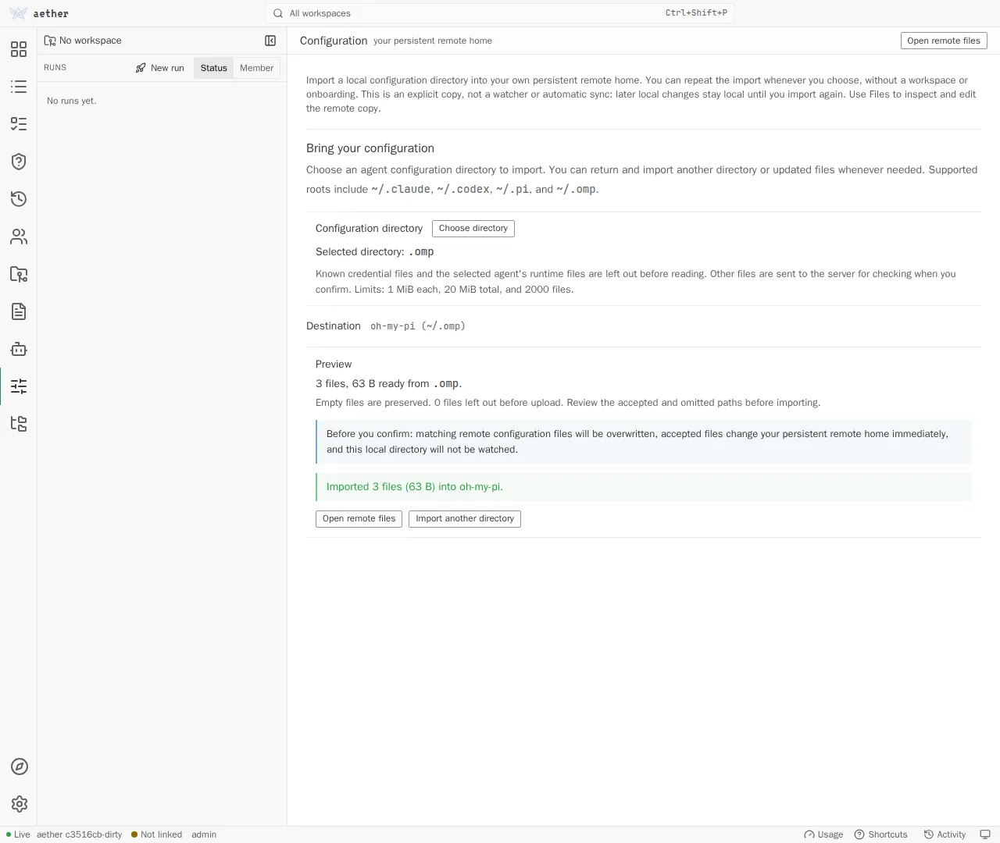
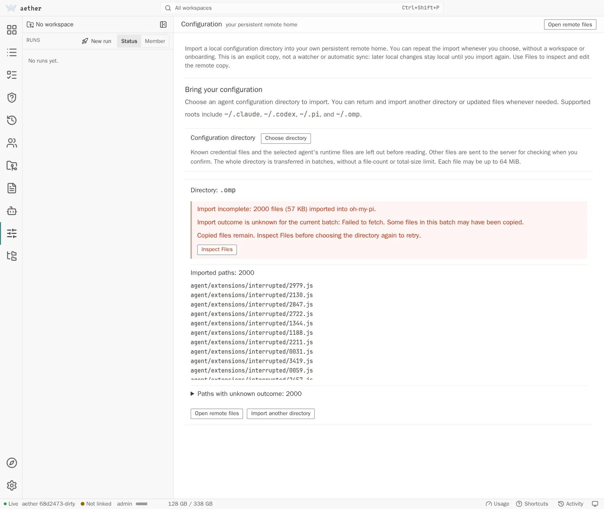

# Agent harnesses

A **harness** is one agent CLI and everything Aether needs to know to launch
it: how to start it in interactive and headless mode, where its login state
lives, where its configuration lives, and which environment variables carry an
API key. The registry is `internal/harness`, a map and a few functions - not a
plugin system.

Two rules shape everything below:

1. **Aether does not install agents for you.** A member runs the displayed
   vendor install command in their environment terminal. The command should
   install the executable into `~/.local/bin`. Once a shipped agent is
   installed there, Aether keeps it current; see
   [Updates before launch](#updates-before-launch).
2. **Aether does not copy vendor credentials to clients or synchronize them.**
   Logins happen through the vendor's own flow in an Aether terminal.
   Credentials remain in the member home; an explicit account share mounts only
   the harness's login path (the **Login state** column below) from that home
   into a recipient's run, a whole directory for `omp`. For the read-only subscription quota
   indicator, the server may read supported native Claude Code and Codex
   subscription credentials in that home and call the vendor's fixed HTTPS
   usage endpoint. Credential bytes and provider responses are never sent to
   the browser or a run.

The quota reader supports native OAuth subscription logins for Claude Code and
Codex only. API-key logins, `pi`, `omp`, `opencode`, `fake`, and deployment
custom harnesses are not quota sources. The dashboard explains an unsupported
source rather than treating missing usage as zero. Native vendor
reauthentication remains a member action in the environment terminal; Aether
does not refresh or rewrite OAuth files.

### Subscription quota

The dashboard requests `account.usage` with
`{"account_member_id":"<member-id>","refresh":false}`; an omitted or empty
account selects the authenticated member. The result always has Claude and
Codex rows. Each row reports only percentages and reset times returned by that
provider. The internal provider endpoints are vendor APIs and may change
without notice; a row can therefore be `unauthenticated`, `unsupported`,
`unavailable`, `stale`, or `error` instead of inventing a number.

Successful results normally remain cached for 60 seconds. `refresh:true`
bypasses that success TTL but still observes a 10-second request floor; errors
are retried no faster than 60 seconds and provider retry deadlines are honored.
Stale data is retained only for the same credential identity, always carries
its error and `stale` status, and is not shown as current after its reset
window has passed without a new measurement.

## Shipped harnesses

| `--agent` | CLI | Login state | Configuration root | API key env | Launch env | Status | Steering | Env setup |
| --- | --- | --- | --- | --- | --- | --- | --- | --- |
| `claude` | Claude Code | `~/.claude/.credentials.json` | `~/.claude` | `ANTHROPIC_API_KEY` | `IS_SANDBOX=1` | hooks (`--settings`) | PTY | yes |
| `codex` | OpenAI Codex CLI | `~/.codex/auth.json` | `~/.codex` | `OPENAI_API_KEY` | - | notify (`-c notify=[...]`) | PTY | yes |
| `pi` | pi | `~/.pi/agent/auth.json` | `~/.pi` | `ANTHROPIC_API_KEY`, `OPENAI_API_KEY` | - | extension (`-e`) | PTY | yes |
| `omp` | oh-my-pi | `~/.omp/agent` (directory) | `~/.omp` | `ANTHROPIC_API_KEY`, `OPENAI_API_KEY` | - | extension (`-e`) | PTY | no |
| `opencode` | opencode | `~/.local/share/opencode/auth.json` | `~/.local/share/opencode` | `ANTHROPIC_API_KEY`, `OPENAI_API_KEY` | - | plugin (V1 inline config / V2 discovery) | PTY (`\r\r`) | no |
| `fake` | a script you name | - | - | - | - | - | PTY | no |
| `custom` | deployment-supplied | - | - | - | - | - | PTY | no |

Paths are inside the run container, relative to the run user's home (`/root`,
or `/home/aether` for a non-root image user). **Login state** is the path an
account share mounts from the owner's home into a recipient's run
(`harness.Profile.CredentialPaths`); everything else there is the launcher's.
`omp` shares a directory because its login is a SQLite WAL database beside its
settings, MCP configuration, extensions, and sessions. omp loads extensions and
MCP server commands from that directory, so a recipient's run can plant code
that runs in the owner's own omp sessions, and the owner's extensions run in
the recipient's run; share an `omp` account only with someone you would give
your home to ([security.md](security.md#account-sharing)).

The `config.roots` response used by the dashboard carries a `runtime_ignores`
list for each configuration root. These are root-relative paths, and the
browser applies them before reading selected file bytes with case-sensitive
exact or component-prefix matching; trailing slashes are presentation-only.
This policy is destination-specific: a directory whose basename is renamed or
ambiguous must be assigned to a destination before the import preview can be
read. Credential names remain globally excluded, independent of this runtime
list.

The **Env setup** column marks harnesses that can participate in agent setup:
the dashboard can open the member's environment terminal for installation and
login. Exactly `claude`, `codex`, and `pi` qualify; everything else stays
launchable for runs but is not offered in that setup flow.

Every newly created managed runtime container receives the verified
`/usr/local/bin/aether-internal` CLI, including taskless runs, custom images,
member terminals, and verification containers. Runs also receive their own
identity socket, including when conflict coordination is disabled. Member
terminals and verification containers do not inherit a run identity.
Staging failure refuses creation rather than silently omitting the CLI.

No harness receives an automatic Aether MCP registration flag or config.
Supported harnesses receive a short native per-launch discovery hint;
`aether-internal skill` loads live capability and assignment guidance.
Containers without run identity receive only general guidance, not borrowed
authority. OpenCode's discovery configuration does not depend on the optional
lifecycle-status plugin.

The startup switches follow the vendor references: [Claude CLI
reference](https://code.claude.com/docs/en/cli-reference),
[Codex configuration reference](https://learn.chatgpt.com/docs/config-file/config-reference),
[pi CLI reference](https://github.com/badlogic/pi-mono/blob/main/packages/coding-agent/README.md),
[omp CLI reference](https://omp.sh/docs/cli), and
[OpenCode configuration](https://opencode.ai/docs/config/). Aether passes these
only for the one launch that owns the coordination socket.

The **Status** column is how the agent itself tells Aether it is waiting for
you, rather than leaving the server to guess from silence. See "Status
reporting" below.

The **Launch env** column is what the server sets in the run container
because the CLI will not start without it. It is applied after the
workspace's own variables, so a workspace cannot leave the agent unable to
run. See the launch table below for why `claude` needs one. Optional reporter
environment (OpenCode V1's `OPENCODE_CONFIG_CONTENT`) is not a required
**Launch env** value; see "Status reporting" for its interactive-only scope.

Fixed launch values replace workspace values of the same name. Native
OpenCode coordination has version-specific merge/discovery behavior,
described under [managed loading](#managed-native-loading).

- **TUI.** Container PID 1 supervises the harness and opens a login shell after
  any normal harness exit. Exiting that shell opens another, so the run and
  container remain `running` until an explicit Close, Kill, or Delete, or until
  the agent's own success or failure report finishes the run (see
  [Report an outcome](coordination.md#report-an-outcome)).
- **Headless.** The harness is the container's main process. When it exits,
  Aether commits and publishes the branch, records `completed` or `failed`,
  and destroys the container immediately. It never opens a replacement shell
  and is never relaunchable.

Close a TUI run explicitly:

```sh
aether close <run> --outcome merged
aether close <run> --outcome abandoned
```

Close pauses the container and retains the exact container, checkout, run row,
member account, and coordination surfaces for `--run-container-ttl`. The
default is `168h` (7 days); `0` uses that default. A negative value
disables retention and cleans up immediately. Kill and Delete remain immediate
cleanup operations.

Relaunch is available only for a retained TUI run - closed, or finished by its
agent's report - while its retention deadline has not passed:

```sh
aether relaunch <run>
```

It resumes the same row, container, checkout, member account, and coordination
surfaces; it performs no new launch, checkout, container, branch, or disk-floor
admission. Expired or unavailable runs cannot relaunch. A deployment-supplied
argv override receives no registry-only flags, because nothing checks that the
override is still the registered CLI. See [failure-handling.md](failure-handling.md).

## Incoming coordination hooks

Coordination uses the durable run mailbox, not terminal keystrokes. An
**inbox integration** tells the agent to read mail; a **status reporter**
tells Aether what the agent is doing. They are separate even when both load
through the same native extension/plugin mechanism.

| Integration | Launch profile | Mail at next boundary | Native idle wake | Copyable asset |
| --- | --- | --- | --- | --- |
| Claude Code | `claude` | yes | no | `claude.json` |
| Codex | `codex` | yes | no | `codex.json` |
| Native pi | `pi` | yes | yes, owning session only | `pi.ts` |
| OMP | `omp` | yes | yes, main agent only | `omp.ts` |
| OpenCode V1 | `opencode` | yes | yes, selected root only | `opencode-v1.js` |
| OpenCode V2 | `opencode` | yes, V2 API only | yes, selected root only | `opencode-v2.js` |
| Copilot CLI | custom definition required | yes | no | `copilot.json` |
| Gemini CLI | custom definition required | yes | no | `gemini.json` |
| Cursor CLI | custom definition required | yes | no | `cursor.json` |
| Fake | scheduler test profile | explicit inbox only | no | none |
| Other/custom | deployment/member definition | adapter required | native API required | `generic.sh` |

“Yes” requires the matching integration to be loaded and executing in the
owning live session. It is not a promise that a copied file, a registry
profile, or a status reporter activates inbox delivery. Native idle wake is
for eligible TUI runs, not a way to restart headless or exited processes.

### Installation and activation

Inside the run, inspect configuration and export the asset for **only the
current harness**:

```sh
aether-internal skill
aether-internal hook file
aether-internal hook file claude.json
```

For JSON, append missing Aether entries to each `hooks` event array; preserve
unrelated settings and hooks. Do not install duplicates at user and project
scope. Copilot and Cursor snippets use `version: 1`; resolve an existing
version conflict rather than overwriting it. Commands invoke
`/usr/local/bin/aether-internal` directly, without `jq` or another script.
For TypeScript/JavaScript, export the matching file to the destination below
only if absent; inspect/diff an existing file before editing. No executable
bit is needed. For example, a new manual OMP installation is:

```sh
mkdir -p "$HOME/.omp/agent/extensions"
test ! -e "$HOME/.omp/agent/extensions/aether.ts" &&
  aether-internal hook file omp.ts > "$HOME/.omp/agent/extensions/aether.ts"
```

Do not add a manual copy merely because a managed run-scoped extension is
absent from the checker’s fixed paths. `skill` is read-only: **configured
means present on disk, not loaded, trusted, or executed**. It checks standard
user and current-directory project paths, not every ancestor, package,
explicit CLI path, or runtime override. Restart/reload as below, inspect the
native load errors, and verify a real event in the intended root session.
Never edit trust records or remove an intentional disable setting to make
the checker green.

For OMP, `unverified (modified/unknown source at ...)` describes only the
named manual file's mismatch with the CLI's embedded asset. An older
context-only extension can produce that result while a managed launch names
`-e /run/aether`. Inspect the live launch arguments and
`/run/aether/aether.ts` separately; neither the manual mismatch nor a matching
managed file proves which handlers executed. Compare with
`aether-internal hook file omp.ts`, preserve custom code and disable settings,
then verify a real context boundary and idle wake before claiming activation.

### Managed native loading

For the shipped `pi`, `omp`, and `opencode` profiles, Aether stages native
mailbox assets for **coordinated, task-bearing TUI launches**. Taskless,
headless, disabled-coordination, and custom/overridden argv launches do not
get this automatic mailbox installation. Manual integrations remain usable
where the harness supports them; a boundary hook in a headless process does
not grant it idle wake.

For pi, the server stages `/run/aether/aether.ts` and adds
`-e /run/aether/aether.ts`. For OMP it stages that same filename but adds
`-e /run/aether`, using the native directory loader. Both retain the
separate `/run/aether/status.ts` reporter. Managed loading skips
`--no-extensions` / `-ne` and does not change persistent user/project
configuration. Current manual/managed copies share one receiver rather than
starting independent watchers. If an older context-only copy is also loaded,
it can still execute its own context helper; it does not acquire the current
receiver's shared lifecycle. A manual-source warning is not an instruction to
add another copy or overwrite that file.

Pi's explicit-file loader would otherwise bypass resource exclusions, so
the managed copy reads settings through pi's public `SettingsManager`.
**Any** negative `!` or `-` extension selector in global/project settings or
a package's extension selectors conservatively disables automatic mailbox
loading, with a warning; unreadable settings also fail closed. A separately
loaded, explicitly authorized manual copy is unaffected. OMP instead uses
its native `disabledExtensions` directory filter, described below.

OpenCode's managed wrapper preserves the original argument boundaries:

```sh
/bin/sh /run/aether/opencode-native-launch.sh /run/aether \
  opencode --prompt="<task>"
```

The wrapper checks the installed `opencode --version`: major 1 selects V1,
major 2 selects V2, and another major refuses managed startup with an error.
A custom launch definition remains the explicit alternative. The API targets
below are specific releases, not a guarantee for every future release in
those majors.

- **V1:** `/run/aether/opencode-native-v1.json` merges the workspace's inline
  config with file URLs for `/run/aether/opencode-v1.js` and
  `/run/aether/opencode-status.js`, preserving unrelated fields and plugin
  entries. The wrapper supplies it through `OPENCODE_CONFIG_CONTENT`.
- **V2:** the wrapper adds `--standalone`, selecting a private TUI-owned
  server rather than the member home's detached service. This keeps server
  and receiver lifetime tied to this run and avoids cross-container service
  registration collisions. The server stages `opencode-v2.js` and
  `opencode-status-v2.js` in `/run/aether` and mounts them read-only at
  `/.opencode/plugins/aether-mailbox-<run-id>/index.js` and
  `/.opencode/plugins/aether-status-<run-id>/index.js`. Native ancestor
  discovery loads these packages before user enable/disable directives.
  `OPENCODE_CONFIG_CONTENT` remains unchanged. The stable plugin IDs are
  `aether-mailbox` and `aether-status`, regardless of the run-specific directory.

`OPENCODE_PURE=1` or `OPENCODE_PURE=true` (case-insensitive `true`)
suppresses managed OpenCode mailbox and status additions; `0` and `false`
do not. V2's native
`plugins: ["-aether-mailbox"]` disables only mailbox automation;
`"-aether-status"` disables its reporter and `"-*"` disables all discovered
plugins. Preserve these choices. Aether writes neither the worktree nor
member configuration and does not mount over an existing user plugin path.

### Claude Code inbox integration

Export `claude.json`; merge into `~/.claude/settings.json` (or
`$CLAUDE_CONFIG_DIR/settings.json`). Project alternatives are
`.claude/settings.json` and `.claude/settings.local.json`.
Restart Claude Code and review `/hooks` in its normal workspace-trust UI.
Honor `disableAllHooks`, `allowManagedHooksOnly`, and managed settings such
as `/etc/claude-code/managed-settings.json`.

The supported events are `SessionStart`, `UserPromptSubmit`, `PostToolBatch`,
and `Stop` from the current [Claude hook API](https://code.claude.com/docs/en/hooks).
Older releases may lack these events or context outputs. Child-agent events
do not take ownership of the run mailbox. Stop may request one continuation
for pending mail or an integrator refresh; it is not an idle watcher. The
built-in `--settings` status reporter alone is not this inbox installation.

### Codex inbox integration

Export `codex.json`; merge into `~/.codex/hooks.json` (or
`$CODEX_HOME/hooks.json`), alternatively `.codex/hooks.json`.
Restart Codex, then use `/hooks` to review and trust the **exact hook
definitions**; repeat after changing them. Project trust is not hook trust.
Honor managed policy and `features.hooks` / `features.codex_hooks` controls
in the applicable `config.toml`.

Supported events are `SessionStart`, `UserPromptSubmit`, `PostToolUse`, and
`Stop`, filtered against child-agent events. The built-in `notify` reporter
only reports turn completion: it neither installs these hooks nor wakes
later-idle Codex. Use a version implementing the current
[Codex hook contract](https://learn.chatgpt.com/docs/hooks).

### Native pi inbox integration

The native API target is **pi 0.87.1**. For manual installation, export
`pi.ts` to `~/.pi/agent/extensions/aether.ts`, or
`$PI_CODING_AGENT_DIR/extensions/aether.ts`; the project alternative is
`.pi/extensions/aether.ts`. Restart pi or use `/reload`, inspect extension
load errors, and preserve configured extension/resource exclusions and
`--no-extensions`.

The extension adds guidance at the per-model `context` event. Native wake
uses `sendMessage` with `triggerTurn: true` and `deliverAs: "followUp"`, but
**does not proactively queue during busy work**. Pi suspends the idle wake
receiver for an active turn; context hooks continue, and new mail stays
durable and unnotified. Successful native `agent_settled` plus `isIdle`
rearms a fresh helper snapshot and admission before dispatch, rather than
restarting a wake helper after every model call. This avoids leaving a
custom hint queued through a retry or compaction Stop; a successful
automatic retry still rearms wake normally.

Pi owns one root session and follows its new/resume/fork lifecycle, not
independent multi-root SDK hosts. Stop/abort, failed native settlement, or
compaction abort pauses wake until an accepted non-extension user message
(not merely an input callback) or an explicit session replacement. The
configured interrupt key is observed without consuming it. UI prompts
suspend observation until resolved; extension continuations do not undo Stop.

### OMP inbox integration

The native API target is **OMP 18.3.1**. Export `omp.ts` to
`~/.omp/agent/extensions/aether.ts`, or `.omp/extensions/aether.ts` for the
project. A profile can change the user destination: run `omp config path`
and use its active agent directory, not a guessed default. The checker
accounts for `OMP_PROFILE` / `PI_PROFILE` and `PI_CODING_AGENT_DIR`; CLI
`--profile`, `--config`, and `-e` overrides require checking the live launch.
Restart OMP after installation.

Only the main agent handles `context` and native wake. `sendMessage` uses
`triggerTurn: true` and `deliverAs: "followUp"` **only while idle**. Busy work
suspends the wake receiver; context hooks still point to the durable inbox.
Mail read and acknowledged during that work must not leave a follow-up queued
after its final response. Mail still unread at settlement receives fresh
server admission before a single deferred wake.

OMP 18.3.1's [extension `agent_end`](https://github.com/can1357/oh-my-pi/blob/v18.3.1/packages/coding-agent/src/extensibility/shared-events.ts)
can precede prompt cleanup and carry `willContinue: true` for native retries
or todo reminders. It is not the idle
boundary. The receiver observes the owning `AgentSession`'s public terminal
`agent_end`, waits for `waitForIdle()` outside that callback, rechecks
`ExtensionContext.isIdle()` and session generation, then requests an immediate
fresh mailbox snapshot. It does not use pi's `agent_settled` events.
Stop/abort cancels the receiver and any pending settlement observation until
actual non-extension input starts a turn or an explicit session switch/branch
replaces it. Tool-approval prompts suspend observation until resolved; their
resolution does not authorize queuing a turn while work remains busy.

Honor `--no-extensions` and
`disabledExtensions: [extension-module:aether]`. On OMP 18.3.1, directory
loading (`-e /run/aether`) applies that disabled-module filter; explicit-file
loading (`-e /run/aether/aether.ts`) bypasses it and must not be used to
circumvent the user's choice.

### OpenCode V1 inbox integration

The V1 API target is **OpenCode 1.18.32**. Check `opencode --version`, then
export **only** `opencode-v1.js` to
`~/.config/opencode/plugins/aether.js` (or
`$XDG_CONFIG_HOME/opencode/plugins/aether.js`); a project alternative is
`.opencode/plugins/aether.js`. An explicit `OPENCODE_CONFIG_DIR` may supply
another plugin directory. Restart OpenCode and inspect plugin load errors.

The plugin binds the first explicitly prompted root session. Child sessions
are ignored; prompting a different root retires the receiver until the
plugin host restarts, rather than transferring the mailbox. The context
hook supplies a trusted inbox instruction. Native wake uses
`client.session.promptAsync` with a synthetic text part, **only after a
successful turn completes and the root is idle**. Mail arriving during busy
work stays durable until a fresh helper admission at that boundary. V1's
prompt API joins active work; it is not a next-turn queue and has no Aether
`followUp` argument.

Stop or error pauses wake until the next explicit prompt in the same root.
An unclassified idle event (for example, shell/setup cancellation) does not
rearm wake; a successful model completion is required. Preserve
an intentional `OPENCODE_PURE=1` or `true`, which disables external plugins
(`0` and `false` do not). Do not load the V2 file.

### OpenCode V2 inbox integration

The V2 API target is **OpenCode 2.0.18** (`@opencode/cli`). Check
`opencode --version`; export **only** `opencode-v2.js` to
`.opencode/plugins/aether-mailbox/index.js`. The user alternative is
`~/.config/opencode/plugins/aether-mailbox/index.js` under the active XDG
config root. The asset default-exports the native `{id, setup}` definition
and uses only Node built-ins; neither a `package.json` nor an
`@opencode/plugin` runtime installation is needed. Restart the V2 plugin
host and inspect load errors. For a manual Aether launch, use
`opencode --standalone` to keep its server owned by the run's TUI, not a
detached service shared through the member home.
Its stable ID is `aether-mailbox`, so honor native
`"plugins": ["-aether-mailbox"]` or `["-*"]` disable directives.
`OPENCODE_CONFIG_DIR` relocation is unverified for V2; do not infer it from
V1's behavior.

V2 also supports legacy auto-discovered `plugins/aether.js` files in these
roots; [its pinned loader distinguishes these from explicitly configured
local plugins](https://github.com/anomalyco/opencode/blob/v2.0.18/packages/core/src/plugin/module.ts),
which use directory packages. Inspect any existing flat file before adding
the recommended package. The first exported `aether-mailbox` ID wins, so an
older manual V2 copy can shadow the managed integration without running a
second receiver. Update or migrate an authorized existing copy rather than
installing both. A V1 asset at that filename is not a V2 integration.

**V2 startup caveat:** in 2.0.18, an initial task passed with `--prompt` can
remain prefilled in the composer instead of submitting. If the TUI is ready
and that task has not started, press Enter once to submit it. This is human
submission of the initial prompt, not mailbox delivery: Aether does not
auto-press Enter or add a PTY workaround. Later admitted mailbox wake uses
the native session API after the owning root has completed a turn.

V2 uses `ctx.session.hook` for prompt/context and `ctx.session.prompt` with
`delivery: "queue"` for the trusted wake text. Despite that queue API, this
integration **defers busy mail until successful completion and settlement**:
V2 reports interruption after cleanup, too late to safely enqueue during a
human Stop. It rechecks the root outcome and obtains fresh helper admission
before dispatch; it does not steer active work.

The first explicitly prompted root owns the receiver. Children are ignored;
prompting another root retires it until plugin-host restart. Stop/error
pauses wake until the next explicit prompt in the same root; deleting,
archiving, or moving the root ends its ownership. Do not load both versioned
files. A V1 status reporter or V1-compatible argv does not establish V2
plugin activation. Preserve plugin disable/trust policy and verify a real
session event.

### Copilot CLI inbox integration

Copilot CLI is integration-only, not a built-in launch profile. Export
`copilot.json`; merge into `~/.copilot/hooks/aether.json` (or
`$COPILOT_HOME/hooks/aether.json`), alternatively
`.github/hooks/aether.json`. Quit and restart in the intended trusted
repository. Honor `disableAllHooks`, `allowManagedHooksOnly`, enterprise
policy, and session trust; `--config-dir` may require a different destination.

Supported events are `sessionStart`, `postToolUse`, and `agentStop`, using
the current [Copilot hook API](https://docs.github.com/en/copilot/reference/hooks-reference).
Config-file `userPromptSubmitted` output is not used for context delivery.
There is no later-idle wake.

### Gemini CLI inbox integration

Gemini CLI is integration-only. Export `gemini.json`; merge into
`~/.gemini/settings.json`, or `.gemini/settings.json` for the project.
`GEMINI_CLI_HOME` is the **parent** of `.gemini`, not that directory itself.
Fully exit and restart Gemini, then inspect `/hooks list`.

The supported events are `BeforeAgent`, `AfterTool`, and `AfterAgent` in
the current [Gemini hook API](https://geminicli.com/docs/hooks/reference/).
Honor folder trust, system settings, `hooksConfig.enabled`, and
`hooksConfig.disabled` (the hook name is `aether-inbox`). An intentional
disable is not permission to run `/hooks enable` automatically. These are
boundary hooks, not an idle receiver.

### Cursor CLI inbox integration

Cursor CLI is integration-only. Export `cursor.json`; merge into
`~/.cursor/hooks.json` or `.cursor/hooks.json`. Use `/quit` or `/exit`,
restart in the intended workspace, respect workspace trust, and inspect
`/logs` while exercising an interactive boundary. `CURSOR_CONFIG_DIR` and
`XDG_CONFIG_HOME` do not establish a documented relocation rule for
`hooks.json`; verify custom paths in the running CLI.

Events are `sessionStart`, `postToolUse`, and `stop` in the current
[Cursor hook API](https://cursor.com/docs/hooks). Older `--print` releases,
including **2026.08.11-e8db854**, omit `stop`; headless parity is not
guaranteed. Another stop hook can supersede `followup_message`. Aborted
turns and repeated stop continuations do not receive another Aether
continuation. There is no later-idle wake.

### Fake inbox support

`fake` is a deterministic scheduler/test harness, not a vendor integration.
It receives the run-mounted CLI and identity socket, but has no shipped
context hook, status reporter, trust UI, or native wake API. When coordination
is enabled, it must read and acknowledge the inbox explicitly.

### Custom and unlisted harnesses

A launch definition only supplies argv; it does not prove a CLI has loaded
an inbox integration. Export `generic.sh` for a plain-stdout native context
boundary, or adapt its output with the host's documented serializer. There
is no universal destination or activation command. Native idle wake requires
a real session API and lifecycle/Stop integration; do not emulate it with
PTY input. Follow the [unsupported-harness authoring guide](harness-integration.md)
for runnable examples and the complete contract.

### Shared delivery and wake limits

While actively coordinating, use `aether-internal inbox --wait 30`; an active
inbox waiter has priority over native observers. Native wake carries only a
trusted inbox pointer, never peer text at system/developer priority. The
agent reads attributed bodies through `inbox`, processes the batch, and
explicitly acknowledges its returned token. Sending, hinting, and native
API acceptance are not acknowledgement or proof the model read anything.

Protection and human takeover suppress new wake admission without losing
mail. Current run/mission authority is checked again when the server
dispatches the admitted response, not from a cached eligibility flag.
A wake already accepted before a later hold may still be processed. Native
receivers cancel stale session generations and respect Stop/abort and
approval waits; none starts a dead process or attaches to an arbitrary TUI.
Without a loaded working integration, use explicit inbox reads; there is no
silent terminal fallback.

Native receiver errors appear in the harness warning UI or stderr. Only
recoverable helper/transport failures get bounded backoff; unsupported
protocols and nonretryable helper errors stop observation rather than spinning.
After exhausting helper retries, pi/OMP require a reload/restart; OpenCode
pauses until another explicit same-root prompt. Native synchronous send
rejection instead permits [lifecycle-driven recovery with fresh admission](harness-integration.md#keep-observation-and-notification-separate),
without marking the rejected IDs notified or blindly resending. Fix the
underlying error first; reloading never erases or acknowledges durable mail.

Command stop hooks may request one continuation for pending mail or an
integrator's final mission refresh, even with an empty inbox. Native
repeat-stop guards prevent loops. Automatic hook checks have a separate
bounded allowance, so they cannot consume explicit coordination capacity.
See [delivery semantics](coordination.md#delivery-acknowledgement-and-retries)
for acceptance, acknowledgement, and retries.

## Status reporting

**Working** and **Idle** describe execution. Idle remains the display label
for the existing `needs-attention` status and includes settled, failed, and
stalled execution. **Needs input** is a separate indicator: it requires an
unresolved, correlated question, form, extension dialog, or permission
request. A run can be Working and need input at the same time. Turn end,
silence, notification text, and a question in the final response do not
establish a pending request.

A harness with a **Status** entry can run a command on its own lifecycle
events. Aether points each one at the staged server binary inside the
container, through whatever the CLI's own mechanism is, for that launch
alone - by flag where the CLI has one, by environment where it does not -
and where that mechanism needs a file, the file is written into the run's
coordination directory. The status-only argument additions are shown below;
task-bearing native launches also use [managed loading](#managed-native-loading):

```
claude --dangerously-skip-permissions "<task>" \
  --settings /run/aether/claude-settings.json

codex --dangerously-bypass-approvals-and-sandbox "<task>" \
  -c 'notify=["/opt/aether/aether-server","report","codex"]'

pi "<task>" -e /run/aether/status.ts
omp --auto-approve "<task>" -e /run/aether/status.ts
```

OpenCode's reporter-only/taskless profile uses V1's
`OPENCODE_CONFIG_CONTENT` plugin mechanism:

```sh
OPENCODE_CONFIG_CONTENT='{"plugin":["file:///run/aether/opencode-status.js"]}' opencode
```

Task-bearing managed launches instead select a version-matched V1 or V2
status plugin alongside the mailbox plugin. V2 translates native execution,
permission, and form events into the same canonical reporter commands.
Taskless launch wiring is not a V2 activation guarantee; use a matching
manual integration/custom launch and inspect the actual plugin host.

Every reporter uses the existing staged binary and coordination socket:

```sh
/opt/aether/aether-server report claude                 # hook JSON on stdin
/opt/aether/aether-server report codex '<notify JSON>'
/opt/aether/aether-server report pi --json '<report JSON>'       # pi and OMP
/opt/aether/aether-server report opencode --json '<report JSON>' # V1 and V2
```

Stateful extensions/plugins send `state` (`working` or the legacy `waiting`
wire value), an optional `reason`, and `input_updates`. Their `replace`
update contains the complete current request list, including `[]` when
empty. Claude's stateless hooks send matching `open`/`close` updates.
Each request contains only `id`, `session_id`, and `kind` (`question`,
`permission`, `form`, or `extension_ui`). Identity includes all three:
answering one request cannot clear another session's request with the same
ID. An input-only report leaves execution unchanged. No prompt, answer,
tool arguments, transcript, URL, or credential is included in metadata.
There is no second report transport and no new way to answer prompts;
use the existing terminal or native approval/question surface.

| Reporter | Execution evidence | Needs input evidence and limits |
| --- | --- | --- |
| Claude command hooks | `UserPromptSubmit`, ordinary tool activity, and `SubagentStart` report Working. Root `Stop` reports Idle unless `background_tasks` is nonempty. `StopFailure` reports Idle with a failure reason, not an input request. | `AskUserQuestion` opens by `tool_use_id`; matching completion/failure closes it. MCP `Elicitation`/`ElicitationResult` open/close a form **only when `elicitation_id` is present**. Child identity includes `agent_id`. `SessionEnd` clears the terminated scope; ordinary Stop/SubagentStop does not clear requests. |
| OpenCode V1 1.18.32 | Tracks all native busy sessions; one child becoming idle cannot park another active session. | `permission.asked`/`question.asked` preserve `id` and `sessionID`; replies/rejections close the matching `requestID`. Idle reconciles that session's known requests with the released `/permission` and `/question` lists, including interruption cleanup without a reply event. |
| OpenCode V2 2.0.18 | Tracks `session.execution.started` until succeeded, failed, interrupted, or session deletion. | `permission.asked/replied` and released `form.created/replied/cancelled` preserve request and session IDs. Terminal execution and permission replies reconcile known permissions through `ctx.permission.list`. Session deletion removes only that session's requests. |
| pi 0.87.1 | Starts report Working; `agent_settled` or confirmed idle after `agent_end` reports Idle. A late finalized message cannot restart settled execution. | Named `ask`/`AskUserQuestion` tools retain `toolCallId` until tool execution ends. The documented `ui_prompt_start/end` pair tracks blocking extension UI with one process/session-scoped ID; Pi emits this pair around the outermost dialog, including dismissal/rejection. Titles and answers are discarded. |
| OMP 18.3.1 | Uses its public main-session terminal event and `waitForIdle()` so owned background work can drain before Idle; automatic continuation is not settlement. | Named ask tools retain `toolCallId`. `tool_approval_requested/resolved` retain `sessionId` and `toolCallId`, including rejection. The pinned native TUI API has **no generic `ui_prompt_start/end` equivalent**. |
| Codex legacy notify | `agent-turn-complete` reports Idle only. | No correlated input evidence in this integration. No app-server migration or inference from the final message. |

Pi, OMP, and OpenCode forward native Working reports even when the request
snapshot is unchanged. Pi/OMP tool callbacks, V1 busy status callbacks, and
V2 concurrent execution starts refresh liveness without inventing input or
status transitions. Actual settlement still reports Idle; silence without
further activity can still trigger the stall detector.

OpenCode keeps execution and requests independent: a native busy session
stays Working while its tool awaits input, and a background session can
remain Working after the requesting session becomes idle. Closing a request
does not invent a new busy session. An unresolved request survives ordinary
settlement; matching completion, authoritative native reconciliation, or
actual session/run termination clears it.

Failed or invalid OpenCode request-list reads retain the observed requests
and schedule retries with a one-second delay. Successful reconciliation
stops retrying that snapshot, even if some requests remain live. Matching
replies, session deletion and plugin shutdown cancel obsolete work; an older
read cannot clear a newly opened request. Both versions use a four-second
query timeout. V1 serializes retries with lifecycle events; V2 allows one
query or delay per affected session.

The public CLI surfaces have limits:

- Claude `PermissionRequest` explicitly omits `tool_use_id`, and
  `Notification` permission/elicitation alerts have no correlated
  resolution identity. Neither creates a durable Needs input indicator.
  Elicitations without IDs are likewise unsupported. Claude has no general
  command-hook interrupt/request-list API; an interrupted request whose
  completion hook is absent can remain until session termination. Root
  Stop can observe background work, but these stateless hooks cannot infer
  root completion from a later child-only stop. Scheduled future wakeups
  (`session_crons`) alone are not current work.
- V1 reconciliation uses the public plugin `serverUrl`, the `directory`
  query, and documented HTTP Basic authentication from
  `OPENCODE_SERVER_PASSWORD` / `OPENCODE_SERVER_USERNAME` (default username
  `opencode`). Unreachable or rejected native APIs retain the last-known
  requests and report the real error through OpenCode's log; they do not
  guess that input was resolved.
- The released V2 2.0.18 plugin context has `permission.list` but **does not
  expose `session.form.list`**. Forms rely on their native reply/cancel and
  session-deletion events; dropped form events cannot be reconstructed by
  an invented list API. Current-development `question.v2.*` events are not
  this release's contract.
- Native plugin event streams are live, not a durable replay log. A plugin
  reload or missed event can lose adapter evidence; persistence on Aether's
  side cannot reconstruct a callback the native host never delivered.
- OMP's separate `rpc-ui` mode and Codex app-server can expose other input
  APIs, but Aether does not change native CLI hosting mode to use them.
  Gemini, Copilot, and Cursor inbox hooks remain inbox integrations, not
  status/input reporters. Default permission-bypass/auto-approve flags
  suppress many ordinary permission prompts.

Source contracts: [Claude command hooks](https://code.claude.com/docs/en/hooks),
[V1 1.18.32 public SDK endpoints](https://unpkg.com/@opencode-ai/sdk@1.18.32/dist/v2/gen/sdk.gen.js),
[OpenCode HTTP authentication](https://opencode.ai/docs/server/#authentication),
[V2 2.0.18 form events](https://unpkg.com/@opencode/schema@2.0.18/dist/form.js),
[V2 released plugin session API](https://unpkg.com/@opencode/plugin@2.0.18/dist/promise/session.d.ts),
[Pi 0.87.1 UI prompt lifecycle](https://github.com/earendil-works/pi/blob/v0.87.1/packages/coding-agent/src/core/extensions/runner.ts),
and [OMP 18.3.1 extension events](https://github.com/can1357/oh-my-pi/blob/v18.3.1/packages/coding-agent/src/extensibility/extensions/types.ts).

`codex` only says when a turn ends. It never says a new one started, so its
run comes back to `running` the way a harness with no reporter does: on
agent output or a file change. Everything drawn in the terminal counts
there, the echo of your own typing included, so a long prompt typed into a
parked `codex` run can read as `running` before you send it. `claude`, `pi`
and `omp` report both ends, and their runs stay parked until the agent
itself says it is working again - a TUI repainting while you type is not
work.

Execution and the current pending-request set are persisted separately, so
both survive an Aether server restart for a still-live run. The server emits
`run.input` only when the request set changes; it does not replay old input
deltas as new opens. Actual run termination/relaunch clears the old
lifetime's requests. See [failure-handling.md](failure-handling.md).

For a harness with a **Status** of `-`, nothing changes: the run is judged
on silence alone and parks at `needs-attention` after `--stall-threshold`
with a reason that leads with `stalled:`. See
[failure-handling.md](failure-handling.md).

The following disable or exclude automatic reporting:

- **Headless runs.** `--mode headless` never gets the reporter: the agent
  exits when it is done and never waits for anyone.
- **`--conflict-coordination=false`.** Lifecycle reporting is disabled, but
  the run identity socket, canonical CLI and discovery remain available.
- **An argv override.** A `--harness-definitions` entry that redefines a
  shipped harness drops the status arguments, status environment, and
  taskless discovery mechanism - nothing checks the overridden command is
  still that CLI.
- **Truthy `OPENCODE_PURE` in the workspace environment.** `1` or
  case-insensitive `true` disables OpenCode's external plugins, Aether's
  included; `0` and `false` do not. Aether preserves the member's choice.
  With plugins disabled, the run still launches but reports nothing and is
  judged on silence like a harness with no reporter.
- **V2 plugin directives.** `plugins: ["-aether-status"]` excludes the
  managed V2 reporter without excluding the mailbox; `["-*"]` excludes both.

Assets are server-written and read-only, staged in `/run/aether`; managed V2
also receives the run-specific discovery mounts described above. None is
written into the worktree or member's persistent configuration.
`--settings` layers over Claude Code's settings; `-e` adds a pi/OMP status
extension; `-c` overrides Codex's `notify` for this launch only, so a member's
own notify command still works outside that Aether run.

OpenCode config handling depends on the launch. A task-bearing managed V1
launch preserves existing inline fields/plugins and adds its two plugins;
V2 keeps that environment value unchanged and uses native discovery.
The older reporter-only/taskless profile still reserves
`OPENCODE_CONFIG_CONTENT`, replacing a workspace value rather than merging
it. For configuration needed in both paths, use a file named by
`OPENCODE_CONFIG`, which Aether does not set. Do not assume V1 and V2 plugin
configuration schemas are interchangeable.

## Steering delivery

Human/member steering is separate from automated mailbox wake. The latter
uses the native APIs above and never falls back to this PTY path.

`run.inject` writes a message, then the harness's submit sequence, to the
run agent's PTY. Most TUIs send the message on one Enter (`\r`); `opencode`
accepts steered text into its editor on the first Enter and sends on the
second, so its profile ends the write with `\r\r`. The sequence lives in the
harness profile (`SteerSubmit` in `internal/harness`), not in the caller:
the scheduler and the coordination radar both resolve it from the run's
harness before writing. Aether records the delivery only after the complete
stdin write succeeds and renders the attribution without terminal control
bytes.

Only `claude` has a **structured-output adapter** today, so its headless runs
produce typed tool-call and token events. Everything else degrades to the PTY
transcript plus the diff timeline, which is always enough. Adding an adapter is
[adapters.md](adapters.md).

## How Aether launches them

`--mode tui` (the default) runs the agent's native interactive TUI in a
persistent server-side PTY: `aether attach <run>` puts you in it from the
CLI, and the dashboard navigates there automatically on launch. Container
PID 1 supervises the TUI process and, after any normal harness exit, opens a
login shell; exiting that shell opens another. The run and container remain
`running` until an explicit Close, Kill, or Delete. A signal or other
non-normal harness failure records `failed` and cleans up without a
replacement shell.
`--mode headless` runs the agent's machine-readable mode as a one-shot:
on exit Aether commits and publishes the branch, records `completed` or
`failed`, and destroys the container immediately. Headless runs never open a
replacement shell and are not relaunchable.
Full-permission flags are applied by default in both - the agent is in a
container, and the container is the boundary ([security.md](security.md)).

The task prompt is optional in tui mode: launch without one and you land in
the agent's interactive TUI with an empty composer, exactly as if you had
started the CLI yourself, and type the first prompt there. Every argv token
that carries the prompt is then dropped, so `opencode --prompt={task}` leaves
whole rather than dangling an empty flag. Headless mode has no interactive
surface, so it still requires a task.

Task-bearing and taskless launches use the same capability-neutral discovery
instruction:

```
Use `aether-internal skill` to read this run's live identity, capabilities, and any assignment before acting. Use only available capabilities and report only what you verified.
```

For a taskless launch, the same instruction is delivered through the
vendor-native startup mechanism, without inventing an initial user prompt:

| CLI | Taskless discovery mechanism |
| --- | --- |
| `claude` | `--append-system-prompt` |
| `codex` | one-launch `-c developer_instructions="..."` |
| `pi`, `omp` | `--append-system-prompt` |
| `opencode` | ephemeral `instructions` file in `OPENCODE_CONFIG_CONTENT` |

The instruction is short and runtime-scoped. The `skill` command loads the
version-matched assignment, role guidance, and workflow from the staged CLI.
The server stages that `/usr/local/bin/aether-internal` CLI and the run's
`/run/aether/coord3.sock` automatically. No manual skill install, identity
flag, repository instruction, or persistent member-home write is needed.
The agent should run `aether-internal skill` before acting, then use the CLI
for coordination. Report a terminal outcome only after the assigned work is
finished. The co-author rule still asks the agent to read
`/run/aether/co-authors` before each commit. Only the prompt
the harness receives changes: the stored task, branch slug, and every CLI and
dashboard surface keep what the member typed. See [coordination.md](coordination.md).

Custom harnesses, `fake`, and argv-overridden shipped profiles do not receive
guessed vendor flags or a fabricated initial task. They still get the staged
CLI and the run identity socket. Their authors must call `aether-internal
skill` manually or through their own native taskless startup mechanism. Aether
does not create permanent repository settings, mutate member configuration,
register MCP servers, or claim tools exist merely to make discovery appear
successful. Standalone help works without a socket; standalone `skill` gives
short capability-neutral discovery, never a borrowed run identity.

### Agent development workflow

`aether-internal status` reports the live capability allow-list.
`aether-internal skill` preserves the mission/task/inbox/report workflow and
offers `skill terminal`, `skill browser`, and native `skill git` only when the
relevant development execution/observation capability is advertised. The Git
topic does not claim that GitHub CLI, credentials, push permissions or image
tools are installed.

The command families are `terminal`, `browser`, `control`, and `artifact`.
Each operation has command-specific offline help and accepts a typed JSON
object via `--params-file FILE` or `--params-file -` (stdin); `--json` is optional
because results already use the v3 envelope. Parameters are capped at 48 KiB
before/after encoding, control frames at 64 KiB; identity/unknown fields are
refused. There is no generic arbitrary RPC, run-ID selector or socket override.

```sh
aether-internal terminal list
aether-internal terminal start --help
printf '%s\n' '{"command":["npm","run","dev"],"name":"app"}' |
  aether-internal terminal start --params-file -
aether-internal skill browser
aether-internal browser status
aether-internal browser open --help
aether-internal artifact list
```

Edit, run, observe, interact, correct and verify the changed path. A terminal
command starts a real owned PTY process without a viewer. `terminal output`
reads history; `terminal screen` reads the current styled cell grid;
`terminal screenshot` returns a private artifact path. They are not
interchangeable. Acquire the exact terminal incarnation's control lease before
input/resize/stop, use its returned controller generation and release when
finished. Detach/release does not stop the app.

The browser companion is lazy and sandboxed on a standard **headless Ubuntu
server**, without X11, Wayland, Xvfb, a desktop session or host browser.
First `browser open` sends a URL, nonempty `control_session_id`, generation
zero and no `session_id`; the broker creates the companion and acquires its
surface. Retain returned `page` and `control`. Later page mutations use the
session/page/revision plus controller fence; coordinate input also uses the
observed viewport identity. Use `browser snapshot` for semantic nodes,
`browser console`/`network` for diagnostics and `browser screenshot` for an
image artifact. See [the complete commands and bootstrap contract](coordination.md#development-terminals-browser-and-captures).

Only claim visible screenshot evidence after an actual image-consuming harness
tool reads the returned artifact path. If no such tool exists, report that
exact limitation and the text/DOM checks actually performed; text alone is
not visual proof. Capture and verify before resource cleanup or a terminal
worker success/failure report. Do not automatically upload screenshots publicly.

Use native `git` and `gh`, not a second agent Git engine. Inspect the checkout
origin separately from the workspace mirror import source; for fork PRs,
explicitly choose base repository/branch and head owner/branch. Preserve
existing signing/author configuration and coauthors, stage exact intended paths,
inspect existing PRs before creating one, and follow assignment approval
boundaries instead of automatically merging. See [native Git guidance](coordination.md#native-git-and-pull-requests).

### Launch argv

| `claude` | `claude --dangerously-skip-permissions {task}` | `claude -p --output-format stream-json --verbose --dangerously-skip-permissions {task}` |
| `codex` | `codex --dangerously-bypass-approvals-and-sandbox {task}` | `codex exec --json --dangerously-bypass-approvals-and-sandbox {task}` |
| `pi` | `pi {task}` | `pi -p {task}` |
| `omp` | `omp --auto-approve {task}` | `omp -p --auto-approve {task}` |
| `opencode` | `opencode --prompt={task}` | `opencode run {task}` |
Every `claude` **run** also gets `IS_SANDBOX=1`. Runs execute as root on the
standard image, and Claude Code refuses `--dangerously-skip-permissions` as
root; that variable is a vendor internal, not a supported interface, and the
vendor's own answer is to run the container as a non-root user. It is a
stopgap until the standard image ships one. Environment terminals carry no
harness, so they get none of this - the member's own shell is not launching
an agent.

These are the vendors' own flags, and vendors rename them and tighten how
they combine - `claude` now refuses `--output-format stream-json` unless
`--verbose` comes with it. If a launch fails with the CLI rejecting its own
arguments, the installed CLI has drifted from the registry.
Update the registry or install a compatible CLI in the member's environment
terminal. The installed executable lives in that member's environment home.
An argv override replaces the shipped template wholesale, so a registry fix
never reaches it: a deployment's `--harness-definitions` entry that redefines
a shipped harness has to be updated on its own. It keeps the registry's key
passthrough and launch env for that name, since neither is part of the
command line.

## Setting up an agent

Once per person, per agent:

```sh
aether agent add <name>
```

For a shipped name, the local dashboard's Agents step opens the live
environment terminal dock and types the vendor install script for you. In the
CLI, run:

```sh
aether terminal
```

Install the executable into `~/.local/bin`, complete the vendor login in that
terminal, and return to the dashboard. The login and executable are in your
member home, so every container for that member sees them. A member-defined
name also records a launch definition under that member.

The local dashboard's **I've installed and logged in** button checks `agent.list`
before confirming installation. The Agents page shows **Installed** or
**Not installed** for your account. These checks verify the executable;
the agent verifies its vendor login when it starts. Shipped agents need no
separate registration record. Your installation is used only by runs you
launch. Sharing your account lends other members your login, not your
installation: each recipient installs the agent in their own environment
([teams.md](teams.md#agent-accounts)).

`agent.list` with `account_member_id` set to a shared account still reports
the caller's own agents and installations, and says why a launch of one on
that account would be refused, resolving the name as a launch does:
`login_missing: true` when the account owner has no login at its **Login
state** path (a missing or empty file), `own_account_only: true` when it
resolves to the caller's own member-defined agent, which runs only on the
caller's own account, and `unavailable` with the launch's own error when the
login is there but cannot be shared (a symlink in its path, a file with
another hard link, or neither a file nor a directory). At most one is set. A
member-defined name that is also a server-wide
definition resolves to the server-wide one, so it can report
`login_missing`. The launch dialog does not offer a refused agent on that
account, and the server refuses such a launch.

For an unshipped name the command asks for interactive and headless launch
templates first (`<name> {task}` and `<name> -p {task}` by default). Install the
executable into `~/.local/bin` using the vendor's documented procedure, then
complete its login.

The environment terminal has no browser. Open the URL it prints in your own
browser. In the dashboard, clicking an OAuth URL with a loopback redirect
starts the matching callback forward before the authorization page opens. With
the CLI, start it explicitly before completing the browser flow:

```sh
aether forward terminal <callback-port>
```

Device-code flows do not need a callback forward.

### Setup details

The login commands below run in the environment terminal:

Three things to know:

- **There is no browser in the container.** Open the printed URL on the machine
  running `aether gui` or the CLI.
- **Logins belong to one member account.** They reach another member's run only
  through the account owner's explicit grant described in
  [teams.md](teams.md#agent-accounts), and then only the **Login state** path.
- If you skip the login part, the agent's own login prompt simply appears in
  the run's PTY. Attach with `aether attach <run>` and complete it there; it
  persists the same way.

### Claude Code

Inside `aether terminal`, start the CLI and use its `/login` slash command,
which prints a URL to open in your own browser and takes a code back. `/status`
shows which credential is active. Credentials land in
`~/.claude/.credentials.json` and remain in the member's persistent home. The
browser configuration import skips known credential names before upload.
Once you share your account, `/logout` in your own containers revokes the
login but leaves the file in place; see
[security.md](security.md#account-sharing).

For an API key instead of a subscription, set `ANTHROPIC_API_KEY` in the
server's environment (`/etc/aether/aether-server.env` with the shipped systemd
unit) and skip setup entirely. Note that Aether passes through
`ANTHROPIC_API_KEY` only; a `CLAUDE_CODE_OAUTH_TOKEN` from `claude setup-token`
is not in the passthrough list, so use the terminal for subscription auth.

### Codex

Inside `aether terminal`, run the CLI's login command and choose the
device-code option. Codex writes `auth.json` under `~/.codex`, which remains
in your member home. The browser configuration import skips known credential
names before upload.

`OPENAI_API_KEY` in the server environment is the API-key alternative.

### pi

Inside `aether terminal`, start the CLI and use its `/login` command to pick
a provider. Tokens land in `~/.pi/agent/auth.json` under the member's home.
The browser configuration import skips known credential names before upload.
`OPENAI_API_KEY` in the server environment is the API-key alternative.

### omp

oh-my-pi is a fork of pi with its own executable and its own home. Install
it with the vendor's command, `curl -fsSL https://omp.sh/install | sh`,
which puts `omp` in `~/.local/bin`. Inside `aether terminal`, start the CLI
and log in through its own flow; credentials land in the agent database
under `~/.omp/agent/`, which is excluded from configuration uploads. `ANTHROPIC_API_KEY`
or `OPENAI_API_KEY` in the server environment is the API-key alternative.

`omp` is a shipped name, and a shipped name always wins over a member's own
definition of the same name. If you ran `aether agent add omp` before Aether
shipped it, your stored definition is ignored from now on and runs use the
launch template in the table above. The row stays where it is - there is no
command that removes one, and `aether agent list` keeps printing it as
`agent omp member` next to `agent omp shipped`. To launch your own build,
register it under a name Aether does not ship.

### opencode

Inside `aether terminal`, run `opencode auth login` and pick your provider.
Credentials are written to `~/.local/share/opencode/auth.json` in the member
home.

### `fake`

The deterministic test harness. It has no login and no fixed command: the
server reads its argv from the `AETHER_FAKE_AGENT` environment variable at
launch time, so it runs whatever you name - typically a script committed to the
repo, since the run's checkout is mounted at `/workspace`.

```sh
AETHER_FAKE_AGENT="sh /workspace/agent.sh {task}" aether-server serve --data-dir /var/lib/aether
```

The `{task}` placeholder expands to the run's task text; omit it if the
script does not need it.

This is how the [quickstart](quickstart.md#prove-the-plumbing-without-an-agent-subscription)
proves the whole lifecycle without any vendor account, and it is the harness
the end-to-end tests drive.

### Custom agents

Custom launch definitions come from two places, resolved in this order:

1. **Server configuration** (administrator): `--harness-definitions` or the
   `AETHER_HARNESS_DEFINITIONS` environment variable. These pin a name for
   every member and always win.
2. **Member registration**: `aether agent add <name>` stores a definition
   scoped to the registering member, over the normal control channel; no
   server restart. A member's definition shapes argv only inside that
   member's own containers and never affects anyone else. Shipped names and
   the reserved names `custom` and `fake` cannot be registered.

A member's own definition runs only on that member's own account. On a
shared account, only a shipped harness or a server-wide definition is
launched, and its `CredentialPaths` are the login paths the share mounts from
the owner's home. A launch is refused when a credential path is the home
itself.

Both forms carry the same fields and pass the same validation. The
administrator JSON is an object keyed by harness name. Each definition must
name the executable and provide both interactive and headless argv. `{task}`
is replaced as one argv value, never passed through a shell. Profile and
credential paths are explicit absolute container paths under `/root` or
`/home/aether`; credentials must be inside the profile root when one is
configured. Deny names are basenames only.

For example, an administrator can point `omp` at a different build for every
member. A shipped name is the one case a member cannot register themselves,
so an administrator definition is the only way to change one. A definition
replaces the shipped profile rather than extending it, so it carries the
deny names too - omp keeps its provider keys in `agent.db`, which no
generic denylist knows about:

```json
{
  "omp": {
    "Name": "omp",
    "TUIArgs": ["omp", "{task}"],
    "HeadlessArgs": ["omp", "-p", "{task}"],
    "Executable": "omp",
    "ProfileRoot": "/home/aether/.omp",
    "CredentialPaths": ["/home/aether/.omp/agent"],
    "DenyNames": ["agent.db", "agent.db-wal", "agent.db-shm"]
  }
}
```

The server validates that the executable is a name rather than a host path,
that argv starts with that executable, and that profile, credential, and
deny-name policies are safe. An invalid administrator definition rejects
server startup; an invalid member registration is refused at the RPC.
Agent installation, login state, configuration import, and launch definitions
remain separate concerns: installation and login state live in the member home,
the explicit browser import writes selected configuration there, and the
definition resolves argv for that member. The terminal is the only setup
transport for installation and login.

## Updates before launch

Before it launches a run, the server updates the shipped agent installed in
the member home's `~/.local/bin`. It runs the agent's own update command in a
short-lived container with the run's image, user, environment, and member
home. The first launch per member home and agent checks for an update; after
that, a launch checks again once 6 hours have passed, or 15 minutes after a
failed update. Concurrent launches on one home, such as a swarm, share one
update.

| Agent | Update command |
| --- | --- |
| `claude` | `claude update` |
| `codex` | reads the latest version with `npm view @openai/codex version`; when `codex --version` differs, runs `npm install -g --prefix <stage> "@openai/codex@<version>"` |
| `pi` | reads the latest version with `npm view @earendil-works/pi-coding-agent version`; when `pi --version` differs, runs `npm install -g --prefix <stage> --ignore-scripts "@earendil-works/pi-coding-agent@<version>"` |
| `omp` | `omp update` |

For `codex` and `pi`, npm installs the new version into a stage directory
beside the old one in `~/.local/lib`. Aether resolves its server executable
path before passing the read-only mount to Docker, so `/proc/self/exe`
cannot select Docker's executable. That helper exchanges the installed and
staged package directories with Linux's atomic directory-exchange operation:
the installed path is never removed. If the filesystem rejects the exchange,
the update reports that error and leaves the installed package in place.

Their own updaters are not used: `codex update`
installs into the image's global npm prefix, outside the member home, and
`pi update --self` replaces files in place. A `codex` or `pi` in
`~/.local/bin` that npm did not install is not updated, and the update
reports, for example, `codex in ~/.local/bin was not installed with npm, so
Aether cannot update it`.

Nothing else is touched: no agent configuration, plugins, extensions, or
release channel. These are never updated:

- an agent defined by a member, or a shipped name an administrator overrides
  with `--harness-definitions`;
- `opencode`, because an upgrade can cross a major version that the managed
  OpenCode wrapper refuses (see [Managed native loading](#managed-native-loading));
- an agent installed in the image rather than in `~/.local/bin` of the member
  home.

A launch waits at most 25 seconds for the update. If it is still running, the
agent starts on whatever is installed at that moment, the update finishes in
the background, and the run's timeline in the dashboard shows:

```text
starting the installed version 2.1.288 (Claude Code) while claude updates
```

The update's result appears on the timeline of the run that started it, also
when it finishes after the agent started. A new version reads
`updated <agent> from <old> to <new>`, or `to an unknown version` when the
new `--version` cannot be read; an unchanged one adds nothing. A
failure, including a vendor release server that cannot be reached, never
stops a launch; the timeline shows the real cause:

```text
could not update claude from 2.1.288 (Claude Code): the updater exited 1: <updater output>
```

An updater still running after 10 minutes is stopped and reported as
`the updater did not finish within 10m0s`. Killing the run or closing the
dashboard does not stop an update.

A newer CLI may migrate its own state in the member home on first start, and
Aether does not roll an update back. Relaunching a retained run reuses its
container and does not update. `omp` and Claude Code keep the files of
previous versions in the member home; Aether does not prune them.

To turn updates off for the whole server, start it with
`aether-server serve --harness-update=false`.

## Agent configuration: import and Files

Open **Configuration** from the Agents page, the shared navigation rail, or
the command palette in either the local dashboard (`aether gui`) or the
server-hosted dashboard. This permanent route is available whenever the
gateway advertises `config.roots` and `config.import`; it needs no workspace
or onboarding progress. The local onboarding Agents step offers the same
importer as an optional entrypoint.

Choose one directory such as `~/.claude`, `~/.codex`, `~/.pi`, or `~/.omp`
with the browser directory picker. A hosted page can read a directory you
explicitly select, not arbitrary local paths. The browser waits for
`config.roots` and a known destination before it reads any file bytes. A
unique basename selects its destination automatically; an unknown or ambiguous
basename must be assigned explicitly. Review the accepted paths and the full
list of omitted paths before upload. Import is explicit and repeatable:
after a result, you can select a directory for another import or choose
**Open remote files** to visit the existing **Files** editor.



Credential names in any path component and `*.pem` files are always skipped
before upload. Runtime/history exclusions come from the selected root's
`runtime_ignores` metadata, which matches exact root-relative paths or
component prefixes case-sensitively after trailing slashes are trimmed. This
policy applies to renamed directories too. Changing an ambiguous destination
recomputes the preview from retained file handles without reading file bytes.
These local exclusions are not overridden by `.aether-profile-ignore` in browser import.
`agent/skills/`, `agent/extensions/`, and `agent/npm/` remain configuration and
are imported.
The accepted bytes are uploaded and scanned by the server; do not assume all
secret-looking content stays on the laptop. A complete response reports
accepted counts and server exclusions. If the server stops after writing files,
the dashboard reports an incomplete result with exact committed paths, counts
and the real error, and warns that copied files remain. If the RPC response is
lost, the outcome is unknown and some files may have been copied; inspect
**Files** before retrying. There is no watcher or automatic retry: selecting
the directory and importing again is explicit.
The directory has no file-count or total-size ceiling. The browser reads and
uploads bounded batches, showing progress until all eligible files have been
processed. There is no option to approve a truncated selection. Individual
files use the same **64 MiB** ceiling as configuration editing; an oversized or
unreadable file is an error, not a silently omitted file.
Navigation within the dashboard preserves the operation and its result.
Changing authenticated members or servers discards the prepared selection and
stops further batches; an already submitted request may still finish for its
original owner. Its paths and result are not shown to the new identity.
Browser imports create new files with mode `0644` and preserve existing remote
file modes when overwriting. The browser cannot preserve local executable bits
or symlinks, so a newly imported script may need `chmod` in the remote terminal.



The imported files are written into your authenticated member's persistent
configuration home. That home is mounted read-write in your environment
terminal and in runs you launch, so the change is immediately visible to
existing and future runs (an agent may need to reload its configuration). It
is not an isolated per-run profile. A share of your account does not expose
it, except the `~/.omp/agent` directory an `omp` share mounts: a recipient's
run uses the recipient's configuration. A snapshot pin
records launch provenance, not an isolated writable copy or a promise that
home changes wait for later runs.
Changing configuration does not rebuild the installed-agent image.

After import, open **Files** to browse your own member configuration alongside
workspace base and live-run files. The editor supports JSON, JavaScript,
TypeScript, Markdown, Python, and TOML syntax highlighting, plus find/replace.
Edits stay as in-memory dirty tabs while you navigate. Save explicitly with
**Save**, **Commit to <branch>**, or Ctrl/Cmd-S; there is no autosave or
force-save. Browser navigation warns before unloading dirty buffers.

Configuration files are complete UTF-8 text up to 64 MiB. Binary and oversized
files are read-only. New configuration files accept nested relative paths and
never overwrite an existing file. A stale save keeps the draft; reload from the server only when
you want to discard it and replace it with current content.
Every `config.*` method requires `Launch` and addresses only the authenticated
member's own home; an admin cannot select another member.

For workspace files, **Commit to <branch>** makes a one-file commit on the
workspace base branch and does not push upstream. Live-run writes change the
run's uncommitted checkout. Workspace saves require **Push**; live-run saves
require **Steer**. The [Files protocol](local-gateway.md#files-and-member-configuration)
defines revision and concurrency rules.

### Manual profile commands

The explicit CLI profile surface remains available for operators who need
content-addressed snapshots or rollback:

```sh
aether profile push --agent claude
aether profile status --agent claude
aether profile rollback --agent claude <snapshot-id>
```

`profile push` is manual; it is not run by a local watcher. Its exact optional
flags are repeatable `--skip-secret <file>` and
`--allow-secret <file>`. The latter requires an explicit
`--workspace <workspace>` for audit attribution:

```sh
aether profile push --agent claude --skip-secret <file>
aether profile push --agent claude --allow-secret <file> --workspace <workspace>
```

`profile push` reads the selected agent's local harness root and records a
content-addressed snapshot; `status` reports recorded snapshot metadata, not a
live inventory of the home. Browser imports and **Files** edits do not create
or update this CLI snapshot history. Configuration persists in the member HOME
even when no snapshot exists.

Manual `push` and `rollback` overlay the snapshot's files into that same shared
HOME, making those writes visible to the member's active and future runs.
They do not create isolated per-run copies. Rollback is not an exact-tree
restore: files absent from the chosen snapshot are not deleted. A run's snapshot
pin is optional launch provenance, not a guarantee that its current home still
matches those bytes. No path automatically synchronizes later local changes.

## Adding a harness

The registry defines argv templates for both modes, credential/configuration
roots, denylist, API-key passthrough, taskless discovery, status reporting,
the install command (`InstallScript`), and the optional pre-launch update
command (`UpdateScript`), which must be a cheap no-op when the CLI is current
and must update only the program.
An output adapter is optional; see [adapters.md](adapters.md).
Inbox support is a separate capability: follow the
[harness integration guide](harness-integration.md) for the durable CLI,
boundary adapter, and optional native receiver. Only a version-matched
native implementation should opt a shipped profile into managed mailbox
loading; a custom argv override must not inherit that assumption.
