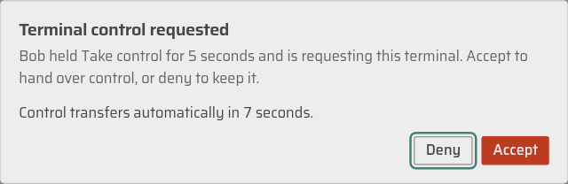
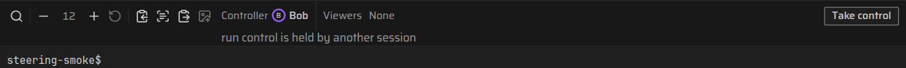
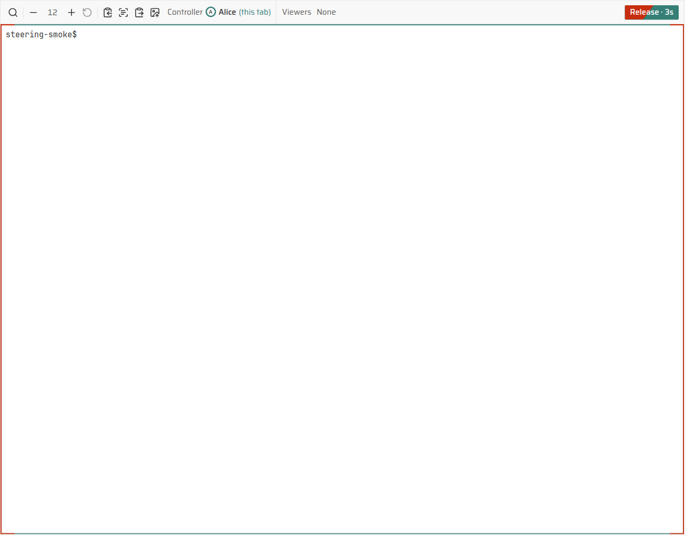

# Terminals

Aether draws three kinds of terminal:

- **Environment**: your own persistent shell. It runs in one server-side
  container with your member home mounted at `$HOME`, so files, executables
  in `~/.local/bin`, and agent login state survive reconnects and new runs.
- **A run's agent terminal**: the agent's PTY in a Standard run, shown in
  the run's **Terminal** view.
- **Run shells**: extra shells in a run's container, listed beside the agent
  terminal.

## Open your environment

From the CLI:

```sh
aether terminal
aether terminal --tab t2
aether terminal status
aether terminal stop
```

In the dashboard, select **Environment** in the header or its **More
navigation** menu (or press `g` then `e`). Before the container exists the
page shows **Your environment starts
on first open** with **Open**. Once it runs, the terminal fills the page and
**Add terminal tab** (`+`) in the tab strip opens another tab. The header
holds **Save environment** and **Environment actions** (**Forward port**,
**Stop environment…**, **Reset to standard…**); on a phone they sit at the
end of the tab strip. While nothing is saved, the header reads **Installs
here reach agents after you save.**

The first open says **Starting your environment container** until the shell
attaches, and shows the server's own error if the start fails. Later tabs and
tab switches reach a container that is already up, so they say **Connecting
to your environment**. The terminal reconnects and restores its output when
the page or network reconnects. Closing a tab only detaches it; opening that
tab again reattaches to its shell.

The stream ack names the exact bootstrap byte count in its `replay` field,
including a boundary that falls inside one WebSocket frame. As each
frame-sized bootstrap operation arrives, the dashboard splits only the
boundary-crossing frame and starts one serial xterm write chain behind the
CSS-hidden surface; it does not retain the bootstrap until the full boundary
arrives or allocate a browser-sized buffer from the declared length. Only the
slice containing the exact final bootstrap byte is tagged `replay-end`; live
output and geometry stay in wire order behind xterm's write backpressure.
Terminal-generated replies and user input stay muted from the ack through
the final bootstrap write callback. Input may resume after that callback,
but the surface stays hidden until two paint turns and any saved viewport
restoration have settled; only then is the terminal revealed.

When a persistent terminal host is replaced, `rebind` cancels the old
bootstrap drain with its cancellation signal, drops the old socket, installs
the new handlers, and starts one fresh bounded bootstrap after cancellation;
it does not issue a second reopen. If an `online` wake interrupts an
incomplete bootstrap, the client cancels its parser and drain with the same
cancellation signal, drops that socket while keeping the terminal hidden, and
reconnects for a fresh hidden bootstrap rather than revealing a partial
prefix. A final replacement refusal settles the bootstrap gate before its
server error is shown. For a run terminal, this bootstrap is compact
current-screen state captured without scanning the retained archive; the
live view never fetches that archive.

### Terminal font

Every terminal draws in `JetBrainsMono NFM`, shipped as
`web/public/fonts/jetbrains-mono-nfm-regular.woff2` and `-bold.woff2`, so
agent TUIs get their Nerd Font symbols at the cell width. xterm measures
glyphs once when it opens, so `web/src/lib/term-font.ts` opens a terminal
only when both faces report status `loaded`. Otherwise it loads both faces
and opens when they arrive, or after 2 seconds, or after a failed fetch, in
which case the terminal uses the platform's monospace glyphs. It does not
use `FontFaceSet.check`: Chromium answers true for a face that never loaded,
which opened terminals on fallback metrics.

## Run control

A run's agent terminal is the **Terminal** view of the run: open a run from
the sidebar, the board or the palette, then pick **Terminal** in the view
switch (`[` and `]` cycle the views), the row under the run header. A
Standard run opens on it. Its **Session** view lists messages, notes and the
agent's tool calls; while the agent works it ends with what the agent is
doing now ("Reading src/billing.js", from its reported activity) and **Live
detail is in the Terminal.** with **Open terminal**.

An [Enhanced run](enhanced-runs.md) has no agent terminal: its server-side
PTY is the container's login shell (`aether attach` reaches it), and the
agent runs beside it over the Agent Client Protocol. Its Terminal view says
**No agent terminal** and offers run shells. The run's control lease is the
same one: holding it from the Session view (`/ws/acp/<run_id>`) is what lets
you answer the agent's permission requests.

The **agent terminal** has one controller session at a time. A member needs
permission to message the run (the `steer` permission) to acquire it.
Viewing, presence, and run ownership by themselves do not grant input
access. A writable agent terminal or `aether attach` must acquire that
lease; read-only attaches may coexist. A second tab or connection from the
same member is a different session, not a second writer. Run shells have
separate, surface-scoped leases.

On a desktop, the owner's agent terminal asks for control automatically once
the Terminal view is first shown, **except for swarm workers**. Opening the
run on Session or Changes keeps the terminal a mirror, so reviewing a run
leaves the lease free. A swarm worker is a run assigned work by an
integrator; its terminal starts as a read-only mirror even for its owner, so
merely viewing it never creates an orchestration hold. Use **Take control**
to type, and **Release** to return to viewing. A deliberate per-run control
choice survives same-tab navigation under the identity and authority fences
below. Other members and phones start as mirrors.

The server grants an unoccupied lease only with the `steer` permission. A
write request that cannot acquire the lease is refused rather than silently
becoming a second writer. `aether attach` asks for control by default; use
`aether attach --read-only <run>` to watch deliberately. Clicking **Take
control** in the Terminal view's toolbar acquires an unoccupied terminal.
An occupied click reports `run control is held by another session` and leaves
the current controller in place.

To request an occupied terminal, hold **Take control** for five seconds with
the pointer, touch, Space, or Enter. A red fill with a forward-slash leading
edge advances across the button; covered and uncovered text retain separate
contrast. The holder sees the same fill on **Release** and red tracing over
the teal border from the side midpoints toward the top and bottom centers.
Releasing early, moving off the button, pressing Escape, or leaving the tab
cancels the hold.

After the full hold, the holder gets a focused dialog naming the requester.
**Deny** keeps control; **Accept** transfers it immediately. With no response,
the server transfers control after seven seconds. Releasing the button after
the full hold does not cancel the request. The server cancels a pending
request if either participant disconnects, authority changes, or the target
lease is released or replaced. Progress never grants input before the server
acknowledges the new controller. The dialog returns focus to the interrupted
terminal or composer when it closes.





Control is tied to the logical terminal session. When a controller
disconnects, the server holds its lease for a **15-second reconnect window**.
The same tab or connection session can reclaim the lease during that window.
The disconnected session cannot write while it is away. A different tab
cannot inherit it without an explicit takeover, and after the window expires
a normal acquisition can win. A dashboard tab keeps one control session per
run until the tab reloads, or until the signed-in identity, the server's
event log (a fresh data directory restarts it), your authority over the run
(role, run owner, protection, or the workspace's **Who may message others'
runs** setting), or the run's `created_at` changes. Returning to a run
terminal in the same tab therefore attaches as the session that held the
lease, and the server hands a disconnected lease back to it without a
takeover. Until the old connection's disconnect reaches the server, that
lease still reads as occupied, so the tab keeps asking for it through the
reconnect window before it becomes a mirror. After the window, the return
acquires control only if the run is still unoccupied.

**Control changes are acknowledged on the existing attach WebSocket.** A
dashboard terminal sends a text frame such as
`{"type":"control","request_id":17,"write":true}`. Occupied takeovers use the
five-second hold and seven-second review exchange described in the
[attach protocol](local-gateway.md#get-wsattachrun_id). The server answers on
that same stream with
`{"type":"control","request_id":17,"ok":true,"has_control":true,
"control_session_id":"...","control_generation":8}`. Every result includes
`has_control`, even when false; refusals also carry `code` and `error`.
A refused duplicate acquisition does not revoke a lease the session still
owns. An unsolicited lease revocation is also a `type:"control"` frame, but
has no `request_id`; it reports the exact revoked generation and
`control_session_id`, and the displaced interactive session remains a
read-only mirror. Its `revocation_reason` identifies an actual lease
replacement (`takeover`), lost messaging authority (`permission`), or other
fencing (`revoked`). A successful voluntary-release acknowledgement has no
revocation reason. The same-socket notification is used when an interactive
attach loses the `steer` permission: the terminal stays open and input is
disabled. Raw legacy attaches retain the named close (`1008`, `steer
permission withdrawn`) instead. Input frames carry the current
`control_generation`, and stale input is rejected. Taking or releasing
control therefore does not reconnect or replay the terminal. The terminal
remains at its current screen while the lease changes. A successful takeover
fences the old writer; its input is rejected and its session becomes a
read-only mirror. Invalid, stale, or cross-member requests are refused
without changing the current writer.

When this run is a swarm worker, taking writable agent or shell control also
sets a durable orchestration hold for that worker. The hold survives
reconnect expiry, disconnect cleanup, protection fencing, and a server
restart; integrator messages remain visible and durable but cannot reach the
agent's input while the hold is active. **Release control** on the worker's
task in the swarm page clears the hold, even after the lease, PTY, or worker
attempt has disappeared; it must name the current durable takeover
generation (`mission.worker.release`), and a stale generation is refused.
The server rechecks the releasing member's current `steer` authority and
never evicts a different member's live writer while releasing. A failed
release leaves both the human lease and the hold in place. This hold changes
orchestration eligibility only; taking control never grants account-use
authority or affects unrelated workers.

Only the run owner or an administrator can enable protection. Enabling
protection immediately fences the current controller and cancels every
queued message to the agent. While protected, other members cannot message
the run, and the owner or an administrator must acquire control again before
typing. Disabling protection does not restore a controller or a cancelled
message.

### The Terminal view's toolbar

The toolbar holds the terminal tabs (shown once a run shell exists), **Tools**
and, on the right, who controls the agent terminal: **You control**, **Alice
controls**, **You control in another tab** when your own other session holds
the lease, or **Nobody controls**, followed by **Take control** or
**Release**. A name read before a control change, while the attach is not
live, or after a failed presence read carries **(last known)**. Before the
first answer it reads **Checking control…**, and **Control unknown** if
presence cannot be read, with **Presence unavailable:** and the server's
error on the line under the toolbar. The connection word (**Connecting**,
**Reconnecting**, **Offline**) shows only while a live run's attach is not
live; a finished run reads **Container removed · read-only** (**Container
stopped · read-only** for a kept container) in muted text instead.
**Release** is a quiet button, so it never competes with the run's own
action. A
member without the `steer` permission sees **You can watch this run but not
type in it.** under the toolbar. **In control** and **Watching** are also
listed in the run's **Details** panel.

Live local ownership is shown by **You control** and **Release**. A 1px
subdued teal border traces only the terminal viewport, never the toolbar,
find bar, or UI above it. After this tab acknowledges live input, the border
propagates from the left and right side midpoints, splitting up and down to
meet at the top and bottom centers. An acknowledged voluntary release
reverses that path. Both decelerate toward their endpoints. An explicit
server takeover notification for this session's current lease turns the
border red, then retracts along the reverse path over about two seconds. A
completed hold has already made the border red; it stays red through the
handoff. Presence names never trigger takeover feedback. Input is fenced
immediately; the exit animation is decoration, not authority. Replay,
recorded history, disconnects, permission loss, and other fencing hide the
border without takeover feedback. A fresh read-only mirror has no border.
Reduced motion makes ownership changes instant and replaces moving takeover
fills with static red indicators and countdowns. Resizing preserves the
viewport boundary, and a rapid control change reverses from the visible
point.



Presence refreshes on mount and every ten seconds while the run is open, and
after acknowledged control changes. A stalled refresh times out after 15
seconds; later polls retry automatically. Presence never decides who may
type.

### Messages and notes

People reach the agent in the run's **Session** view and talk to each other
in its **Details** panel. Both read and write the run's durable, attributed
messages (`run.room.list`, `run.room.post`).

The Session view's composer sends a message to the agent: type it and press
**Ctrl+Enter** (**Cmd+Enter** on macOS) or **Send**; on a touch screen
**Send** is the only way, and Enter inserts a newline. The paperclip attaches
images. A message from the current controller session, with its current
lease, is delivered to the PTY at once; the composer says so (**Sends to the
agent's terminal.**). The owner of a run nobody controls gets the same: **Send**
takes the lease first, then sends. A message from anyone else waits 45
seconds (**Delivers in 45 s unless the controller decides sooner.**), with
the countdown on its row (**Delivers in
32s**). A send the server refuses keeps the draft and shows the server's
error above the composer. During the countdown the controller sees the
message in **Details > Needs you** with **Approve** and **Deny**; anyone else
who could take control sees **Take control to decide**. When the timer
expires Aether attempts delivery. The row then reads **Sent** (`sent`),
**Not sent** (`not_sent`), **Delivery uncertain** (`uncertain`), **Denied**
or **Cancelled**. **Sent** means the PTY write was accepted, not that the
agent read or answered it. Retries reuse the message identity, so they never
create a second request. When the viewer cannot message the agent the
composer is replaced by one line saying why: **This run has finished.**
(with **Reopen it from More to message the agent.** when the run can be
reopened), **The agent is still starting.**, **This run is protected: only
its owner or an admin can message the agent.**, or **You can watch this run
but not message the agent.**

**Details** lists, in order: **Needs you** (every pending request with the
actions that answer it; when the run needs you for another reason, such as
an idle agent or an unreviewed finish, one card with that reason and the
header's action; otherwise **Nothing is waiting on you.**), **Agent
messages** (agent-to-agent mail to or from this run, shown when there is any
or the run belongs to a swarm), **Notes** and the run's facts. A note is for
people only: the agent never sees it. Type it in **Add a note for people on
this run** and select **Add**; it is posted as a `comment`. A `question`
message from a teammate appears in **Needs you** for the run owner with a
reply field; **Reply** posts a correlated `reply`. Every question also
appears under **Notes**, marked **question**. The owner's own question shows
in the Session view as a note with no action. The run snapshot counts
unanswered questions from anyone but the owner, so the run is in the owner's
**Needs you** before anyone opens it. The question does not change the run's
wire status.

Message image attachments use the terminal upload rules: each message may
include up to eight actual PNG, JPEG, GIF, or WebP files, each no larger than
8 MiB. Aether validates and stores the bytes in the home the run's container
mounts, then records the generated container-visible path with the message.
A local filesystem path from clipboard text is not an upload. An attachment
is a persistent file reference, not a second input channel; messages still
reach every supported agent as serialized text written to its run PTY.
Aether does not require or provide a universal inbound agent hook.

The phone opens the agent terminal as a read-only mirror, including a run
owned by that member; tap **Take control** before the keyboard can send
input. Phone terminals follow the already acknowledged PTY size and do not
resize the shared session. **Details** opens as a bottom sheet over the
terminal.

`aether attach` remains a raw terminal stream: it consumes exactly the
replay byte count announced by the ack before treating following bytes as
live. It does not use the dashboard's segmented, ordered xterm transaction or
hidden surface. A writable CLI attach mutes its input by discarding
keystrokes that arrive before the announced replay has been written to your
terminal; they are dropped, not deferred. Dashboard xterm may answer
device-attribute and colour queries encountered while parsing replay, but
the replay gate mutes those terminal-generated replies along with user input
until the final replay callback; they do not reach the server. The CLI is
raw and has no xterm parser, so the announced replay and input discard rules
above remain in force.

## Run shells

A run shell is an extra shell in the run's container, started by a member or
by the agent. **+ Shell** in the Terminal view's toolbar calls
`dev.terminal.start` and opens it as a tab after **Agent**; an Enhanced run,
which has no **Agent** tab, lists only its shells. The tabs appear once a
shell exists; on a phone they are one menu. A shell the server gave no name
reads **Shell 1**, **Shell 2** and so on, in start order. Displaying,
selecting, reconnecting or showing a hidden shell never starts a process.
At most four shells can run at once; **+ Shell** says **At most 4 shells**
when that limit is reached. Shells can open only in a `running` or
`needs-attention` run that is not paused; a refused open says **You can view
this run but not open a shell in it**. The server assigns each shell a
stable `terminal_id` and an `incarnation`; every attachment and mutation
names that exact incarnation. An ended or replaced process is never
implicitly rerun.

A tab names its process state when it is not running (**Shell 1 · exited**),
and the line under the toolbar shows its exit status and reason when
available. **Hide this shell** (in **Shell actions**), switching to **Agent**
or another view, and disconnecting only detach the viewer. The process keeps
running in the run container. While a hidden shell exists, **+ Shell** opens
a menu with **New shell** and **Show Shell 1**; the same compact replay,
focus handling and phone panning are used as for the agent terminal. **Stop
this shell** is different: the current controller confirms **Stop this
shell?** before the process ends. Ended shells remain discoverable until the
server replaces them; starting a new one is always a separate action.

The shell's toolbar shows its current controller (**Alice controls**, **The
agent controls** or **You control**). **Take control** acquires only that
shell's lease; when someone holds it, **Take control of this shell?** asks
first and the takeover fences the previously observed generation.
**Release** releases only that shell's lease. It does **not** release agent
terminal control or clear a durable swarm hold; use **Release control** on
the swarm page for that separate decision. Input, paste, mouse sequences,
resizing and stop all use the acknowledged surface control session and
generation. Failed mutations are shown and are not automatically retried.

All shell attaches follow the shared grid, including desktop watchers. Only
a confirmed writer sends an explicit fenced resize after acquisition; phones
continue following the acknowledged grid even while controlling input. The
attach header carries `incarnation`; its ACK must name the same
`terminal_id`/`incarnation` and advertise `server_owned_responder`. The
server answers PTY protocol queries exactly once. The dashboard suppresses
xterm's query responders through parser handlers (including mixed OSC colour
queries/setters), not by guessing which outgoing bytes are replies.
Rendering, alternate-screen state, Unicode, keyboard, paste and mouse input
remain active; output parsing is not a reason to discard user input. This
policy applies only to shells; agent terminal replay gating is unchanged.

**Take a screenshot** (in **Shell actions**) calls the terminal screenshot
API and captures the server's actual emulator state, without needing a
connected viewer, then says **Captured <id>. Open Captures to keep it.** Its
total budget is 90 seconds, including first companion startup; rendering
itself is bounded to 30 seconds. Cancelling the request closes only its
isolated renderer, not the app's browser session. Open **Captures…** (in the
run's **More** or the toolbar's **Tools**) to inspect transient captures and
explicitly retain them with verification notes. Taking a screenshot alone
does not retain it.

## Set up agents and GitHub

The Agents page and the onboarding wizard set up an agent in three steps. In
step 2, **Install and log in**, the Environment terminal is embedded on the
page with the agent's login command typed into it (or its install command,
when the dashboard cannot install the agent itself); press Enter to run it.
Step 3, **Check**, re-reads the agent and shows **Installed** and **Login
found**. Login state lives in your home, so it needs no **Save environment**.

**Connect GitHub** embeds the same terminal and types the `gh auth login`
command instead. Finish the device login in your browser, then **I've logged
in** runs the rest of the connection and reports the account and the
signing key it registered. See
[environment-home.md](environment-home.md#connect-github).

## Sign in to agents

In the dashboard, click the OAuth URL printed in the terminal. For loopback
callbacks, Aether starts the local forward before it opens the authorization
page. In the CLI, run `aether forward terminal <callback-port>` before
completing the browser flow. Device-code logins need no forward, `gh auth
login --web` among them: gh prints a one-time code and a URL you open on
your own machine, and nothing calls back to the terminal. Login state under
your home is available to later runs without saving the environment.

## Save your environment

Install system tools and toolchains in your environment, then select **Save
environment** on the **Environment** page; it confirms with **Saved - new
runs use this environment**. The same actions are available from the CLI:

```sh
aether env save
aether env reset
```

Saving pauses the terminal for the few seconds Docker needs to commit it.
New runs and workspace shells use the saved image; `aether env reset` stops
the environment, removes that image, and makes the next open use the
standard image. See [environments.md](environments.md) for image selection
and persistence.

Stopping and resetting are separate, each behind its own confirmation.
**Stop environment…** does what `aether terminal stop` does: the container
stops and both your home files and your saved image remain, so a later open
starts it again. **Reset to standard…** does what `aether env reset` does,
and is offered only once you have a saved image to discard. A failure is
reported in the dialog that caused it.

## Keys

These work in every terminal Aether draws - your environment, a run's agent
terminal, and a run shell - and only in the terminal that has focus, because
the terminal itself claims them before the shell sees them.

| Key | What it does |
| --- | --- |
| `Ctrl+Shift+C` | Copy the selection. A plain `Ctrl+C` copies too when text is selected, and interrupts when none is. |
| `Ctrl+Shift+V` | Native paste on Windows and Linux. Plain `Ctrl+V` is native too; on macOS use native `Cmd+V`. |
| `Ctrl+Shift+F` | Open the find bar. `Enter` goes to the next match, `Shift+Enter` back, `Esc` closes it. |
| `Ctrl+=` / `Ctrl+-` | Grow or shrink the terminal font, 8px to 32px. `Ctrl+Shift+=` grows too, since that is how a keyboard without a numpad types `Ctrl++`. |
| `Ctrl+0` | Back to the default 12px. |

`Cmd`, or the `Super`/`Windows` key, works as well as `Ctrl` for the zoom
keys. The font size is one preference across every terminal and survives a
reload. Find searches the focused terminal's bounded live scrollback; while
reading a run's history, it searches the already loaded recorded pages and
frozen screen rows instead. It does not fetch the entire archive to search
it. Scroll upward in a run terminal to read older output in the same pane.
`PageUp` and `Home` also enter reading mode; `Shift+PageUp` explicitly opens
recorded output even when an alternate-screen application owns ordinary
scrolling. While reading, arrows, `PageUp`/`PageDown` and `Home` navigate;
scrolling down to the bottom or pressing `End` returns to live output.
`Ctrl+Shift+=` is accepted for zoom, but `Ctrl+Shift+-` remains the shell's
`Ctrl+_` (readline undo or a vim keymap switch), as does a shifted `Ctrl+0`.
The zoom shortcuts normally cancel the browser's own page zoom; if a browser
keeps its accelerator, the page may zoom too.

Native paste is deliberately left to xterm and the browser for those
keyboard shortcuts; it does not depend on the asynchronous
`navigator.clipboard` API. That matters on Windows when clipboard-read
permission is denied. When image upload is enabled, a native paste
containing actual image file data is handled by the terminal's image paste
listener; ordinary text remains native terminal input. On macOS, `Cmd+V` is
the native paste shortcut.

A paste reaches the agent as one block rather than as the Enter presses
its newlines would otherwise be, because the terminal is told the session
has bracketed paste on. An agent sets that mode once when it starts, long
before you open the terminal, so the server tracks it - along with the
cursor, autowrap, and mouse reporting - and restores it ahead of the
replay. Without that, a terminal opened hours into a run would disagree
with the agent about how a paste arrives, and only the agent could tell.

The toolbar's **Tools** menu has **Find** (**Find in recorded output** while
reading history), **Smaller text**, **Larger text**, **Reset text size**,
**Copy selection**, **Copy screen**, **Paste** and **Upload image…**; a run's
terminals add **Captures…**. Under 768px the menu opens as a bottom sheet.
**Copy screen** copies the rows currently on screen, which is how to copy
without a drag selection - a touch screen has none. Copying an empty screen
says so. **Paste** first uses the browser clipboard API to look for an image
and then falls back to text. If no usable clipboard read API remains, or its
reads are denied, it shows **Paste unavailable:** with the reason, telling
you to use the native paste shortcut or allow clipboard access. Copy uses
the same API with a selection fallback; if both routes fail it shows **Copy
unavailable** rather than silently dropping the copy.

### On a touch screen

A soft keyboard has no Esc, Tab, Ctrl or arrows, and an agent TUI needs all
four. Below the terminal, whenever it accepts input, is a key bar: **Ctrl**,
**Esc**, **Tab**, the four arrows, **Enter** and **Ctrl+C**. They send
exactly what those keys send. **Ctrl** is a modifier rather than a held key:
tap it, then type or tap one more key, and that key arrives as its control
code - `Ctrl` then `d` is `Ctrl+D`. It covers the letters, space, and
`@ [ \ ] ^ _`, applies to one key and then releases; a key it does not cover
is sent as itself and leaves **Ctrl** armed for the next one.

A run's terminal is sized by the people controlling it: the PTY is the
smallest window among them, so nobody's screen is reflowed past what it can
show. Watching it read-only imposes nothing - except when you are the only
one attached, where there is no other screen to protect and the terminal
follows your window the way `ssh` does. A second attach ends that, and the
size is recomputed without you.

On a phone every terminal - a run's agent terminal, its shells, and your
environment - keeps the session's existing size. Swipe vertically or
horizontally to reach parts of a desktop-sized grid that do not fit on the
phone, including an agent's input prompt near the bottom. The viewport
initially reveals the cursor and keeps it visible while you type or the
keyboard reduces the available height. Panning pauses that following until
you tap or focus the terminal or type again.

In a run's normal buffer, dragging downward first reveals the top of the
live grid, then continues into recorded history. Swipe toward newer output
to return live at the bottom. An oversized alternate screen can be panned
the same way, without entering history. When the grid fits vertically,
alternate-screen scrolling remains with the running application.
Horizontal drags remain native when the grid cannot pan in that direction.
The phone follows a desktop viewer's resizes; watching, controlling, panning
and opening the keyboard never change the shared PTY size.

**Tools** scrolls when the keyboard leaves too little room for every action.
Closing it restores that space to the terminal.

On a phone every run - including one you own - opens as a read-only mirror.
On desktop, an owner's unoccupied agent terminal may already have acquired
control; swarm workers start as mirrors on both. **Take control** is a tap.
While it is a mirror the terminal takes no input, so tapping it does not
raise the keyboard.

### Paste or upload an image

An image paste must contain the actual file bytes. If the clipboard provides
a PNG, JPEG, GIF, or WebP file (including a disk-backed clipboard image),
native paste or **Tools > Paste** opens **Upload image to terminal** with a
preview. Select **Upload and insert** to send it. In a browser or desktop app
on Windows, macOS, or Linux, **Tools > Upload image…** opens the platform's
file chooser directly; use **Choose another image** in the dialog to replace
a selection. The chooser is the fallback when the clipboard exposes no image
bytes.

The client accepts PNG, JPEG, GIF, and WebP files up to 8 MiB. The server
validates the decoded bytes and format again, so a misleading filename or
MIME type is not enough. A rejected selection stays in the dialog with the
actual validation error; server or connection failures appear as **Upload
failed:** with the server's detail. A native image-paste failure is shown as
**Pasting image failed:** with its detail.

Some clipboard managers expose only a path such as
`C:\Screenshots\shot.png` or `/home/me/shot.png`. That is text, not an image
file: a remote container cannot read a path on your local OS, and a browser
cannot auto-read arbitrary local paths. Choose the actual file in the
chooser instead. The server stores the selected bytes and returns a remote
absolute path; Aether inserts that path with shell quoting and does **not**
press Enter. Review or edit it, then press Enter yourself when it is ready.

Changing away from a run terminal closes its socket and unmounts its live
xterm. You are no longer **Watching**, and the inactive run has no control
transport or geometry participation. A controller's lease waits out the
reconnect window: returning in the same tab within 15 seconds still holds
control, while another tab still needs **Take control**. A pinned reading
position keeps its static screen presentation, loaded pages, and
row-relative pixel and horizontal offsets. Switching from run A to B and
back restores A's same recorded row and position, even if A kept producing
output. The new live attachment bootstraps a compact current screen behind
that saved presentation; it does not replace pinned content or jump the
reader to the bottom. A run left following live output returns to the fresh
current screen.

When an already-mounted dashboard surface deliberately reopens while its
parsed screen remains valid, it may send the server's nonempty `resume_id`
for that PTY incarnation with its xterm-settled cursor. A valid
same-incarnation resume supplies only the bytes still available in the
bounded in-memory resume ring and keeps the current screen; it never scans
the transcript for a gap. If the ring, geometry, cursor, or incarnation
fence cannot serve that gap, the server sends a compact current screen
instead. Neither path replays the archive. A completed session opens from
its compact final checkpoint, with a bounded recent-output fallback while a
missing or invalid checkpoint is repaired, and remains read-only unless that
run is reopened.

### Current screen and retained terminal archive

A dashboard run attach requests `screen:true` and `interactive:true`. Its
bootstrap is a compact VT snapshot of the current viewport, cursor, modes,
colours, and alternate buffer, not every recorded byte from the run. The
live session serializes that state in memory at the same output boundary
named by the attach acknowledgement, so opening the terminal does not wait
for a durable-history scan. The server snapshot keeps at most 200 scrollback
rows and bounds the screen store to 1,048,576 cells. The browser requests up
to 5,000 live-scrollback rows and reduces that count as needed to keep its
normal and alternate buffers within a 1,000,000-cell cap. The live side of a
live, fallback, or finished run therefore opens at the current screen rather
than showing a historical timelapse or scanning the archive. A saved pinned
presentation stays in front of it. User input and terminal-generated replies
stay muted through the final hidden snapshot write. After that write,
authorized protocol replies resume even while reading; user input resumes
only after returning live. Paint and viewport restoration settle before the
live surface can be revealed.

Live xterm and its bootstrap remain bounded; older retained output is
reached by continuing upward in the same terminal pane. Reading freezes the
current VT presentation while new output continues behind it. Older archive
pages are **normalized recorded text**, not a reconstruction of historical
VT screens. An inline boundary separates that text from the frozen current
screen. Some content can appear on both sides: the dashboard does not
heuristically deduplicate text against VT rows or replay the raw recording
into xterm.

The server keeps a rolling archive, not an unlimited recording: complete
events rotate at 16 MiB, with a 128 MiB retained target (eight segments)
per session and a seven-day age limit for sealed segments. The active
segment and latest compact screen remain available; these are retention
targets, not a hard quota on an event being written. Output keeps flowing,
and absolute sequence positions do not restart when older segments expire.
Container, checkout and retained evidence lifetimes are separate.
Retention is applied during ordinary live checkpoint maintenance, at startup,
hourly, and when full cold replay is opened. Startup/hourly maintenance
also expires sealed segments from stopped run terminals, member terminal tabs,
and run shells without requiring anyone to read or reopen them. Active or
starting sessions remain under their live writer's retention policy.
During maintenance or full cold replay, legacy archives with missing,
old-format or stale checkpoints are repaired one segment at a time before
pruning and opening retained replay descriptors. The latest compact screen
and absolute byte accounting survive that migration. Paged history and bounded
recent replay remain lazy reads: they do not force full legacy repair or scan
unrelated older segments. Recent replay without a validated checkpoint does
not claim a proven terminal position.
The private retention frontier keeps absolute byte accounting without replaying
expired data. Already-open replay readers pin their finite window: removed
segments can still occupy disk space until those readers close. A replay's
proven end boundary is independent of whether its earlier prefix has expired.

Archived attach acknowledgments report `truncated_before: true` when earlier
recorded output has expired, including compact screen snapshots and the
recent-output fallback. A complete current screen does not imply a complete
recording. Raw history downloads report the same fact in
`X-Aether-Truncated-Before: true|false`.
Replay byte counts and downloaded `.ansi` bodies describe the exact retained
output, with no synthetic expiry marker bytes; they need not represent the
original complete recording.

As you approach the oldest loaded rows, the dashboard prefetches older pages
and prepends them without moving the row or partial-row pixel offset you are
reading. Only the visible rows and a small overscan window are rendered.
Pages are stored in IndexedDB with a small resident text cache, so
continuing upward can reach all retained pages without a fixed line-count
cutoff. The saved view and cursor-linked rows belong to the authenticated
identity, terminal-data epoch, and run creation identity; identity changes,
invalidation and run deletion fence off stale results. If browser storage is
unavailable, newly loaded content can remain in memory for this session, but
durable restore is not guaranteed. Storage and paging failures are reported
rather than silently treated as the end of the archive.

The frozen presentation keeps its line layout when the live grid changes.
The shared font zoom also scales the reading surface while preserving its
row-relative position. Find searches retained loaded pages and frozen rows,
including pages outside the rendered window; copy targets the read surface.
Typing, native paste and toolbar paste remain disabled while reading.
Unmodified dashboard shortcuts also stay inactive while the reading surface
has focus: `n` cannot launch a run and `Esc` cannot leave this one.
Terminal-generated replies continue under the live connection's write
authority, so reading history does not stall applications awaiting a reply.
Scroll down to the bottom or press `End` to resume following live output.
Only starting a new reading episode after returning live refreshes the
archive from its newest page; remounting a pinned run preserves its existing
pages and continuation instead.

The [run-switch example](media/terminal-history-restore.webp) shows the same
deep archive viewport before and after visiting another run while the
archive grows. Continuing upward reaches the
[earliest retained output](media/terminal-history-earliest.webp).

The server returns at most 200 lines per request and also bounds disk reads,
decoded events, segment discovery, concurrent readers, and elapsed scan
time. A page can therefore be short or empty while `has_more` still says
older output remains. Paging automatically continues with the authenticated
opaque cursor returned by the server; it is tied to this run and query and
must not be constructed or edited by the client. The dashboard's Find does
not use the protocol's separate server-search option.

Responses carry `truncated_before:true` when earlier recording has expired.
An authenticated cursor into a pruned segment returns an explicit history
expiry error, not an empty complete recording or a silently restarted page.
Malformed or forged cursors remain invalid parameters. The reader keeps its
position and shows the error; returning live and starting a new reading
episode deliberately opens the newest retained window.

Evidence capture copies available transcript bytes into its own immutable
artifact before cleanup. It marks the source truncated if an earlier prefix
already expired, if the copy reaches its 16 MiB cap with more source bytes,
or both, naming the actual causes. An exact-limit complete source is not
marked truncated. Those facts and the recorded artifact length survive
retry and server restart; subsequent terminal-history cleanup cannot change
the retained copy. Expired history cannot be reconstructed by capturing it.

The retained raw archive remains separately available to non-dashboard
compatibility clients through `GET /api/runs/<run_id>/terminal-history` and
the legacy form `POST` route at the same path. They use the gateway's normal
authentication and member authorization, stream raw ANSI bytes from all
retained cast incarnations only to the finite archive boundary captured for
the request, and do not control or alter the PTY. The dashboard calls
neither route and exposes no full-history download action. `aether attach`
likewise remains a raw CLI stream: it requests `screen:false`, consumes the
ack-declared replay byte count, and then treats following bytes as live. CLI
output is retained raw history, not the dashboard's compact snapshot, and
its pre-replay input-discard rule remains unchanged.

### Reattaching after an update

Desktop terminals draw at the shared PTY's size, not independently at each
window's width. A smaller writer can reduce that grid; other viewers adopt
that size without reporting it back as their own window size. Fresh viewers
can request a redraw nudge, but the compact bootstrap keeps that redraw
hidden until the settled current screen is ready.

The current-screen checkpoint lives beside the transcript in the runtime
transcript directory as a versioned `<transcript>.screen` record. A
checkpoint stores the compact VT snapshot, its columns and rows, the cast
incarnation ID and byte offset, and segment byte/output counts. It is
replaced atomically, so a restart can resume from a complete record. A
missing, invalid, or corrupt checkpoint is not trusted: Aether reconstructs
the screen safely from the recorded cast output and resize events. If output
was never persisted, it is unavailable.

Starting a new PTY incarnation preserves the previous non-empty cast as an
old, timestamped artifact instead of truncating it. The current-screen
checkpoint is only a fast bootstrap; it is not the archive. The raw
compatibility exports and CLI replay can still read all retained cast
incarnations, subject to the run's retained-artifact lifecycle.

### Control availability

**Upload image…** in **Tools** is disabled until the selected terminal has a
live attach and write permission. In a run's agent terminal, a read-only
mirror, a `Connecting`, `Reconnecting`, or `Offline` state, a starting run
(**Starting the run's container**), or a server-denied **Take control**
state leaves image upload disabled. Take control first when you may message
the run. A run that has ended shows no control; its Terminal view replays
the recorded output, or says **This run has ended and left no recorded
terminal to replay.** when there is none. Your environment shows **Starting
your environment container** for its first open and **Connecting to your
environment** for a later attach; a startup or attach failure displays the
gateway's own error. These states do not turn a read-only transcript into a
writable terminal.

## Environment tabs and lifecycle

There is one environment container per member. `main` is its login shell.
Other tabs run another login shell in the same container and use names such
as `t2`. A member may have at most six tabs. A shell that exits closes its
tab; opening the environment again recreates the container if it stopped.

Stopping the environment stops its container and all tab processes. The
member home is not deleted. The next CLI or dashboard open starts a new
container with the same home.

Uploaded images are kept in the persistent member home the target container
mounts (your own for your environment, the launcher's for a run) under
`$HOME/.aether/terminal-images/`. The server generates a name such as
`image-<random>.png`, writes the original bytes with private permissions,
and returns the absolute path visible inside that target container. The path
is not a local OS path, a workspace checkout path, or part of the Docker
saved environment image. Stopping the environment, recreating its container,
or running `aether env reset` leaves the member home (and these images)
intact; there is no automatic image cleanup.

To remove one known image from a terminal, substitute the exact generated
filename and run:

```sh
rm -- "$HOME/.aether/terminal-images/image-<random>.<ext>"
```

Do not replace the filename with a wildcard.
